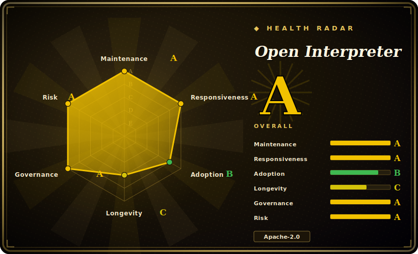
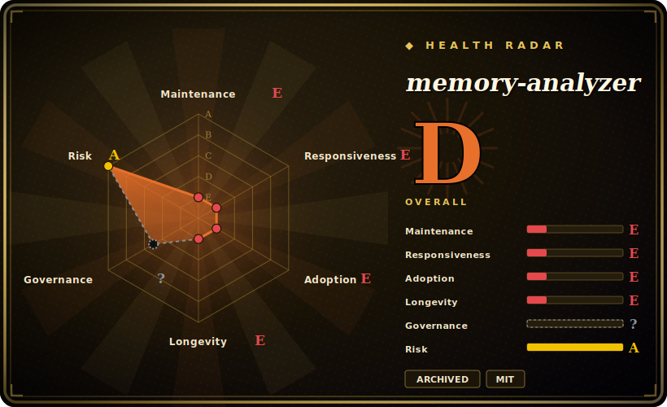

# Health radar — gallery

> An auto-computed **viability snapshot** for each project: a 6-axis JoJo-stand-stats radar —
> **maintenance · responsiveness · adoption · longevity · governance · risk/license** — each graded
> **A–E** or **?** (unknown, never coerced to a score). The machine source of truth is the `health:`
> block in every project's frontmatter; these cards are regenerated from it by
> [`tools/health_card.py`](tools/health_card.py). Grades are computed by
> [`tools/health.py`](tools/health.py) per the [rubric](docs/health-rubric.md).
>
> 中文：[HEALTH.zh.md](HEALTH.zh.md)

The full index is backfilled. A `?` axis means the signal is unobtainable or not applicable
(e.g. adoption for a desktop app that ships no package), not a low score.

## Open Interpreter — overall A

## Agent Orchestrator — overall B

## memory-analyzer — overall D

