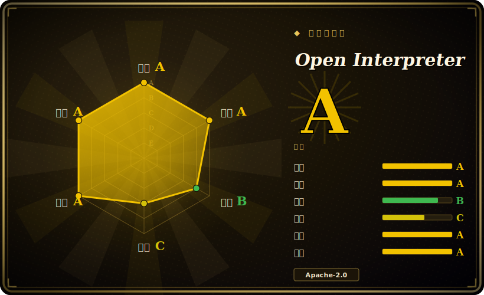
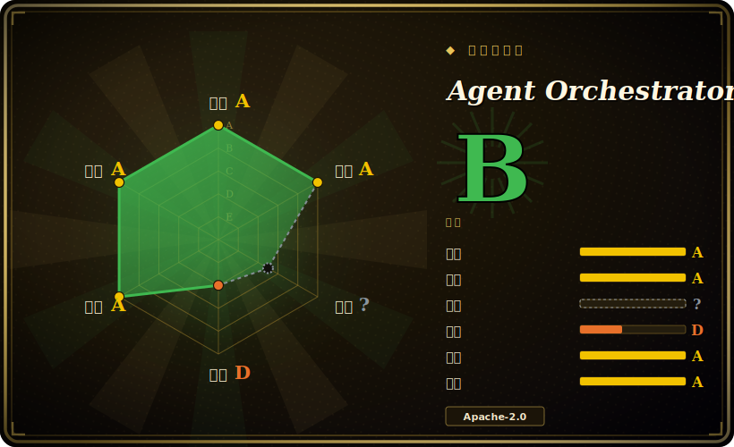

# 健康度雷达 — 画廊

> 每个项目的**可持续性快照**：一张 JoJo 替身能力风格的六轴雷达——**维护 · 响应 · 采用 · 寿命 · 治理 ·
> 许可/风险**——每轴评 **A–E** 或 **?**（未知，绝不当成低分）。机器事实源是每个项目 frontmatter 里的
> `health:` 块；这些卡由 [`tools/health_card.py`](tools/health_card.py) 从该块重新生成，档位由
> [`tools/health.py`](tools/health.py) 按[评分规则](docs/health-rubric.md)计算。
>
> English: [HEALTH.md](HEALTH.md)

全量索引已回填。某轴为 `?` 表示该信号无法获取或不适用（例如不发布任何包的桌面应用的“采用”），而不是低分。

## Open Interpreter — 总评 A

## Agent Orchestrator — 总评 B

## memory-analyzer — 总评 D

