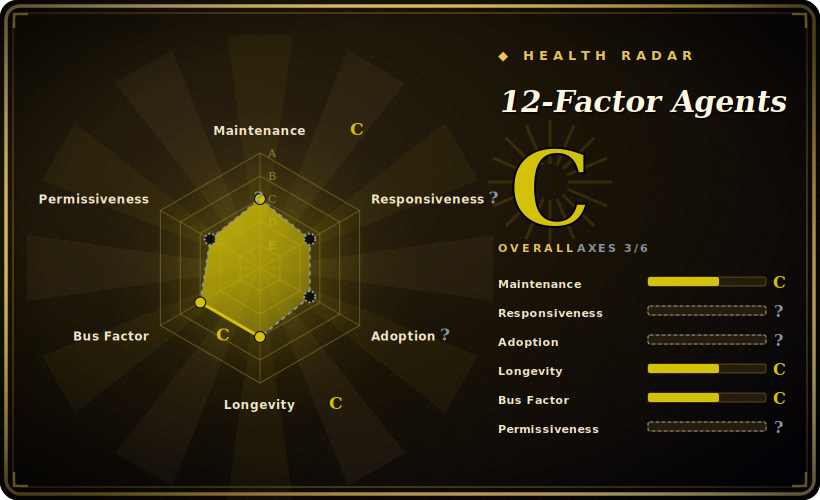

# 12-Factor Agents

A set of 12 engineering principles (a methodology doc, not a runtime) for building LLM software reliable enough to ship to production customers — own your prompts, own your context window, keep agents small and stateless.

## When to use

You're an engineer who built a demo agent with a big framework, it dazzled in the demo, and now it's flaky in production: the control flow is buried inside someone else's loop, you can't see or edit the exact prompt that hit the model, and when a tool errors the whole thing wedges. You suspect the problem isn't the model but the architecture, and you want a vocabulary and a checklist to reason about *what good looks like* before you rip things out. 12-Factor Agents gives you exactly that — a Heroku-12-factor-style list (Own your prompts, Own your context window, Tools are just structured outputs, Unify execution and business state, Launch/Pause/Resume, Contact humans with tool calls, Own your control flow, Compact errors into context, Small focused agents, Stateless reducer) that names the failure modes you're hitting and prescribes a direction.

You reach for it when you want principles to guide a hand-rolled or thinly-framed agent, to review an existing design, or to onboard a team to a shared mental model. It is reading material plus illustrative code snippets and a workshop — you read it, internalize the factors, and apply them in whatever stack you already use; there is nothing to `pip install` and no library to depend on.

## When NOT to use

- **You want code to run, not principles to read.** This is a methodology document; it ships no installable package, no runtime, no SDK. If you need a framework that *does* the orchestration, look at LangGraph, the OpenAI Agents SDK, or PydanticAI — 12-factor tells you what to aim for, not a library to import.
- **You want a turnkey agent harness / persona pack for your coding agent.** Sibling skill-packs ([Superpowers](superpowers.md), [SuperClaude Framework](superclaude.md), [get-shit-done](get-shit-done.md)) ship actual installable prompts/commands; 12-factor is upstream theory, not drop-in config.
- **You need step-by-step prescriptions or guarantees.** The factors are directional principles, deliberately framework-agnostic. They will not tell you which vector DB, which model, or give you copy-paste production code — you still do the engineering.
- **Maintenance/recency risk.** The content is essentially a stable essay set; the repo has no tagged releases and was last pushed 2025-09 [未验证]. It tracks the agent landscape as of its writing, so some specifics (model behaviors, tooling) may lag the current ecosystem — treat it as enduring principles, not a living API reference.
- **You disagree with the opinionated stances.** "Own your control flow" and "make your agent a stateless reducer" are strong positions; if your team is committed to a high-abstraction framework, the advice pushes against that grain.

## Comparison

| Alternative | In index | Our verdict | Tradeoff |
|---|---|---|---|
| [Compound Engineering](compound-engineering.md) | ✅ | Use this page for its stated niche; choose Compound Engineering when you need a workflow/plugin methodology for AI-assisted dev. | A workflow/plugin methodology for AI-assisted dev; more about the human+agent build loop than 12-factor's architecture-of-the-agent principles. |
| [ECC](ecc.md) | ✅ | Use this page for its stated niche; choose ECC when you need context-engineering oriented methodology. | Context-engineering oriented methodology; overlaps on "own your context" but is its own framing, not the 12-factor checklist. |
| [Superpowers](superpowers.md) | ✅ | Use this page for its stated niche; choose Superpowers when you need an installable skills/prompt pack for a coding agent. | An installable skills/prompt pack for a coding agent — concrete commands, not upstream design principles. |
| [SuperClaude Framework](superclaude.md) | ✅ | Use this page for its stated niche; choose SuperClaude Framework when you need a configuration framework that injects personas/commands into Claude. | A configuration framework that injects personas/commands into Claude; operational, not a methodology essay. |
| [get-shit-done](get-shit-done.md) | ✅ | Use this page for its stated niche; choose get-shit-done when you need a spec-driven workflow pack you install. | A spec-driven workflow pack you install; prescribes a process, where 12-factor prescribes agent architecture. |
| Anthropic "Building effective agents" guide | 未收录 | Use this page for its stated niche; choose Anthropic "Building effective agents" guide when you need a vendor essay arguing for simple, composable patterns over frameworks. | A vendor essay arguing for simple, composable patterns over frameworks; similar spirit, different (and shorter) taxonomy. Hosted article, not a repo. |
| Heroku 12-Factor App | 未收录 | Use this page for its stated niche; choose Heroku 12-Factor App when you need the original SaaS-app methodology this borrows its name/format from. | The original SaaS-app methodology this borrows its name/format from; about apps, not agents. |

## Health & viability

- **Maintenance (2026-06):** last pushed 2025-09 with no tagged releases — ~9 months idle. For a living API this would read as coasting, but it's an essay set; [推断] the content is "done/stable" by nature, not abandoned. Treat staleness as low-risk for principles, higher-risk for any model-/tooling-specific specifics it cites.
- **Governance & backing:** an Organization-owned repo (HumanLayer / Dex Horthy), maintained alongside a commercial product. Effectively a small-vendor / single-author voice, not a foundation — the roadmap is one team's editorial line, though the factors read vendor-neutral.
- **Age & Lindy (2026-06):** created 2025-03, ~1 year old. Young and idea-driven, not a battle-tested codebase — its ~23k stars reflect mindshare, not longevity. Lindy verdict: **unproven by age**, but it's a methodology doc whose value is conceptual rather than maintenance-dependent, so the usual young-and-hyped risk applies more to specifics than to the core principles.
- **Risk flags:** no installable artifact = no relicense/CVE/supply-chain surface; the real risk is **content drift** (the agent landscape moving past a frozen essay). No governance/funding model is published beyond the HumanLayer association.

## Caveats (unverified)

- [未验证] Stated dual license: content under CC BY-SA 4.0, code examples under Apache-2.0 (GitHub reports the repo license as "Other"); confirm exact terms per file before reuse.
- [未验证] Repo last pushed 2025-09-21 and has no tagged releases (`latestRelease: null` from `gh repo view`); "last pushed 2025-09" is the freshness signal, not a version.
- [未验证] Primary language is reported as TypeScript by GitHub, but the substance is Markdown content; the TS/Python is illustrative example code, not a shippable library. Classified here as a methodology `skill-pack`, not a framework.
- [未验证] Star count ~23.5k (as of 2026-06) — GitHub stars are unreliable and date-sensitive; indicative only.
- [推断] Maintained by HumanLayer (Dex Horthy) alongside their commercial product; this inferred provenance does not make it product marketing — the factors read as vendor-neutral principles.
- [推断] A "Factor 13" (pre-fetch context) and a workshop exist as bonus material; exact current contents shift with edits — verify against the live repo before citing specifics.
