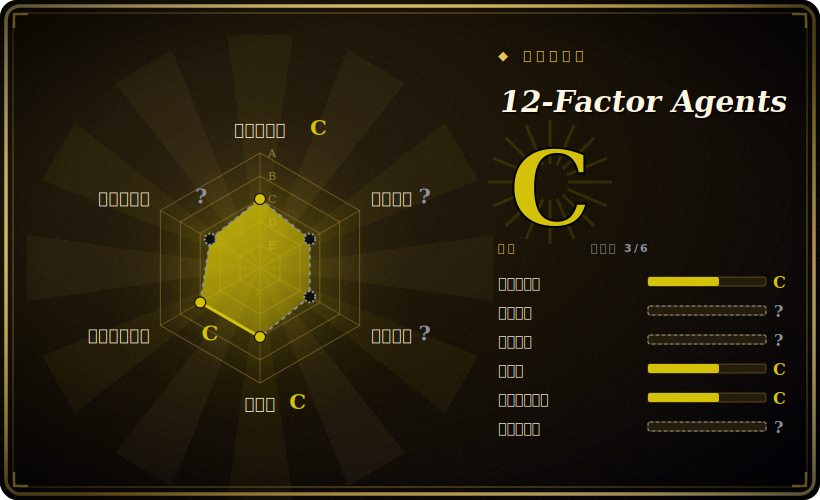

# 12-Factor Agents

一套 12 条工程原则（是方法论文档，不是运行时），用来构建可靠到能交付给生产客户的 LLM 软件——自己掌控 prompt、自己掌控 context window、让 agent 保持小而无状态。

## 何时使用

你是个工程师，用某个大框架搭了个 demo agent，演示时惊艳，一上生产就抖：控制流埋在别人的循环里，你看不到也改不了真正打到模型的那段 prompt，某个工具一报错整个流程就卡死。你怀疑问题不在模型而在架构，想在动手重写之前先有一套词汇和检查清单，去推理“好该长什么样”。12-Factor Agents 给的正是这个——一份 Heroku 12-factor 风格的清单（自己掌控 prompt、自己掌控 context window、工具只是结构化输出、统一执行状态与业务状态、启动/暂停/恢复、用工具调用联系人类、自己掌控控制流、把错误压进上下文、小而专注的 agent、无状态 reducer）——它给你正在踩的失败模式命名，并指出该往哪个方向走。

当你想用一套原则来指导一个手写或薄框架的 agent、评审一个既有设计、或者让团队对齐一套共同心智模型时，就会拿它出来。它是阅读材料加上示例代码片段和一个 workshop——你读它、吃透这些 factor，然后在你已有的任何技术栈里落地；没有任何东西要 `pip install`，也没有库要依赖。

## 何时不用

- **你要的是能跑的代码，不是要读的原则。** 这是方法论文档；它不发布可安装包、没有运行时、没有 SDK。如果你需要一个真去做编排的框架，看 LangGraph、OpenAI Agents SDK 或 PydanticAI——12-factor 告诉你该瞄准什么，而不是给你一个可 import 的库。
- **你要一个开箱即用的 agent harness / 人设包给你的 coding agent。** 同类目里的 skill-pack（[Superpowers](superpowers.zh.md)、[SuperClaude Framework](superclaude.zh.md)、[get-shit-done](get-shit-done.zh.md)）发布的是真正可安装的 prompt/命令；12-factor 是上游理论，不是即插即用的配置。
- **你需要分步规定或保证。** 这些 factor 是方向性原则，刻意保持框架无关。它不会告诉你用哪个向量库、哪个模型，也不给可复制粘贴的生产代码——工程还是你自己做。
- **维护/时效风险。** 内容本质上是一套稳定的文集；仓库没有 tagged release，最后一次 push 在 2025-09 [未验证]。它跟踪的是其写作时点的 agent 全景，某些具体细节（模型行为、工具链）可能落后于当前生态——把它当作恒久原则，而非活跃的 API 参考。
- **你不认同其强观点。** “自己掌控控制流”“让 agent 成为无状态 reducer”都是强立场；如果你的团队铁了心用高抽象框架，这些建议是逆着你来的。

## 横向对比

| 替代品 | 是否收录 | 取舍 |
|---|---|---|
| [Compound Engineering](compound-engineering.zh.md) | ✅ | 一套面向 AI 辅助开发的工作流/插件方法论；更关注人+agent 的构建循环，而非 12-factor 那种“agent 自身架构”的原则。 |
| [ECC](ecc.zh.md) | ✅ | 偏 context engineering 的方法论；在“掌控上下文”上有重叠，但是另一套框定，不是 12-factor 清单。 |
| [Superpowers](superpowers.zh.md) | ✅ | 给 coding agent 的可安装技能/prompt 包——具体命令，而非上游设计原则。 |
| [SuperClaude Framework](superclaude.zh.md) | ✅ | 往 Claude 注入人设/命令的配置框架；偏操作落地，不是方法论文集。 |
| [get-shit-done](get-shit-done.zh.md) | ✅ | 一个你要安装的 spec 驱动工作流包；规定的是流程，而 12-factor 规定的是 agent 架构。 |
| Anthropic《Building effective agents》指南 | 未收录 | 一篇厂商文章，主张用简单可组合的模式而非框架；精神相近，但分类更短、更不同。是托管文章，不是仓库。 |
| Heroku 12-Factor App | 未收录 | 本项目借其名称/格式的 SaaS 应用原始方法论；讲的是应用，不是 agent。 |

## 健康度与可持续性

- **维护（2026-06）：** 最后一次 push 在 2025-09，且无 tagged release——约 9 个月没动。若是活跃的 API，这会读作 coasting；但它是一套文集，[推断] 内容本质上是「已完成/稳定」，而非弃坑。把陈旧性当作对原则低风险、对它引用的任何模型/工具具体细节较高风险来看待。
- **治理与背书：** Organization 持有（HumanLayer / Dex Horthy），在其商业产品之外维护。实质上是小厂商/单作者的声音，而非基金会——路线图是一个团队的编辑主张，尽管这些 factor 读起来是厂商中立的。
- **年龄与 Lindy（2026-06）：** 创建于 2025-03，约 1 岁。年轻、以理念驱动，不是久经考验的代码库——约 23k star 反映的是声量而非寿命。Lindy 裁决：**按年龄看属未经验证**；但它是方法论文档，价值偏概念、不依赖维护，因此「年轻且被热捧」的常见风险更多落在具体细节上，而非核心原则。
- **风险标记：** 无可安装产物 = 没有 relicense/CVE/供应链面；真正的风险是**内容漂移**（agent 生态走在一篇被冻结的文集之前）。除 HumanLayer 关联外，未公布治理/资金模型。

## 存疑（未验证）

- [未验证] 声称的双许可：内容为 CC BY-SA 4.0，示例代码为 Apache-2.0（GitHub 把仓库 license 报为 "Other"）；复用前请按文件核实确切条款。
- [未验证] 仓库最后一次 push 在 2025-09-21，无 tagged release（`gh repo view` 显示 `latestRelease: null`）;“最后 push 2025-09”是新鲜度信号，不是版本号。
- [未验证] GitHub 把主语言报为 TypeScript，但实质内容是 Markdown；其中的 TS/Python 是示例代码，不是可发布的库。本页将其归类为方法论 `skill-pack`，而非 framework。
- [未验证] Star 约 23.5k（截至 2026-06）——GitHub star 不可靠且对时间敏感，仅供参考。
- [推断] 由 HumanLayer（Dex Horthy）在其商业产品之外维护；此推断的来源不使它成为产品营销——这些 factor 读起来是厂商中立的原则。
- [推断] 存在 "Factor 13"（预取上下文）和一个 workshop 作为附赠材料；具体内容随编辑变动——引用细节前请对照在线仓库核实。
