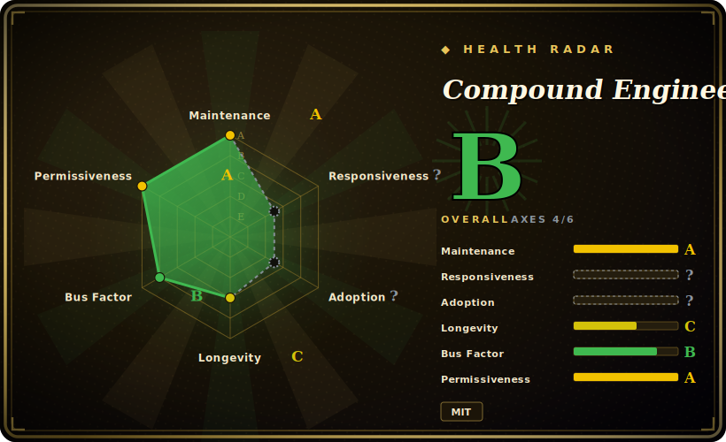

# Compound Engineering

An opinionated, install-as-a-plugin skill-pack that wires a six-step loop — brainstorm → plan → work → simplify → review → compound — into Claude Code, Codex, Cursor, and a dozen other coding agents, so each task writes learnings back for the next one.

## When to use

You're a developer who lives inside a coding agent (Claude Code, Codex, Cursor, OpenCode…) and you've noticed your sessions are one-shot: you brainstorm a feature in chat, the agent codes it, you eyeball the diff, and the hard-won context — why you rejected approach A, the gotcha that cost you an hour — evaporates the moment the session ends. The next feature starts from zero. You want a *named, repeatable* workflow that front-loads planning and review (the project's bet: "80% is in planning and review, 20% is in execution") and, crucially, captures each loop's learnings somewhere the next loop will read them.

Compound Engineering installs as a plugin via your agent's marketplace (`/plugin marketplace add EveryInc/compound-engineering-plugin` for Claude Code) and gives you slash commands for each phase: `/ce-brainstorm`, `/ce-plan`, `/ce-work`, `/ce-simplify-code`, `/ce-code-review`, and `/ce-compound` — plus `/lfg` to run the whole pipeline autonomously. The `/ce-compound` step writes the loop's insights into `docs/solutions/` so the next `/ce-brainstorm` and `/ce-plan` start from your accumulated decisions instead of a blank slate. Reach for it when you want a turnkey, multi-host methodology you can drop in today, rather than hand-rolling your own slash-command discipline.

## When NOT to use

- **You already run a mature, custom workflow.** If you've built your own skills/commands and memory conventions (your own plan→TDD→review→retrospect chain), bolting on 27 opinionated `/ce-*` commands mostly adds surface area and a competing convention — the README states it's "opinionated by design" and won't bend to every workflow.
- **You don't want a `docs/solutions/` knowledge folder in your repo.** The "compound" payoff depends on committing learnings as files; if that doesn't fit your repo hygiene or you can't commit agent-generated docs, the loop loses its compounding edge and you're left with ordinary plan/review prompts.
- **You need deterministic, audited gates (CI must-pass, schema review, security).** This is a set of prompt assets that *guide* an LLM through phases; the review/simplify steps are model judgment, not a linter, type-check, or test gate. Wire your real CI/guards separately — don't treat `/ce-code-review` as a merge gate.
- **You only need one capability, not a methodology.** If you just want a good plan command or a code-review prompt, adopting a full 6-phase, multi-host plugin is heavier than copying one skill.
- **Vendor / philosophy lock-in tolerance is low.** The phases, naming, and the "80/20 planning" thesis are Every's editorial line; you inherit their cadence and their right to decline contributions that don't fit the vision.

## Comparison

| Alternative | In index | Tradeoff |
|---|---|---|
| [Superpowers](superpowers.md) | ✅ | Large general-purpose skill library for Claude Code (broad capability surface); Compound Engineering is a tighter, opinionated 6-step *loop* with an explicit knowledge-capture step. |
| [SuperClaude Framework](superclaude.md) | ✅ | Persona/command framework with rich config and slash commands, primarily Claude-centric; CE is leaner, loop-shaped, and explicitly multi-host (Codex/Cursor/Kimi/Droid/…). |
| [get-shit-done](get-shit-done.md) | ✅ | Another opinionated agent workflow/skill-pack; overlapping plan-execute spirit — compare command granularity and whether it persists learnings like CE's `/ce-compound`. |
| [ECC](ecc.md) | ✅ | Sibling methodology in this category; different framing of the build loop — pick by which workflow vocabulary and persistence model fits you. |
| [12-Factor Agents](12-factor-agents.md) | ✅ | A set of design *principles* for building agents (a document/manifesto), not an installable per-session loop; CE is the runnable plugin you invoke during work. |
| Spec Kit (GitHub) | 未收录 | Spec-driven dev toolkit (spec→plan→tasks) with its own CLI; comparable planning-first ethos, less about per-loop learning capture across many host agents. |

## Health & viability

- **Maintenance (2026-06):** actively maintained — last pushed 2026-06, latest release `v3.14.3` (2026-06-24), not archived. A high release cadence (semantic-release on a v3.x line) signals a live project, not a coasting one.
- **Governance & backing:** Organization-owned (EveryInc / "Every"), i.e. a media-and-software company's editorial product, not a foundation or a lone hobbyist. The roadmap is Every's opinionated line ("opinionated by design," declines off-vision contributions) — vendor-shaped governance with a real org behind it, but you inherit their cadence.
- **Age & Lindy (2026-06):** created 2025-10, ~8 months old. Very young; already on a v3 major implies fast iteration but also that the install model/command set is still churning. Lindy verdict: **unproven by age** — adopt for current value, expect API/command drift; don't assume long-term stability yet.
- **Risk flags:** MIT-licensed, no open-core gating or relicense history observed. The compounding payoff is coupled to committing a `docs/solutions/` knowledge folder — a soft lock-in to its convention, reversible but real. [未验证] No CVEs or deprecation notices found in the material reviewed.

## Caveats (unverified)

- [未验证] gh metadata (2026-06-26): license MIT, primary language TypeScript, latest release `compound-engineering-v3.14.3` published 2026-06-24, not archived. Star count ~22.0k — GitHub stars are unreliable and date-sensitive; treat as indicative only.
- [推断] Classified as a **skill-pack**: per `package.json` the repo is `private: true` with no published npm CLI binary, and the TypeScript (87.5% of the repo) is dev-only tooling — converters that emit per-host plugin manifests (deps: `citty`, `js-yaml`, semantic-release). The shipped value is the markdown skill/prompt assets in `skills/`, so the Tech stack / Dependencies / Ops sections are intentionally omitted. The README itself states "the Bun CLI remains for repository development and converter maintenance, not normal installation" — re-verify if a runtime binary appears.
- [未验证] "27 skills" and the named commands (`/ce-brainstorm`, `/ce-plan`, `/ce-work`, `/ce-simplify-code`, `/ce-code-review`, `/ce-compound`, `/lfg`) are from the README as of 2026-06-26; the exact set and names shift release-to-release — check the current `skills/` directory before relying on a specific command.
- [未验证] The supported-host list (Claude Code, Cursor, Codex App/CLI, Kimi Code, GitHub Copilot, Factory Droid, Qwen Code, OpenCode, Pi, Antigravity CLI) and install syntax come from the README; per-host fidelity of the converted manifests is not independently verified.
- [推断] `/ce-compound` writing learnings to `docs/solutions/` is described in the README as the persistence mechanism; the actual on-disk path and format may differ per skill version.
- [未验证] Comparison rows for non-indexed substitutes (Spec Kit) and the relative positioning of in-category siblings reflect their README framing as of 2026-06-26, not a hands-on benchmark.
