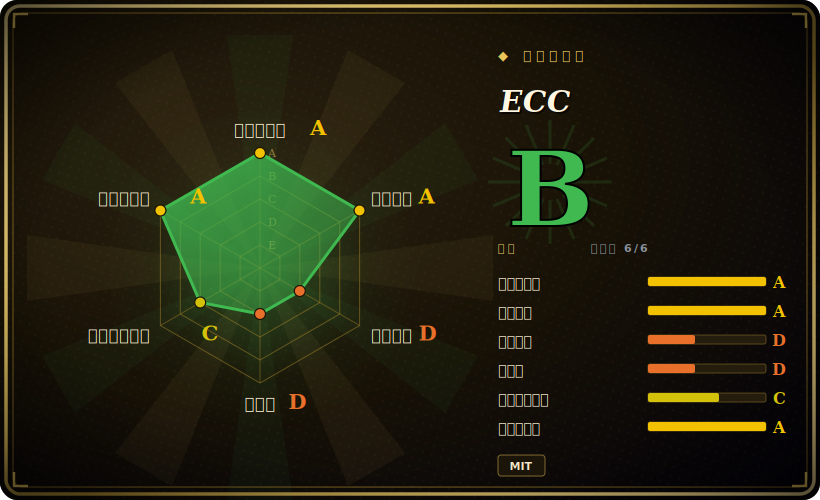

# ECC

一套跨 harness 的「agent 操作系统」：用一个仓库把数百个 skill、agent、rule、hook、memory/instinct 学习，以及一个安全扫描器，一次性装进 Claude Code（以及 Codex/OpenCode/Cursor）。

## 何时使用

你日常在跑 Claude Code（或同时用 Codex、OpenCode、Cursor 等多个 harness），手搓的 `~/.claude` 目录已经撑不住了。你在每个项目里反复重写同样的 TDD / code-review / security-review 流程，会话开场就把上下文撑爆，而且什么经验都没法往后带。ECC 用一套有主张、开箱即全的底座解决这个问题：它是一个 Claude Code 插件，你跑 `/plugin install ecc@ecc`，就能拿到庞大的 skill 库、专门化的子 agent（planner、architect、code-reviewer、各语言专属 reviewer）、常驻 rule，以及 Node 实现的 hook——这些 hook 会自动存取会话上下文，并带置信度打分地抽取「instinct」。当你想要一套有人维护、有版本的 harness 栈、而不是自己一点点攒时，选它就对了。

如果你跨多个 agent runtime 工作、又想要*一个*事实源，它同样合适：ECC 提供 harness 中立的会话适配器和 MCP 清单，让同一套 skill/rule/AGENTS.md 约定在 Claude Code、Codex CLI、OpenCode、Cursor 之间通用；另带一个 `/security-scan`（AgentShield）流程，在你信任配置之前先审一遍注入风险、泄露的 secret 和错误配置。

## 何时不用

- **你想要小而可审计、完全自己掌控的配置。** ECC 会把数百个 skill/agent/rule 和一套 hook 运行时装进 `~/.claude`；如果你更想要几个自己完全看得懂、自己版本管理的文件，这是一个很大的继承面和理解负担。
- **你不在 Claude Code / 受支持的 harness 上。** 主目标是 Claude Code；非 Claude harness 用的适配器完成度参差。如果你的 runtime 不在列表里，大部分价值会蒸发。
- **你不放心自动加载的 hook / memory。** hook 会在会话事件上跑 Node 并把数据落到本地；v2.0.0 的发版说明自己就指出「plugin hook 在 Node 21+ 上静默成 no-op」是个已出过的 bug——提醒你这是会动、会改变行为的自动化，而非惰性 prompt。
- **你只需要一个工作流。** 如果你只想要比如一个 TDD 循环或一个安全闸门，把单个 pattern（或一个单一用途的工具）抠出来，比起采纳整层操作系统及其更新节奏要划算。
- **单作者推进速度 / 锁定风险。** 开发推进很快，且高度围绕单一维护者的仓库；把整个 agent harness 绑定到它的发版节奏和约定上，是实打实的锁定。成熟度/弃坑是你押在这一个项目上的赌注。
- **你要的是 provider 中立的方法论，而非以 Claude 为中心的配置。** ECC 形态高度贴 Claude Code；若你想要厂商无关的*原则*而非装好的配置，纯文档型方法论更合适。

## 横向对比

| 替代品 | 是否收录 | 取舍 |
|---|---|---|
| [SuperClaude Framework](superclaude.zh.md) | ✅ | 同为聚焦 Claude 的配置框架（persona、command、MCP）；比 ECC 数百 skill + hook + 安全扫描 + 跨 harness 底座更窄、更轻。 |
| [Superpowers](superpowers.zh.md) | ✅ | 面向 Claude Code 的精选 skill/插件集合；有重叠的 skill 库思路，但没有 ECC 的 memory/instinct hook、安全扫描器和多 harness 适配。 |
| [Compound Engineering](compound-engineering.zh.md) | ✅ | 把一套特定「复利工作流」方法论编码成插件；相比 ECC 的 OS 式大捆绑，更有主张也更小。 |
| [get-shit-done](get-shit-done.zh.md) | ✅ | 轻量的任务执行工作流包；单一哲学，而非 ECC 的全家桶面。 |
| [12-Factor Agents](12-factor-agents.zh.md) | ✅ | provider 中立的 agent 构建*原则*（文档，而非装好的配置）；与 ECC 具体的 Claude Code harness 处于不同层。 |
| dotfiles / 手搓 `~/.claude` | 未收录 | 完全可控、面最小；代价是每个 skill/hook/rule 都得自己维护，而不是继承并更新一套精选栈。 |

## 技术栈

- **语言：** JavaScript / Node.js（仓库主语言）用于 hook、脚本和安装链路；大量 Markdown（带 YAML frontmatter 的 skill/agent/rule）是真正的载荷。
- **工具：** `install.sh` / `install.ps1` 安装器；npm 包 `ecc-universal`（主）与 `ecc-agentshield`（安全审计器）；内部测试套件用 Node 内置 test runner。
- **可选 GUI:** 一个 Python（Tkinter）仪表盘（`ecc_dashboard.py`）。
- **集成面：** Claude Code 插件格式（`/plugin install`）、`hooks.json` + Node hook 脚本、`mcp-servers.json` 做 MCP 接线，以及各 harness 适配器（Codex `AGENTS.md`、OpenCode 插件 hook、Cursor、GitHub Copilot 指令文件）。

## 依赖

- **运行时：** Node.js（执行 hook 和 setup 脚本）。README 称主目标为 Claude Code CLI v2.1.0+ [未验证]。v2.0.0 说明点名修了 Node 21+ 的 hook 回归——版本敏感性是真实存在的。
- **可选：** 仪表盘 GUI 需 Python 3；多 agent 编排需 PM2;MCP 特性需 MCP 服务器（GitHub、Supabase、Vercel、Context7、Exa、Playwright 等）——每个都是各自的外部依赖/凭据。
- **存储：** 仅本地——memory/metrics 落在 `~/.claude/session-data/`、`~/.claude/skills/learned/`、`~/.claude/metrics/`；无外部后端。
- **安装：** `/plugin install ecc@ecc`（插件路径），或 `npm install && ./install.sh --profile full`（手动）。

## 运维难度

**低到中。** 插件安装一条命令搞定，系统纯客户端（无服务端可跑），上手很容易。难度上升，是因为你装进去的东西又大又*活*：数百个 skill/agent/rule，外加在会话事件上触发、并改写本地 memory 的 Node hook。你要继承它的更新节奏、env 变量调参（`ECC_HOOK_PROFILE`、`ECC_SESSION_START_MAX_CHARS`、`ECC_AGENT_DATA_HOME`）、Node 版本敏感性（v2.0.0 那个 Node 21+ hook 修复）和跨 harness 适配器的各种坑。排查一个意外行为，意味着要穿过 hook 脚本和一大棵配置树，而非翻几个你自己写的文件。

## 健康度与可持续性

- **维护（2026-06）：** 活跃（且快速）维护——最后 push 在 2026-06，处于 v2.0.0 线，未归档。较高的 open issue 数（约 100）加上 v2.0.0 说明里自曝的「hook 在 Node 21+ 上静默成 no-op」回归，既说明推进很快，也说明这些会改变行为的自动化仍在稳定中。
- **治理与 bus factor：** 仓库为 **User 持有**（affaan-m），即单维护者项目——约 222k star 的光环对应仅一人的背书，这是 **bus-factor 红旗**，而非安全信号。「何时不用」一节已点名「单作者推进速度 / 锁定风险」；你是把整个 agent harness 押在一个人的发版节奏上。[未验证] 未公布基金会、公司或共同维护者的治理结构。
- **年龄与 Lindy（2026-06）：** 创建于 2026-01，约 5 个月。对于一个自我定位为装进 `~/.claude` 的「agent 操作系统」而言极其年轻。Lindy 裁决：**不满足寿命先验**——没有历史记录，破坏性改动节奏大概率高；当作早期采用者工具，pin 版本，预期抖动。
- **风险标记：** MIT 许可（未见 relicense）。真正的风险是 **Node 版本敏感性**（已出过的 Node 21+ hook bug）、**自动加载并改写本地状态的 hook**，以及单维护者结构带来的弃坑暴露。内置的 `/security-scan`（AgentShield）审的是*你的*配置，并不能为 ECC 自身的面去风险。

## 存疑（未验证）

- [未验证] v2.0.0 据 GitHub release API 发布于 2026-06-10；某二手来源把它渲染成 2024——以 2026-06 这条 maturity 为准，并在发版页面再核实。
- [未验证] skill/agent/command/rule 数量随来源和版本变动（README 称约 271 skill / 67 agent;v2.0.0 说明称 261 skill / 64 agent / 84 command）。数量逐版变化，请对照当前仓库核实。
- [未验证] GitHub star（截至 2026-06 约 211.9k–221.9k）——本生态 star 不可靠且对时间敏感，仅供参考。
- [未验证] npm 包名（`ecc-universal`、`ecc-agentshield`）、Tkinter 仪表盘、PM2 编排，以及 AgentShield「1,282 测试 / 102 规则」均来自 README，未对照已发布的包独立确认。
- [未验证] Claude Code CLI v2.1.0+ 最低版本，以及受支持的非 Claude harness 集合 / 适配器完成度均来自项目文档，未独立测试。
- [推断] 定型为 `framework`（而非 `skill-pack`），因为除 prompt/skill 载荷外，它还附带真实运行时工具（Node hook、安装器、版本相关行为、env 变量配置、本地状态）——即确有技术栈/依赖/运维。若只取其 Markdown 载荷，把这堆 prompt 集合单独看作 skill-pack 也属合理。
