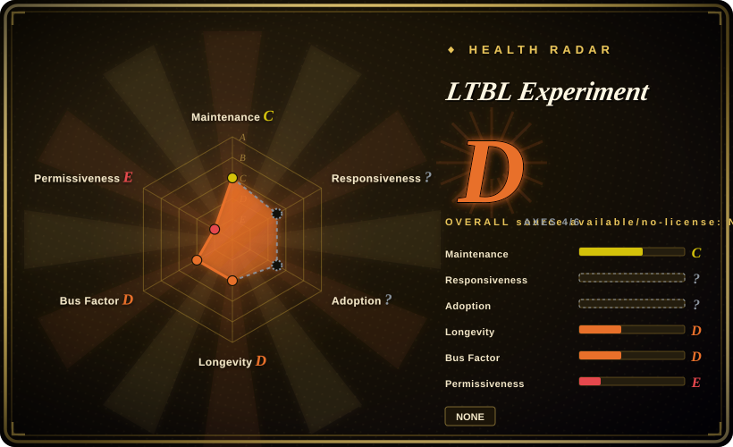

# LTBL Experiment

An unfinished experiment design and index to three early Rust/WebGPU implementation groups; it is not runnable software, a result-bearing benchmark, or evidence that one agent methodology outperforms another.

## When to use

You're studying how the amount and structure of design context might change an AI coding agent's implementation choices. Rather than reading another methodology's claims, you want a small case design that holds the target project roughly constant and links three codebases produced under different context conditions: full parley methodology, good starting documentation with minimal ongoing methodology, and thin documentation as a control group.

You choose this repository only as the map to those three groups and as a prompt for designing a stronger experiment of your own. The repository itself contains only the experiment description; all Rust/WGSL code lives in `ltbl-force`, `ltbl-brute`, and `ltbl-ignorance`, and no comparative results have been published here.

## When NOT to use

- **You need software you can clone and run.** Use `ltbl-force`, `ltbl-brute`, or `ltbl-ignorance` instead; this repository contains only a README and has no manifest, source tree, build command, or executable entry point.
- **You need a maintained Rust/WASM renderer to extend.** Use `bdeansrowe/beam` instead; it is a later, larger MIT-licensed renderer repository, while the three LTBL groups are small snapshots with no declared license.
- **You need a mature game engine for an actual pinball game.** Use Bevy instead; the linked implementations stop at an early wavefront ray-tracing prototype and do not provide a complete game, physics stack, editor, or asset pipeline.
- **You need a repeatable coding-agent benchmark with scoring and datasets.** Use SWE-bench or another benchmark harness instead; LTBL publishes no runner, metric definition, result table, raw agent transcripts, or statistical analysis.
- **You need evidence that richer context improves agent output.** Use a study with preregistered metrics, controlled model settings, and published observations instead; this repository states a question but does not report a conclusion.
- **You need code or documents with explicit reuse rights.** Use MIT- or Apache-licensed alternatives such as Beam, Bevy, or wgpu instead; neither this index nor the three linked groups exposes a license file.

## Comparison

| Alternative | In index | Our verdict | Tradeoff |
|---|---|---|---|
| `bdeansrowe/ltbl-force` | not indexed | Read `ltbl-force` when you need the actual code produced under the full-parley condition; read this page only to understand how that group relates to the experiment. | The group has Rust/WGSL source and extensive context documents, but it is incomplete and has no declared license or published comparative score. |
| `bdeansrowe/ltbl-brute` | not indexed | Read `ltbl-brute` when the condition of good starting documents with little ongoing methodology is the subject; it is not an independent finished renderer. | It contains more rendering code than the index, but interpretation depends on comparing it with the two sibling groups under undocumented controls. |
| `bdeansrowe/ltbl-ignorance` | not indexed | Read `ltbl-ignorance` when you need the thin-documentation control implementation; do not treat its smaller context as proof of a causal result. | It provides the control-group code snapshot, but no experiment report establishes which differences came from context rather than model or session variation. |
| `bdeansrowe/beam` | not indexed | Choose Beam when you want the author's later, runnable Rust/WGPU renderer rather than an experiment index. | Beam is larger, newer, and MIT-licensed; it no longer preserves the three-condition comparison that is LTBL's only distinctive value. |
| SWE-bench | not indexed | Choose SWE-bench when you need standardized tasks and measurable coding-agent outcomes; choose LTBL only for a qualitative parallel-implementation case idea. | SWE-bench sacrifices the shared greenfield game scenario for scale, scoring, and reproducibility; LTBL has the scenario but not the measurement apparatus. |

## Tech stack

- **This repository:** one Markdown README; GitHub reports no primary programming language.
- **Linked implementation groups:** Rust targeting `wasm32-unknown-unknown`, wgpu 27, WebGPU, winit 0.30, WGSL compute shaders, and browser-hosted WASM.
- **Prototype scope:** ray generation, analytic sphere intersection, HDR storage texture output, and partial BVH or shading work depending on the group; none of the three repositories shows a finished pinball game.
- **Experiment representation:** three separate Git repositories, not a shared harness or monorepo with controlled build and evaluation scripts.

## Dependencies

- **To read this index:** none beyond a Markdown viewer and network access to the three linked repositories.
- **To build a linked group:** Rust toolchain, the `wasm32-unknown-unknown` target, `wasm-pack`, `basic-http-server`, and a browser with WebGPU support, according to their READMEs.
- **Missing experiment dependencies:** no pinned agent model, harness version, prompt transcript format, seed, timing protocol, or scoring package is provided in this repository.

## Ops difficulty

**Low for reading, high for reproducing the claimed experiment shape.** Opening the index is trivial, and each linked group documents a short local build path. A credible reproduction is much harder: you must reconstruct the agent sessions, freeze the model and harness, define comparable milestones and metrics, preserve transcripts, and decide how to separate context effects from ordinary stochastic or implementation variation. The repository supplies none of that operational experiment harness.

## Health & viability

- **Maintenance, as of 2026-07:** the index received three commits over 2026-05-09 to 2026-05-10 and has not changed since. The final commit only edits README wording. It is not archived, but there is no continuing experiment log.
- **Content sufficiency:** it clears the oss-atlas inclusion bar because it defines a concrete research question and links three real, non-empty implementation groups. Its selectable value is limited to being an experiment map and design reference.
- **Completion status:** no results, observations, scoring rubric, raw transcripts, experiment diary, or final report are present. Treat the study as unfinished, not as a benchmark with an unknown winner.
- **Governance and bus factor:** all four repositories are owned by one user and show no external contributors or governance. Continuity and interpretation depend on that author.
- **Age, adoption, and license:** the index is about two months old, has 0 stars, no release, no issues, and no license file. Age provides no Lindy signal, and missing reuse terms are a practical blocker for incorporating its material.

## Caveats (unverified)

- [未验证] No license file was found in the index or the three linked implementation repositories; GitHub reports no detected license, so reuse rights require clarification from the author.
- [未验证] The exact model, agent harness, prompts, session controls, compute environment, and human interventions used for each group are not documented in the index.
- [未验证] No published observations establish that implementation divergence correlates with context quality, despite that being the stated measurement goal.
- [推断] Differences among the three codebases may reflect uncontrolled model or session variation rather than the named methodology condition.
- [推断] The later `bdeansrowe/beam` repository may represent continued renderer work, but the upstream material does not state that it is the experiment's result or successor.
