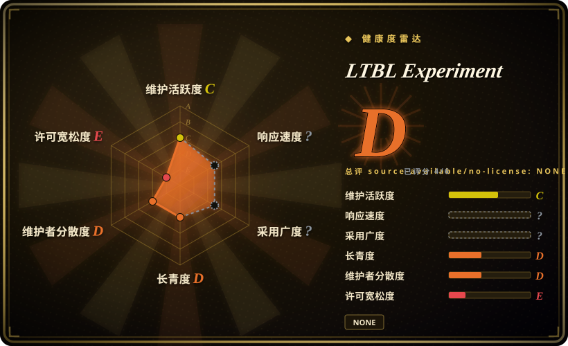

# LTBL Experiment

一个未完成的实验设计与三个早期 Rust/WebGPU 实现组的索引；它不是可运行软件，不是已有结果的 benchmark，也不能证明某种 agent 方法优于另一种。

## 何时使用

你正在研究设计上下文的数量和结构是否会改变 AI coding agent 的实现选择。你不想只读另一套方法论的自述，而想看一个尽量固定目标项目、再链接三种不同上下文条件下代码库的案例设计：完整 parley 方法、较好的起始文档但很少持续方法论，以及薄文档控制组。

只有当你要把这个仓库当作三个实验组的地图，或借它设计一项更严谨的实验时，才应选择它。仓库自身只有实验说明；Rust/WGSL 代码全部位于 `ltbl-force`、`ltbl-brute`、`ltbl-ignorance`，这里没有发布任何比较结果。

## 何时不用

- **你需要 clone 后可以直接运行的软件。** 改用 `ltbl-force`、`ltbl-brute` 或 `ltbl-ignorance`；本仓库只有 README，没有 manifest、源码树、构建命令或可执行入口。
- **你需要一个可继续扩展的 Rust/WASM renderer。** 改用 `bdeansrowe/beam`；它是作者后来发布的更大且采用 MIT 的 renderer，而三个 LTBL 组只是没有声明许可证的小型快照。
- **你要做一款真正的弹球游戏。** 改用 Bevy；几个关联实现都停在早期 wavefront ray-tracing 原型，没有完整游戏、物理系统、编辑器或资产流水线。
- **你需要带评分与数据集、可重复执行的 coding-agent benchmark。** 改用 SWE-bench 或其他 benchmark harness；LTBL 没有 runner、指标定义、结果表、原始 agent transcript 或统计分析。
- **你要证明更丰富的上下文能改善 agent 输出。** 改用预注册指标、固定模型条件并发布观察结果的研究；本仓库只提出问题，没有给出结论。
- **你需要具备明确复用权的代码或文档。** 改用 Beam、Bevy、wgpu 等 MIT 或 Apache 许可项目；本索引及三个实现组都没有许可证文件。

## 横向对比

| 替代品 | 是否收录 | 我们的评价 | 取舍 |
|---|---|---|---|
| `bdeansrowe/ltbl-force` | 未收录 | 如果要读完整 parley 条件下实际产出的代码，选 `ltbl-force`；本页只负责解释它在实验中的位置。 | 该组有 Rust/WGSL 源码和大量上下文文档，但仍未完成，也没有声明许可证或发布比较分数。 |
| `bdeansrowe/ltbl-brute` | 未收录 | 如果研究对象是“较好起始文档、很少持续方法论”这一条件，读 `ltbl-brute`；不要把它当独立完成的 renderer。 | 它比索引仓库包含更多渲染代码，但解释这些代码必须和另外两组对照，而控制条件没有完整记录。 |
| `bdeansrowe/ltbl-ignorance` | 未收录 | 如果需要薄文档控制组实现，读 `ltbl-ignorance`；不要把较少上下文本身当成因果结论。 | 它给出控制组代码快照，但没有实验报告证明差异来自上下文，而非模型或会话波动。 |
| `bdeansrowe/beam` | 未收录 | 如果要作者后来仍可运行的 Rust/WGPU renderer，选 Beam；不要选这个实验索引。 | Beam 更大、更新、采用 MIT；代价是它不再保留 LTBL 唯一有辨识度的三条件比较。 |
| SWE-bench | 未收录 | 如果需要标准任务和可量化 coding-agent 结果，选 SWE-bench；LTBL 只适合作为平行实现案例的想法来源。 | SWE-bench 放弃共同的 greenfield 游戏场景，换来规模、评分与可复现性；LTBL 有场景，却没有测量装置。 |

## 技术栈

- **本仓库：** 只有一份 Markdown README；GitHub 未识别主要编程语言。
- **关联实现组：** Rust 编译到 `wasm32-unknown-unknown`，使用 wgpu 27、WebGPU、winit 0.30、WGSL compute shader 和浏览器内 WASM。
- **原型范围：** 包含 ray generation、解析球体求交、HDR storage texture 输出，以及各组不同程度的 BVH 或 shading 工作；三个仓库都没有完成弹球游戏。
- **实验表达：** 三个分离的 Git 仓库，不是带统一构建和评测脚本的共享 harness 或 monorepo。

## 依赖

- **阅读本索引：** 除 Markdown 阅读器和访问三个关联仓库的网络外，没有其他依赖。
- **构建关联组：** 根据各自 README，需要 Rust toolchain、`wasm32-unknown-unknown` target、`wasm-pack`、`basic-http-server` 和支持 WebGPU 的浏览器。
- **缺失的实验依赖：** 本仓库没有固定 agent model、harness 版本、prompt transcript 格式、seed、计时协议或评分包。

## 运维难度

**阅读很低，复现实验则很高。** 打开索引很简单，每个关联组也记录了较短的本地构建路径。但要可信地重现实验，你得重建 agent 会话，固定模型与 harness，定义可比里程碑和指标，保存 transcript，并区分上下文影响与普通随机波动或实现差异。本仓库没有提供这些实验运维设施。

## 健康度与可持续性

- **维护，截至 2026-07：** 索引只在 2026-05-09 至 2026-05-10 之间收到三个提交，之后没有变化；最后一次提交仅修改 README 措辞。仓库未归档，但也没有持续实验日志。
- **内容充足度：** 它越过 oss-atlas 的收录门槛，因为它提出了具体研究问题，并链接三个真实、非空的实现组。它能被选择的价值仅限于实验地图和设计参考。
- **完成状态：** 没有结果、观察记录、评分 rubric、原始 transcript、实验日记或最终报告。应把它视为未完成研究，而不是胜负未知的 benchmark。
- **治理与 bus factor：** 四个仓库都由同一个用户拥有，没有外部贡献者或治理机制。项目连续性和解释权依赖单一作者。
- **年龄、采用与许可：** 索引约两个月大，0 star，没有 release、issue 或许可证文件。年龄没有形成 Lindy 信号，缺少复用条款也会直接阻碍材料整合。

## 存疑（未验证）

- [未验证] 索引与三个关联实现仓库均未发现许可证文件，GitHub 也没有识别许可证；复用权需要向作者确认。
- [未验证] 索引没有记录每组采用的确切模型、agent harness、prompt、会话控制、计算环境和人工干预。
- [未验证] 尽管项目称要测量实现差异是否与上下文质量相关，但没有发布观察结果来建立这种关系。
- [推断] 三个代码库的差异可能来自未控制的模型或会话波动，而不只是命名的方法论条件。
- [推断] 后来的 `bdeansrowe/beam` 可能延续了 renderer 工作，但上游材料没有说它是本实验的结果或继任项目。
