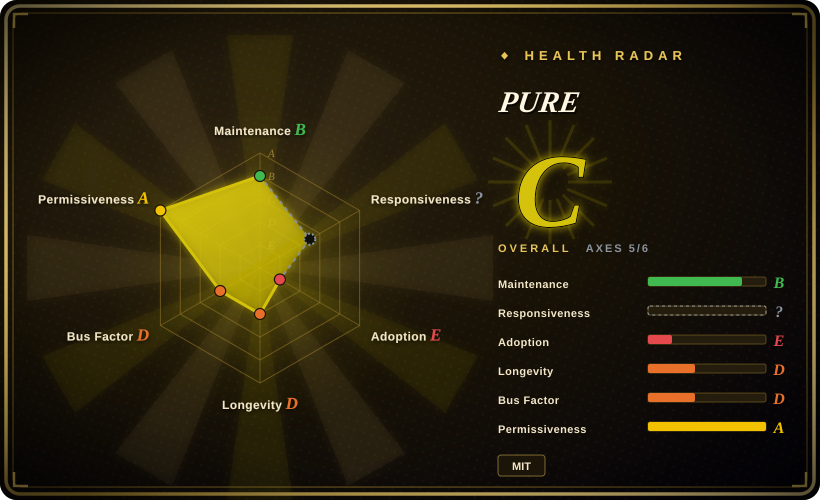

# PURE

An intent-anchored coding-agent framework that combines thin specs, phase gates, knowledge blocks, agent and skill registries, JSON schemas, and tested Shell utilities in a file-based workflow.

## When to use

You're operating coding agents across more than one session and need every deliverable to remain traceable to an approved intent. Plain prompts are no longer enough: you want compact specs, explicit human gates, machine-readable handoffs, a registry that routes work by capability, and a durable session record that a fresh agent can resume without replaying the whole conversation.

You choose PURE over a prose-only methodology when you want those rules embodied in files, JSON schemas, and small scripts that can fail a check. Its main tradeoff is deliberate structure: it remains provider- and harness-neutral at the document level, but adopting it means accepting its PURPOSE→UNIFY→LAUNCH→SHIELD→EVOLVE lifecycle and repository layout.

## When NOT to use

- **You need a mature framework with multi-year adoption evidence.** Use [Superpowers](superpowers.md) or [Spec Kit](spec-kit.md) instead; PURE is a one-week public code history with a v0.1.0 release and one maintainer.
- **You want only design principles, not repository machinery.** Use [12-Factor Agents](12-factor-agents.md) or [USDAD](usdad.md) instead; PURE adds intents, specs, sessions, registries, schemas, hooks, scripts, and archive conventions.
- **You need a vendor-supported spec CLI and generated project scaffolding.** Use [Spec Kit](spec-kit.md) instead; PURE's integration layer is plain files and Shell scripts that you wire into your chosen harness.
- **You need a Claude Code-specific, batteries-included harness with broader security and memory tooling.** Use [ECC](ecc.md) instead; PURE is narrower and prioritizes intent traceability and open handoff formats.
- **Your environment cannot depend on Bash and common Unix utilities.** Use Spec Kit or a native workflow for your platform instead; PURE's operational controls and test suite are Shell-first, and Windows portability is not demonstrated.
- **You are building the production runtime for an end-user AI agent.** Use LangGraph, PydanticAI, or AgentScope instead; PURE governs how coding work is specified and handed off, not model execution, queues, deployment, or runtime observability.

## Comparison

| Alternative | In index | Our verdict | Tradeoff |
|---|---|---|---|
| [Superpowers](superpowers.md) | ✅ | Choose Superpowers when installable cross-harness SDLC skills matter more than explicit intent and knowledge-block schemas; choose PURE when the auditable file protocol is the deciding requirement. | Superpowers is easier to activate and has broader mindshare; PURE exposes more project state as versioned data but requires repository adoption. |
| [Spec Kit](spec-kit.md) | ✅ | Choose Spec Kit when a vendor-backed CLI and generated spec workflow are preferred; choose PURE when provider-neutral registries, A2A handoffs, and phase records matter more. | Spec Kit brings a larger ecosystem and polished entry point; PURE is more transparent and decentralized but much younger. |
| [ECC](ecc.md) | ✅ | Choose ECC when you want a broad Claude Code harness with agents, hooks, memory, and security utilities; choose PURE when you want a smaller lifecycle centered on intent lineage. | ECC provides more ready-made capabilities and stronger platform coupling; PURE provides a narrower open file contract with less integration depth. |
| [Get Shit Done](get-shit-done.md) | ✅ | Choose GSD when fresh-context phase planning and command-driven execution are the main need, but account for the indexed upstream's archival; choose PURE when schemas and handoff records outweigh orchestration breadth. | GSD automates a larger delivery loop; PURE is smaller and still live at this URL, but has far less adoption evidence. |
| [USDAD](usdad.md) | ✅ | Choose USDAD when you want a readable historical spec-first methodology to tailor manually; choose PURE when scripts, schemas, tests, and registries must accompany the method. | USDAD has less machinery and lower setup cost; PURE offers executable checks at the cost of more repository structure. |

## Tech stack

- **Primary implementation:** Bash scripts for intent creation, registry queries, status, context budgets, freshness checks, and archival.
- **Data formats:** YAML for intents, registries, and knowledge blocks; JSON Schema for intents, knowledge blocks, and A2A handoffs; Markdown for agents, skills, hooks, specs, and methodology.
- **State model:** Git-tracked `intents/`, `specs/`, `sessions/`, `learned-skills/`, and `registry/` directories rather than a database or hosted control plane.
- **Quality controls:** Shell integration tests under `scripts/__tests__/` plus a GitHub Actions context-check workflow.

## Dependencies

- **Required local tools:** Bash, Git, and common Unix commands used by the scripts, including `awk`, `grep`, `find`, `wc`, `mktemp`, and standard text utilities.
- **Schema validation:** Python 3 with `PyYAML` and `jsonschema`; `context-check.sh` skips schema validation if these packages are absent.
- **Agent harness:** any coding-agent environment capable of loading `AGENTS.md` and role or skill Markdown files. The repository does not install or run an LLM itself.
- **Optional higher tiers:** shared storage, message transport, vector or graph persistence, and signing infrastructure are described for Tier 2/3 but are not bundled as complete services.

## Ops difficulty

**Low to medium for Tier 1; high if you pursue the documented higher tiers.** Tier 1 is a collection of versioned files and local scripts, so there is no server or database to operate. The burden is procedural: keep intents, specs, knowledge blocks, registry entries, and gates consistent, and integrate the checks into the harness and CI. Tier 2/3 sketches shared persistence, learning engines, signed registries, and protocol gateways; implementing those turns PURE from a file workflow into an architecture project.

## Health & viability

- **Maintenance, as of 2026-07:** seven commits landed between 2026-05-20 and 2026-05-26, with one v0.1.0 release and 16 closed repository issues. There has been no push for roughly seven weeks, so the current signal is an early burst rather than a demonstrated cadence.
- **Implementation substance:** this is not only a methodology essay. The repository contains working Shell utilities, JSON schemas, examples, and tests for context checks, intent creation, status, freshness detection, and archival.
- **Governance and bus factor:** a single user owns the repository and is the only recorded contributor. No foundation, company backing, co-maintainer policy, or governance document is published.
- **Age and Lindy:** the repository is about two months old and has 0 stars. It has no longevity prior or external adoption signal; evaluate the artifacts on current fit and expect contract changes.
- **Risk posture:** MIT is permissive and the core dependency surface is small. The larger risk is incomplete scope: Tier 2/3 capabilities are partly examples or architecture descriptions, and prompt-level agent behavior remains harness-dependent.

## Caveats (unverified)

- [未验证] The README install example still uses `github.com/your-org/pure-agentic`, while `QUICKSTART.md` refers to a `pure-approach` source directory; users must substitute the actual clone path.
- [未验证] Provider, model, and harness agnosticism is a design claim. This review did not execute the workflow across multiple agents to verify equivalent behavior.
- [未验证] Tier 2/3 descriptions mention shared stores, learning engines, signed registries, MCP, A2A, and ATF alignment; several are stubs, examples, or design guidance rather than integrated production components.
- [推断] Markdown rules and phase gates can improve traceability, but an LLM can still ignore or misapply them unless the surrounding harness adds enforcement; behavior is not guaranteed.
- [推断] Closed issues show concentrated initial development rather than established community responsiveness because the issue activity and commits come from the same short launch window.
