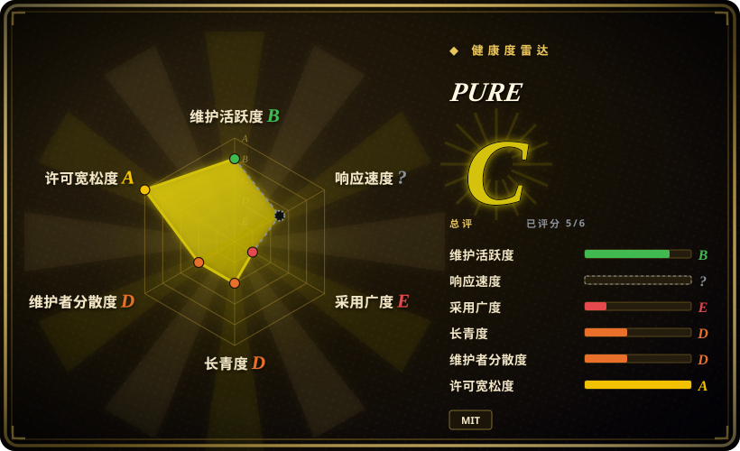

# PURE

一套以 intent 为锚点的 coding-agent 框架，把薄 spec、phase gate、knowledge block、agent/skill registry、JSON Schema 和带测试的 Shell 工具组合成文件式工作流。

## 何时使用

你在多个会话之间运行 coding agent，希望每个交付物都能追溯到一个已批准 intent。普通提示词已经不够：你需要短小规格、显式人工 gate、机器可读交接、按能力路由工作的 registry，以及让 fresh agent 不必重放整段对话就能续接的持久会话记录。

当你不只想读一套文字方法论，还希望规则落实为文件、JSON Schema 和会失败的小脚本时，PURE 比纯文档方案更合适。它的代价也很明确：文档层面不绑定 provider 与 harness，但采用者要接受 PURPOSE→UNIFY→LAUNCH→SHIELD→EVOLVE 生命周期和仓库目录约定。

## 何时不用

- **你需要有多年采用证据的成熟框架。** 改用 [Superpowers](superpowers.zh.md) 或 [Spec Kit](spec-kit.zh.md)；PURE 的公开代码历史只有一周左右，版本为 v0.1.0，且只有一个维护者。
- **你只要设计原则，不想引入仓库机制。** 改用 [12-Factor Agents](12-factor-agents.zh.md) 或 [USDAD](usdad.zh.md)；PURE 会增加 intents、specs、sessions、registry、schemas、hooks、scripts 和归档约定。
- **你需要厂商支持的 spec CLI 与自动生成项目脚手架。** 改用 [Spec Kit](spec-kit.zh.md)；PURE 的集成层是普通文件与 Shell 脚本，需要自己接入选定 harness。
- **你需要 Claude Code 专用、能力更全的 harness。** 改用 [ECC](ecc.zh.md)；它已有更广的 security、memory、agents 和 hooks，而 PURE 更窄，重心是 intent 追溯与开放交接格式。
- **你的环境不能依赖 Bash 与常见 Unix 工具。** 改用 Spec Kit 或平台原生工作流；PURE 的运维控制和测试套件以 Shell 为先，尚未证明 Windows 可移植性。
- **你正在构建面向终端用户的生产 agent runtime。** 改用 LangGraph、PydanticAI 或 AgentScope；PURE 管的是 coding work 如何被规格化与交接，不提供模型执行、队列、部署或运行时观测。

## 横向对比

| 替代品 | 是否收录 | 我们的评价 | 取舍 |
|---|---|---|---|
| [Superpowers](superpowers.zh.md) | 已收录 | 如果可安装、跨 harness 的 SDLC skills 比显式 intent 与 knowledge-block schema 更重要，选 Superpowers；如果可审计的文件协议是决定条件，选 PURE。 | Superpowers 更容易启用，采用面也更广；PURE 把更多项目状态暴露成版本化数据，但要求项目接受它的目录结构。 |
| [Spec Kit](spec-kit.zh.md) | 已收录 | 如果偏好厂商支持的 CLI 与自动生成规格流程，选 Spec Kit；如果 provider-neutral registry、A2A handoff 和阶段记录更重要，选 PURE。 | Spec Kit 有更大生态和更完整入口；PURE 更透明、更分散，但年轻得多。 |
| [ECC](ecc.zh.md) | 已收录 | 如果要带 agents、hooks、memory 和安全工具的完整 Claude Code harness，选 ECC；如果只要围绕 intent lineage 的较小生命周期，选 PURE。 | ECC 提供更多现成能力，也更绑定平台；PURE 的开放文件 contract 更窄，集成深度也更低。 |
| [Get Shit Done](get-shit-done.zh.md) | 已收录 | 如果主要需要 fresh-context 规划与命令驱动执行，选 GSD，但要考虑本索引上游已归档；如果 schema 和交接记录更重要，选 PURE。 | GSD 自动化了更大的交付循环；PURE 在当前 URL 仍未归档，却几乎没有采用证据。 |
| [USDAD](usdad.zh.md) | 已收录 | 如果要一套可手工裁剪的历史 spec-first 方法原稿，选 USDAD；如果方法必须配套脚本、schema、测试和 registry，选 PURE。 | USDAD 机制更少、接入成本更低；PURE 多了可执行检查，也多了仓库结构负担。 |

## 技术栈

- **主要实现：** Bash 脚本负责创建 intent、查询 registry、查看状态、检查上下文预算、检测 freshness 和归档。
- **数据格式：** intent、registry、knowledge block 使用 YAML；intent、knowledge block、A2A handoff 使用 JSON Schema；agent、skill、hook、spec 和方法正文使用 Markdown。
- **状态模型：** 使用 Git 跟踪的 `intents/`、`specs/`、`sessions/`、`learned-skills/`、`registry/` 目录，而非数据库或托管控制面。
- **质量控制：** `scripts/__tests__/` 下有 Shell 集成测试，并提供 GitHub Actions context-check workflow。

## 依赖

- **必需本地工具：** Bash、Git，以及脚本调用的常见 Unix 命令，包括 `awk`、`grep`、`find`、`wc`、`mktemp` 和标准文本工具。
- **Schema 校验：** Python 3 加 `PyYAML` 与 `jsonschema`；缺少这些包时，`context-check.sh` 会跳过 schema validation。
- **Agent harness：** 任何能加载 `AGENTS.md` 和角色或 skill Markdown 的 coding-agent 环境。仓库自身不安装或运行 LLM。
- **可选高阶层：** Tier 2/3 描述了共享存储、消息传输、向量或图持久化与签名设施，但没有把它们作为完整服务打包。

## 运维难度

**Tier 1 为低到中；若实现文档中的高阶层则很高。** Tier 1 只是版本化文件与本地脚本，没有服务器或数据库。负担主要来自流程：持续维护 intent、spec、knowledge block、registry entry 与 gate 的一致性，并把检查接进 harness 和 CI。Tier 2/3 还描绘了共享持久化、learning engine、签名 registry 与协议 gateway；真要实现，会把 PURE 从文件工作流变成架构项目。

## 健康度与可持续性

- **维护，截至 2026-07：** 七个提交集中在 2026-05-20 至 2026-05-26，并发布一个 v0.1.0；仓库有 16 个 closed issue。约七周没有新的 push，因此当前更像一次早期集中开发，而非已证明的稳定节奏。
- **实现含量：** 它不只是方法论文章。仓库包含可运行 Shell 工具、JSON Schema、示例，以及 context check、intent creation、status、freshness detection、archive 的测试。
- **治理与 bus factor：** 一个用户拥有仓库，也是唯一记录到的贡献者。没有基金会、公司支持、共同维护政策或治理文档。
- **年龄与 Lindy：** 仓库约两个月大，0 star。没有寿命先验或外部采用信号；应按当前适配度评估，并预期 contract 仍会变化。
- **风险姿态：** MIT 许可宽松，核心依赖面也很小。更大的风险是范围不完整：Tier 2/3 能力部分只是示例或架构说明，agent 的提示词行为仍取决于 harness。

## 存疑（未验证）

- [未验证] README 的安装示例仍写着 `github.com/your-org/pure-agentic`，而 `QUICKSTART.md` 使用 `pure-approach` 源目录名；用户必须替换成实际 clone 路径。
- [未验证] 不绑定 provider、model 和 harness 是项目设计主张；本次没有在多种 agent 上实际执行流程来核验行为是否等价。
- [未验证] Tier 2/3 提到 shared store、learning engine、signed registry、MCP、A2A 与 ATF；其中若干部件只是 stub、示例或设计指引，并非集成完成的生产组件。
- [推断] Markdown 规则和 phase gate 可以改善追溯性，但若外围 harness 不加约束，LLM 仍可能忽略或错误执行；行为不受保证。
- [推断] Closed issue 反映的是发布窗口内的集中开发，不能直接当作长期社区响应速度，因为 issue 与提交都来自同一短周期。
