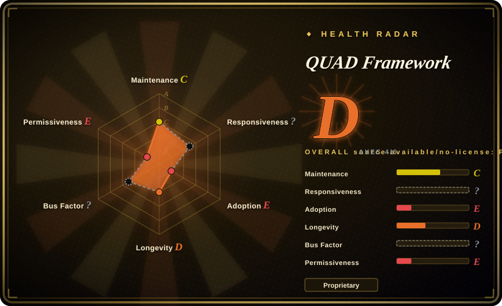

# QUAD Framework

A docs-first agent-development framework that combines a four-Circles operating model, Claude Code rules, a Python CLI, and a self-hosted platform deployment blueprint in one repository.

## When to use

You're an engineering lead defining how management, development, QA, and infrastructure should collaborate around AI-assisted delivery. A coding-only workflow is too narrow: you want role definitions, documentation conventions, Claude Code project rules, a Python CLI, and deployment examples that connect product planning to testing and operations. You choose QUAD over [Spec Kit](spec-kit.md) or [Superpowers](superpowers.md) when the deciding requirement is an organization-level four-Circles model rather than only feature specifications or a coding-agent SDLC loop.

Use it as a reference corpus or controlled evaluation, not as an assumed turnkey platform. The methodology document separately grants CC BY 4.0 rights with attribution, while the repository root license prohibits copying, modification, distribution, and commercial use of the software. Obtain legal confirmation of the applicable file-level license, and obtain written permission or a commercial license before using the proprietary code or platform components.

## When NOT to use

- **You need a working, maintained installer and reproducible bootstrap path.** Use [Spec Kit](spec-kit.md) instead; QUAD's documented GitHub installer URL returned HTTP 404, and at least the `quad-api` and `quad-plugin` submodule repositories returned HTTP 404 during verification.
- **You need an actively maintained coding-agent workflow with a narrower adoption surface.** Use [Superpowers](superpowers.md) instead; QUAD's public commit history stops on 2026-01-14 after a short launch burst, with no releases published by 2026-07-17.
- **You need a batteries-included harness with hooks, memory, security review, and cross-harness adapters.** Use [ECC](ecc.md) instead; QUAD contains Claude rules and a CLI, but its broader platform spans multiple services and inaccessible submodules rather than a verified single-package harness.
- **You need a provider-neutral, Git-tracked handoff protocol that can be adopted without the full platform.** Use [PURE](pure-agentic.md) instead; QUAD's CLI defaults to hosted QUAD endpoints, its rules are Claude-oriented, and its deployment material assumes the project's own service topology.
- **You need a role-heavy planning and delivery method without adopting QUAD's infrastructure stack and proprietary software terms.** Evaluate BMAD Method instead; QUAD couples its four organizational Circles to product-specific agents, services, deployment scripts, and licensing constraints.
- **You need permissively licensed code that your team can fork, modify, redistribute, or embed commercially.** Use [Spec Kit](spec-kit.md), [Superpowers](superpowers.md), or [PURE](pure-agentic.md) instead; QUAD's root license explicitly forbids those uses unless separate permission is obtained.

## Comparison

| Alternative | In index | Our verdict | Tradeoff |
|---|---|---|---|
| [Spec Kit](spec-kit.md) | ✅ | Choose Spec Kit when a maintained spec-driven CLI and generated project workflow matter more than an organization-wide operating model; choose QUAD only when its four Circles and deployment-oriented corpus are the specific evaluation target. | Spec Kit has a narrower, more usable entry point and permissive licensing; QUAD covers more organizational and infrastructure concerns but is inactive and legally constrained. |
| [Superpowers](superpowers.md) | ✅ | Choose Superpowers when you want an installable brainstorm-to-TDD-to-verification workflow inside a coding agent; choose QUAD when you are studying how management, development, QA, and infrastructure roles might share one docs-first model. | Superpowers is focused on the coding lifecycle and easier to activate; QUAD is broader but carries substantially more process, platform, and dependency surface. |
| [ECC](ecc.md) | ✅ | Choose ECC when you need a ready-made harness layer with hooks, memory, security scanning, and cross-runtime adapters; choose QUAD only when the four-Circles organization and platform blueprint are more important than harness completeness. | ECC provides more integrated agent tooling; QUAD provides a wider operating-model narrative but its service graph and submodule integrity require separate repair and validation. |
| [PURE](pure-agentic.md) | ✅ | Choose PURE when auditable intents, schemas, registries, and handoffs should remain provider-neutral and Git-native; choose QUAD when Claude-specific rules and a full product deployment blueprint are useful reference material. | PURE is smaller and easier to inspect but also early; QUAD contains more platform artifacts, with higher operational and licensing costs. |
| BMAD Method | not indexed | Choose BMAD Method when you need a broader role-based product-planning and delivery system; choose QUAD only when its Management, Development, QA, and Infrastructure Circle vocabulary is the deciding fit. | BMAD emphasizes role-driven planning and delivery; QUAD adds a concrete CLI and infrastructure topology, but those additions are inactive, proprietary, and partly inaccessible. |

## Tech stack

- **Methodology and rules:** Markdown documentation defines the four Circles, docs-first flow documents, role hierarchies, agent templates, and Claude Code rules under `.claude/`.
- **CLI and agent code:** Python packages expose `quad login`, `init`, `question`, `deploy`, and hook commands; the repository also contains Python agent modules and Shell, PowerShell, and Batch setup scripts.
- **Web and API blueprint:** documentation and submodules describe Next.js with TypeScript and Tailwind, a Node.js Express API gateway, Java Spring Boot services built with Maven, and PostgreSQL persistence.
- **Infrastructure:** Docker and Docker Compose scripts, Caddy reverse-proxy configurations, Vaultwarden/Bitwarden CLI secret retrieval, and GCP deployment scripts cover DEV, QA, and production-oriented environments.

## Dependencies

- **Methodology-only use:** a Markdown-capable repository and, for the bundled project rules, Claude Code or a harness that can translate the same instructions.
- **Python CLI:** Python 3.9+, `click`, `python-dotenv`, `requests`, `rich`, `openpyxl`, and `psycopg`; login and question flows also depend on QUAD API endpoints or credentials.
- **Full local platform:** Node.js 18+, npm, Java 17+, Maven, PostgreSQL, Docker, Git, Caddy, and the Bitwarden CLI connected to the project's Vaultwarden instance.
- **Hosted and production paths:** GCP services are assumed by deployment commands and documentation. The complete platform also depends on Git submodules, at least two of which were not publicly retrievable during verification.

## Ops difficulty

**High for the full platform; low for reading the methodology alone.** The documentation can be studied without running services, and the Python CLI has a conventional package layout. Operating the described platform is a different proposition: it spans Python, Node.js, Java, Maven, PostgreSQL, Docker networks, Caddy TLS routing, Vaultwarden secrets, GCP deployment, several repositories, and environment-specific scripts. The setup script also contains project-machine assumptions such as `/Users/semostudio/docker/caddy`, while broken installer and submodule URLs make the documented bootstrap path non-reproducible without repair.

## Health & viability

- **Maintenance, as of 2026-07-17:** the repository was created on 2025-12-31, accumulated 172 commits through 2026-01-14, and has no later default-branch activity. It is not archived, but the six-month gap supports the `inactive` maturity label.
- **Distribution integrity:** the documented GitHub installer returns HTTP 404. The `a2Vibes/quad-api` and `a2Vibes/quad-plugin` submodule repositories also return HTTP 404, so a public recursive clone cannot retrieve the complete recorded platform graph.
- **Adoption and governance:** GitHub reports 0 stars, 0 forks, 0 watchers, no releases, and no packages. The repository is organization-owned, but the contributors endpoint returned an empty list and no independent governance structure is published.
- **Age and Lindy:** the repository is about six and a half months old and inactive after its initial two-week development burst. [推断] It has neither age nor continuing activity as a positive longevity prior, so treat it as a snapshot of an approach rather than a durable dependency.
- **License risk:** the root LICENSE is proprietary and restrictive, while `documentation/methodology/QUAD.md` declares that methodology document CC BY 4.0. This component-level split requires legal review before reuse; do not assume the documentation license covers the CLI, rules, deployment scripts, or submodules.

## Caveats (unverified)

- [未验证] The repository's claims of "zero hallucination," quantified productivity gains, faster onboarding, fewer questions, and other efficiency improvements have not been independently validated. LLM behavior is not guaranteed.
- [未验证] HTTP 404 responses do not reveal whether the inaccessible `quad-api` and `quad-plugin` repositories were deleted, renamed, or made private; only their public unavailability was verified.
- [未验证] End-to-end platform completeness could not be tested because the documented installer and part of the submodule graph are unavailable.
- [推断] The four-Circles model may help teams clarify ownership, but its effectiveness relative to Spec Kit, Superpowers, PURE, ECC, BMAD, or conventional delivery practices has not been established by public comparative evidence.
- [推断] Claude rules and documentation conventions are advisory unless the surrounding harness or CI turns them into executable checks; an agent can ignore or misapply prompt-level instructions.
