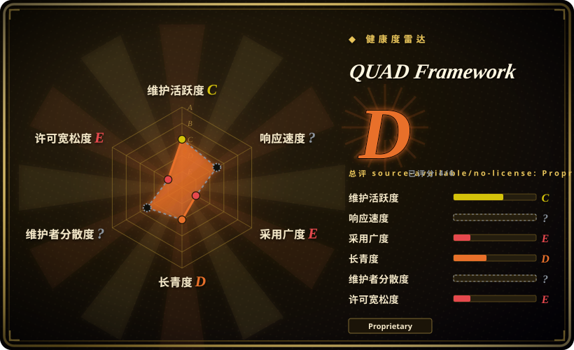

# QUAD Framework

一个文档优先的智能体开发框架，把四 Circles 组织模型、Claude Code 规则、Python CLI 与自托管平台部署蓝图放在同一仓库中。

## 何时使用

你是工程负责人，正在定义管理、开发、QA 与基础设施团队如何围绕 AI 辅助交付协作。只管编码的工作流太窄，你需要角色定义、文档约定、Claude Code 项目规则、Python CLI，以及把产品规划连接到测试和运维的部署示例。当决定性需求是组织级四 Circles 模型，而不只是功能规格或 coding agent 的 SDLC 循环时，你会选择 QUAD，而不是 [Spec Kit](spec-kit.zh.md) 或 [Superpowers](superpowers.zh.md)。

应把它作为参考语料或受控评估对象，而不是默认可直接投产的平台。方法论文档单独以 CC BY 4.0 授权并要求署名，但仓库根许可证禁止复制、修改、分发和商业使用软件。使用前应让法务确认具体文件适用的许可；使用专有代码或平台组件前，还要取得书面许可或商业许可证。

## 何时不用

- **你需要可用且仍维护的安装器，以及可复现的启动路径。** 用 [Spec Kit](spec-kit.zh.md) 代替；QUAD 文档中的 GitHub 安装器地址在核验时返回 HTTP 404，且至少 `quad-api` 与 `quad-plugin` 两个 submodule 仓库也返回 HTTP 404。
- **你需要仍在活跃维护、采用面更窄的 coding agent 工作流。** 用 [Superpowers](superpowers.zh.md) 代替；QUAD 的公开提交历史停在 2026-01-14，集中于短暂的启动期，截至 2026-07-17 仍没有发布版本。
- **你需要带 hook、memory、安全审查和跨 harness 适配器的开箱即用底座。** 用 [ECC](ecc.zh.md) 代替；QUAD 虽有 Claude 规则和 CLI，但更大的平台分散在多个服务与不可访问的 submodule 中，不是经过验证的单包底座。
- **你需要可脱离完整平台采用、与 provider 无关且由 Git 跟踪的交接协议。** 用 [PURE](pure-agentic.zh.md) 代替；QUAD CLI 默认连接 QUAD 托管端点，规则偏向 Claude，部署材料也假设项目自身的服务拓扑。
- **你需要重角色规划与交付方法，但不想承担 QUAD 的基础设施栈和专有软件条款。** 改评 BMAD Method；QUAD 把四个组织 Circles 与项目特定的 agent、服务、部署脚本和许可限制耦合在一起。
- **你需要能由团队 fork、修改、再分发或嵌入商业产品的宽松许可代码。** 用 [Spec Kit](spec-kit.zh.md)、[Superpowers](superpowers.zh.md) 或 [PURE](pure-agentic.zh.md) 代替；除非另获许可，QUAD 根许可证明确禁止这些用途。

## 横向对比

| 替代品 | 是否收录 | 我们的评价 | 取舍 |
|---|---|---|---|
| [Spec Kit](spec-kit.zh.md) | 已收录 | 当仍维护的 spec-driven CLI 与生成式项目工作流比组织级运营模型更重要时，选 Spec Kit；只有在四 Circles 和部署导向语料本身就是评估目标时，才选 QUAD。 | Spec Kit 入口更窄、更容易使用，许可也更宽松；QUAD 覆盖更多组织与基础设施问题，但已经不活跃且受法律限制。 |
| [Superpowers](superpowers.zh.md) | 已收录 | 当你想把 brainstorm、TDD 和验证工作流直接安装进 coding agent 时，选 Superpowers；当你要研究管理、开发、QA 和基础设施角色如何共享文档优先模型时，才选 QUAD。 | Superpowers 聚焦编码生命周期，激活更容易；QUAD 更宽，但流程、平台和依赖面也大得多。 |
| [ECC](ecc.zh.md) | 已收录 | 当你需要带 hook、memory、安全扫描与跨 runtime 适配器的现成底座时，选 ECC；只有当四 Circles 组织方式与平台蓝图比底座完整度更重要时，才选 QUAD。 | ECC 提供更多集成好的 agent 工具；QUAD 给出更广的运营模型叙事，但其服务图和 submodule 完整性需要另行修复与验证。 |
| [PURE](pure-agentic.zh.md) | 已收录 | 当 intent、schema、registry 与 handoff 应保持 provider-neutral 且原生存入 Git 时，选 PURE；当 Claude 专用规则与完整产品部署蓝图适合作为参考材料时，选 QUAD。 | PURE 更小、更容易审计，但同样处于早期；QUAD 有更多平台产物，代价是更高的运维与许可成本。 |
| BMAD Method | 未收录 | 当你需要更广的角色化产品规划与交付系统时，选 BMAD Method；只有在 Management、Development、QA 与 Infrastructure Circle 这套词汇本身最匹配时，才选 QUAD。 | BMAD 强调角色驱动的规划与交付；QUAD 增加了具体 CLI 与基础设施拓扑，但这些部分已不活跃、采用专有许可且部分不可访问。 |

## 技术栈

- **方法论与规则：** Markdown 文档定义四 Circles、文档优先的 flow document、角色层级、agent 模板，以及 `.claude/` 下的 Claude Code 规则。
- **CLI 与 agent 代码：** Python 包提供 `quad login`、`init`、`question`、`deploy` 与 hook 命令；仓库还包含 Python agent 模块，以及 Shell、PowerShell 和 Batch 安装脚本。
- **Web 与 API 蓝图：** 文档和 submodule 描述了采用 TypeScript 与 Tailwind 的 Next.js、Node.js Express API gateway、由 Maven 构建的 Java Spring Boot 服务，以及 PostgreSQL 持久层。
- **基础设施：** Docker 与 Docker Compose 脚本、Caddy 反向代理配置、Vaultwarden 与 Bitwarden CLI 密钥读取，以及 GCP 部署脚本覆盖 DEV、QA 和面向生产的环境。

## 依赖

- **只采用方法论：** 需要能保存 Markdown 的仓库；若要使用随附项目规则，还需要 Claude Code，或能转换同类指令的 harness。
- **Python CLI：** Python 3.9+、`click`、`python-dotenv`、`requests`、`rich`、`openpyxl` 与 `psycopg`；登录和问答流程还依赖 QUAD API 端点或相应凭据。
- **完整本地平台：** Node.js 18+、npm、Java 17+、Maven、PostgreSQL、Docker、Git、Caddy，以及连接项目 Vaultwarden 实例的 Bitwarden CLI。
- **托管与生产路径：** 部署命令和文档假设使用 GCP 服务。完整平台还依赖 Git submodule，其中至少两个在核验时无法公开获取。

## 运维难度

**完整平台为高；只阅读方法论文档为低。** 不运行服务也能阅读文档，Python CLI 也采用常规包结构。但运行文档描述的平台是另一回事，它横跨 Python、Node.js、Java、Maven、PostgreSQL、Docker 网络、Caddy TLS 路由、Vaultwarden 密钥、GCP 部署、多个仓库与环境专用脚本。安装脚本还包含 `/Users/semostudio/docker/caddy` 这样的项目机器假设，而失效的安装器与 submodule 地址让文档中的启动路径无法直接复现。

## 健康度与可持续性

- **维护状态，截至 2026-07-17：** 仓库创建于 2025-12-31，共有 172 次提交，最后一次默认分支活动为 2026-01-14。仓库没有归档，但约六个月无提交，足以支持 frontmatter 中的 `inactive` 判断。
- **分发完整性：** 文档中的 GitHub 安装器返回 HTTP 404。`a2Vibes/quad-api` 与 `a2Vibes/quad-plugin` 两个 submodule 仓库也返回 HTTP 404，因此公开的递归 clone 无法取得记录中的完整平台服务图。
- **采用与治理：** GitHub 显示 0 stars、0 forks、0 watchers、无 release、无 package。仓库由组织账号持有，但 contributors 端点返回空列表，也没有公开的独立治理结构。
- **年龄与 Lindy：** 仓库约六个半月大，在最初两周开发高峰后停止活动。[推断] 它既没有年龄，也没有持续活动形成正向长寿先验，应把它视为一种方法快照，而不是耐久依赖。
- **许可风险：** 根 LICENSE 采用限制性的专有许可，而 `documentation/methodology/QUAD.md` 声明该方法论文档使用 CC BY 4.0。这种按组件拆分的许可在复用前需要法务审查；不要假定文档许可覆盖 CLI、规则、部署脚本或 submodule。

## 存疑（未验证）

- [未验证] 仓库宣称的“zero hallucination”、量化生产率提升、更快入职、更少问答及其他效率收益，尚未得到独立验证。LLM 行为不受保证。
- [未验证] HTTP 404 无法说明 `quad-api` 与 `quad-plugin` 仓库究竟被删除、改名还是转为私有；本次只能确认它们无法公开访问。
- [未验证] 由于文档安装器和部分 submodule 图不可用，无法进行完整平台的端到端测试。
- [推断] 四 Circles 模型可能帮助团队明确责任，但公开资料没有建立它相对 Spec Kit、Superpowers、PURE、ECC、BMAD 或传统交付实践的效果优势。
- [推断] 除非外围 harness 或 CI 把规则转成可执行检查，否则 Claude 规则与文档约定仍是建议性的；agent 可能忽略或误用提示级指令。
