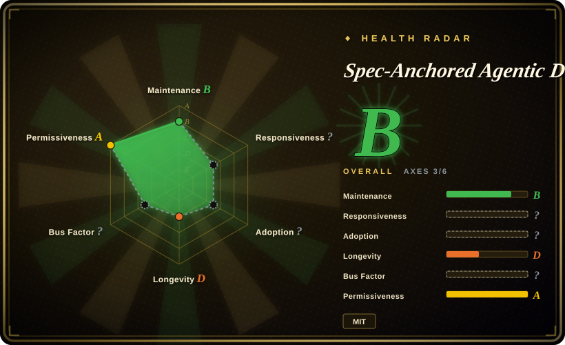

# Spec-Anchored Agentic Development

A methodology and Claude Code bundle that keeps one permanent specification per business capability, checks code against it, and widens agent autonomy only after machine and human evidence gates.

## When to use

You're leading a codebase where AI agents can implement quickly but business decisions disappear into tickets, plans drift from code, and reviewers repeatedly reconstruct intent from the diff. You want each business capability to own a permanent spec containing rules, acceptance criteria, and reference values, with implementation workflows that plan from that spec, dispatch an isolated reviewer, and treat conformance evidence as part of completion. The repository supplies the methodology, spec template, Claude Code skills, commands, reviewer agent, package-by-feature rule, optional spec-first hook, and a narrow-to-wide autonomy playbook.

You choose it over Spec Kit when the spec must remain a standing contract after delivery rather than primarily scaffolding a feature workflow. You choose it over Superpowers when spec conformance and capability organization are the center of the system, accepting that the automation bundle is Claude Code-specific and has almost no adoption history.

## When NOT to use

- **You need a mature, multi-agent installer with broad community validation.** Use Superpowers; this repository is days old, has four commits, and its automation surface targets Claude Code.
- **You want a mainstream spec-driven starter toolkit rather than a permanent capability-contract system.** Use Spec Kit; it has broader tooling and community support with less commitment to this repository's governance model.
- **The task is a small patch with no durable business contract.** Use a normal issue, a focused test, and the existing repository workflow; creating a capability spec for every trivial edit adds ceremony without preserving meaningful decisions.
- **You need a role-heavy product-planning system with analysts, architects, and project phases.** Use BMAD Method; Spec-Anchored Agentic Development is narrower and organized around specs, implementation, review, and conformance.
- **Your repository already has an authoritative skill, command, and hook stack.** Keep that stack or use Compound Engineering as a comparison before adopting selected ideas; copying the bundle can overwrite or conflict with same-named harness files.
- **You want unattended auto-merge before a regression suite has earned trust.** Keep human-approved pull requests and deterministic CI gates, or use a supervised workflow such as Get Shit Done; the autonomy playbook is guidance, not evidence that autonomous changes are safe.

## Comparison

| Alternative | In index | Our verdict | Tradeoff |
|---|---|---|---|
| [Spec Kit](spec-kit.md) | ✅ | Choose Spec Kit for a widely adopted spec-driven starter toolkit; choose this project when permanent capability specs and continuous conformance are the decisive requirements. | Spec Kit has stronger ecosystem and tooling reach, while this project imposes a more durable spec-to-code contract. |
| [Superpowers](superpowers.md) | ✅ | Choose Superpowers for a mature cross-harness brainstorm-plan-TDD-review workflow; choose this project when capability specs and value-by-value conformance should organize the lifecycle. | Superpowers is broader and far more adopted; this project is more spec-centric and Claude-specific. |
| [Get Shit Done](get-shit-done.md) | ✅ | Choose Get Shit Done for a shipping-oriented phased workflow with fresh-context execution; choose this project when the specification must remain the permanent oracle after shipping. | GSD emphasizes phase progression and context management; this project emphasizes durable contracts and review against them. |
| [Compound Engineering](compound-engineering.md) | ✅ | Choose Compound Engineering when reusable workflow automation and accumulated learnings are primary; choose this project when spec drift is the failure mode you most need to expose. | Both provide installable agent methodology, but organize the feedback loop around different artifacts. |
| BMAD Method | not indexed | Choose BMAD Method for a larger role-based planning and delivery system; choose this project for a smaller capability-spec discipline that can start from one file. | BMAD brings more roles and process surface; this project is easier to adopt selectively but much less proven. |

## Health & viability

- **Maintenance snapshot (2026-07):** the repository was created on 2026-07-04 and last pushed on 2026-07-09. It contains four commits and no tagged release or CI workflow.
- **Governance:** the repository is User-owned, has one named author, and exposes no maintainer team, governance process, or release policy.
- **Age and Lindy:** at roughly two weeks old, it has no Lindy evidence. The amount of written material shows effort, but cannot substitute for time, upgrades, or independent adopters.
- **Adoption:** two GitHub stars and no visible contributor history provide almost no external validation of installation safety, workflow usability, or outcome quality.
- **Risk flags:** direct file-copy installation, Claude Code-specific automation, evolving hook APIs, advisory prompt enforcement, no tests or releases, and a methodology whose claimed benefits lack independent evaluation.

## Caveats (unverified)

- [未验证] The methodology's effect on defect rate, delivery speed, review quality, spec drift, or safe autonomy has not been independently measured.
- [未验证] The Claude Code `/goal`, hook, command, agent, and skill wiring must be checked against the installed Claude Code version before adoption.
- [未验证] The repository's external taxonomy and methodology citations were not independently fact-checked in this entry.
- [推断] Prompt and Markdown rules can influence an agent but do not establish compliance; LLM behavior remains nondeterministic and must be backed by executable gates and human review.
- [推断] Copying top-level bundle folders into an existing `.claude/` directory can overwrite or conflict with local files unless the merge is reviewed path by path.
- [推断] `language: Shell` comes from GitHub's primary-language detection for the hook; the repository's main substance is Markdown methodology and configuration content.
