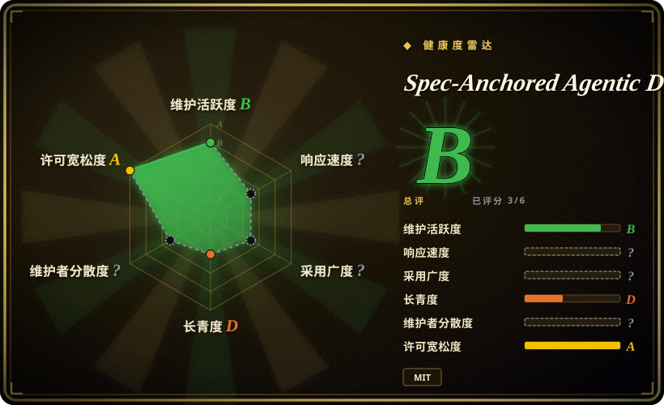

# Spec-Anchored Agentic Development

一套方法论和 Claude Code bundle，为每项业务能力保留一份永久 spec，让代码持续接受 spec 校验，并且只在机器与人工证据充分后逐步扩大 agent 自治范围。

## 何时使用

你负责一个大量使用 AI agent 的代码库。agent 写代码很快，但业务决策会消失在 ticket 里，plan 和代码逐渐漂移，reviewer 每次都要从 diff 反推原意。你希望每项业务能力拥有一份永久 spec，里面记录规则、验收条件和参考值；实现流程从 spec 出发，调用隔离 reviewer，并把 conformance 证据纳入完成条件。这个仓库提供方法论、spec template、Claude Code skills、commands、reviewer agent、package-by-feature rule、可选 spec-first hook，以及从窄到宽的自治 playbook。

当 spec 在交付后仍要作为长期契约，而不是主要充当 feature workflow 的临时脚手架时，选它而不是 Spec Kit。当 spec conformance 和 capability organization 是系统中心时，选它而不是 Superpowers，同时接受自动化 bundle 依赖 Claude Code，并且几乎没有采用历史。

## 何时不用

- **你需要成熟、支持多种 agent、经过大规模社区验证的安装包。** 用 Superpowers；本仓库只有十多天历史、四个 commit，自动化面主要针对 Claude Code。
- **你想要主流的 spec-driven 起步工具，而不是永久 capability contract 系统。** 用 Spec Kit；它的工具和社区覆盖更广，对本仓库治理模型的承诺更少。
- **任务只是小 patch，没有需要长期保存的业务契约。** 使用普通 issue、一个聚焦测试和仓库现有流程；为每个微小修改建立 capability spec 只会增加仪式，不会保存有意义的决策。
- **你需要带 analyst、architect 和 project phase 的重角色产品规划系统。** 用 BMAD Method；本项目更窄，围绕 spec、实现、review 和 conformance 组织。
- **仓库已经有权威的 skill、command 和 hook 栈。** 保持现有栈，或先用 Compound Engineering 做对照，只选择性吸收想法；直接复制 bundle 可能覆盖或冲突同名 harness 文件。
- **你想在 regression suite 还没有可信记录前就无人值守 auto-merge。** 保持人工批准 PR 和确定性 CI gate，或使用 Get Shit Done 这类受监督流程；autonomy playbook 是指导，不是自治修改安全的证据。

## 横向对比

| 替代品 | 是否收录 | 我们的评价 | 取舍 |
|---|---|---|---|
| [Spec Kit](spec-kit.zh.md) | 已收录 | 需要广泛采用的 spec-driven 起步工具时选 Spec Kit；永久 capability spec 和持续 conformance 是硬需求时，选本项目。 | Spec Kit 的生态和工具覆盖更强；本项目对 spec 与代码之间施加更持久的契约。 |
| [Superpowers](superpowers.zh.md) | 已收录 | 需要成熟、跨 harness 的 brainstorm、plan、TDD、review 工作流时选 Superpowers；需要 capability spec 和逐值 conformance 组织全生命周期时，选本项目。 | Superpowers 更全面、采用度高得多；本项目更以 spec 为中心，也更依赖 Claude Code。 |
| [Get Shit Done](get-shit-done.zh.md) | 已收录 | 需要 fresh-context 执行的分阶段交付流程时选 Get Shit Done；spec 在交付后仍必须作为永久判定器时，选本项目。 | GSD 强调 phase 推进和上下文管理；本项目强调持久契约和对照契约做 review。 |
| [Compound Engineering](compound-engineering.zh.md) | 已收录 | 可复用 workflow automation 和经验累积是主目标时，选 Compound Engineering；最需要暴露 spec drift 时，选本项目。 | 两者都提供可安装的 agent 方法论，但围绕不同 artifact 组织反馈回路。 |
| BMAD Method | 未收录 | 需要更大的角色化规划与交付系统时选 BMAD Method；想从一份文件起步的轻量 capability-spec 纪律时，选本项目。 | BMAD 有更多角色和流程面；本项目更容易选择性采用，但远没有得到验证。 |

## 健康度与可持续性

- **维护快照（2026-07）：** 仓库创建于 2026-07-04，最后 push 是 2026-07-09。当前只有四个 commit，没有 tag release 或 CI workflow。
- **治理：** 仓库属于个人账号，只有一位具名作者，没有维护团队、治理流程或 release policy。
- **年龄与 Lindy：** 项目约两周，完全没有 Lindy 证据。文档量说明作者投入过精力，但不能替代时间、升级经历或独立使用者。
- **采用信号：** 两个 GitHub star，且没有可见贡献者历史，几乎不能提供安装安全、workflow 易用性或结果质量的外部验证。
- **风险标记：** 直接复制文件安装、Claude Code 专用自动化、持续变化的 hook API、prompt 级软约束、无测试和 release，以及缺少独立评估的方法论效果。

## 存疑（未验证）

- [未验证] 没有独立测量方法论对缺陷率、交付速度、review 质量、spec drift 或安全自治的影响。
- [未验证] 采用前必须根据实际安装的 Claude Code 版本，核对 `/goal`、hook、command、agent 和 skill wiring。
- [未验证] 本条目没有独立核查仓库引用的外部分类法和方法论来源。
- [推断] Prompt 和 Markdown rule 可以影响 agent，但不能保证遵循；LLM 行为仍有不确定性，必须用可执行 gate 和人工 review 支撑。
- [推断] 把顶层 bundle 目录复制进已有 `.claude/`，可能覆盖或冲突本地文件，除非逐路径 review 合并结果。
- [推断] `language: Shell` 来自 GitHub 对 hook 的主要语言识别；仓库主体其实是 Markdown 方法论和配置内容。
