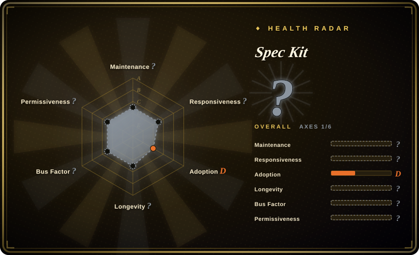

# Spec Kit

An open-source toolkit from GitHub that helps you get started with Spec-Driven Development — focusing on product scenarios and predictable outcomes instead of vibe coding every piece from scratch.

## When to use

You're a developer or product manager who uses AI coding agents (Copilot, Claude Code, Codex, etc.) and you're tired of "vibe coding" — writing a vague prompt, getting code that almost works, and then iterating by feel. You've seen [Superpowers](superpowers.md) and [get-shit-done](get-shit-done.md), but you want a methodology backed by a major vendor with CLI tooling, PRD templates, and GitHub-native integrations rather than a drop-in skill pack. You reach for Spec Kit because it provides a structured spec-driven workflow: write a spec first, define the scenario and expected outcomes, and let the agent build against that contract. It gives you the `specify` CLI, PRD templates, role-based bundles, and AI-agent integrations that turn "build me a feature" into "here is the spec, implement it to these acceptance criteria." Pick Spec Kit over [12-Factor Agents](12-factor-agents.md) when you need a prescriptive day-to-day coding workflow rather than high-level design principles; pick it over [Compound Engineering](compound-engineering.md) when you want a spec-authoring toolkit rather than a session-persistence loop; pick it over [ECC](ecc.md) when you want a focused methodology layer rather than a batteries-included agent harness. It is especially useful when you work on GitHub and want your coding agent to respect a disciplined development process rather than generating ad-hoc solutions.

You also reach for it when you want to standardize how your team uses AI agents. Spec Kit provides extensions, presets, and a documented process (brainstorm → plan → build → review → ship) that can be shared across team members, making agent-assisted development more predictable and reviewable.

## When NOT to use

- **You don't use AI coding agents.** If you write code without AI assistance, use traditional test-driven development or behavior-driven development practices instead of Spec Kit, because Spec Kit is designed around the agent-assisted workflow and loses its primary integration point without a coding agent.
- **You prefer lightweight, ad-hoc coding without formal specs.** If your projects are small experiments, prototypes, or one-off scripts, use direct prompting or [get-shit-done](get-shit-done.md) instead of Spec Kit, because the overhead of writing a PRD and running through a spec-driven phase pipeline may be slower than simply prompting the agent directly.
- **You need a mature, battle-tested methodology.** If you need a spec-driven practice with a proven multi-year track record, use [Superpowers](superpowers.md) or [Compound Engineering](compound-engineering.md) instead of Spec Kit, because Spec Kit was created in 2025-08 and is less than a year old; the practices it encodes are still evolving. [推断]
- **You are not in the GitHub ecosystem.** If you use GitLab or Bitbucket, use [get-shit-done](get-shit-done.md) or [Compound Engineering](compound-engineering.md) instead of Spec Kit, because the tooling and integrations (Copilot-centric bundles, GitHub Pages docs) are optimized for GitHub users and the integration surface is thinner elsewhere. [推断]
- **You need a comprehensive project-management platform.** If you need to track sprints, manage backlogs, or handle cross-team dependencies, use Jira or Linear instead of Spec Kit, because Spec Kit is a methodology and CLI toolkit for agent-driven implementation, not a project lifecycle manager.
- **You want guaranteed outcome quality.** If you need deterministic code generation, use formal methods or traditional TDD with comprehensive human review instead of Spec Kit, because Spec-Driven Development improves predictability but does not eliminate the inherent uncertainty of AI-generated code.

## Comparison

| Alternative | In index | Our verdict | Tradeoff |
| --- | --- | --- | --- |
| [12-Factor Agents](12-factor-agents.md) | ✅ | Choose 12-Factor Agents when you want high-level design principles for production agents rather than a coding-phase spec methodology. | High-level design principles for production agent architecture; more abstract and less prescriptive about the day-to-day coding workflow than Spec Kit. |
| [Superpowers](superpowers.md) | ✅ | Choose Superpowers when you want a drop-in brainstorm→plan→TDD→verify SDLC methodology installed into your coding agent. | Drop-in brainstorm→plan→TDD→verify SDLC methodology for Claude Code; overlapping goals but different packaging (skill/plugin vs CLI toolkit). |
| [get-shit-done](get-shit-done.md) | ✅ | Choose get-shit-done when you want an opinionated phase pipeline that fights context rot with fresh contexts per stage. | Opinionated phase pipeline with fresh-context-per-stage discipline; narrower workflow focus vs Spec Kit's broader spec-driven development toolkit. |
| [Compound Engineering](compound-engineering.md) | ✅ | Choose Compound Engineering when you want a turnkey loop that persists learnings across coding-agent sessions. | Turnkey brainstorm→plan→work→review→compound loop with session-persistence; less about spec authoring and more about iterative improvement. |
| [ECC](ecc.md) | ✅ | Choose ECC when you want a batteries-included Claude Code harness with skills, agents, hooks, memory, and security scanning. | Batteries-included Claude Code harness with a broad feature set; the methodology layer is one part of a larger agent infrastructure. |

## Health & viability
- **Maintenance**: Grade A — 13/13 active weeks in trailing 13; last commit 0 days ago.
- **Responsiveness**: Cannot be scored — unknown.
- **Adoption**: Grade D — 1,919 monthly downloads via pypi.org (package: spec-kit-redist).
- **Longevity**: Grade B — 315 days old.
- **Governance**: Grade A — top-3 contributor share 52.2% (?).
- **Risk / License**: Grade A — MIT license.
## Caveats (unverified)

- [未验证] ~116.8k GitHub stars as of 2026-07-01; the star count is heavily influenced by GitHub branding and AI hype, not necessarily organic production adoption.
- [未验证] The exact CLI commands (`specify`), bundle contents, and AI-agent integrations are evolving rapidly; verify the current release docs before adopting.
- [未验证] GitHub's long-term commitment to Spec Kit as a standalone open-source project (vs. an internal GitHub feature) is unclear; the project may pivot or be absorbed into Copilot workflows.
- [推断] Spec-Driven Development is a promising methodology, but its effectiveness with AI agents depends heavily on the quality of the spec writer and the capabilities of the agent harness; it is not a magic bullet.
- [推断] The project is extremely young (created 2025-08); expect API changes, CLI redesigns, and methodology shifts as it matures.
- [推断] "Predictable outcomes" is an aspirational goal, not a guaranteed property; AI-generated code still requires testing, review, and iteration regardless of how good the spec is.
