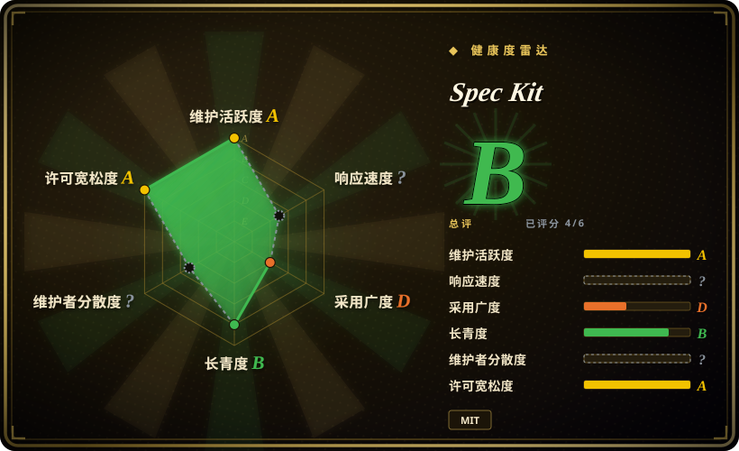

# Spec Kit

GitHub 出品的开源工具包，帮助你上手 Spec-Driven Development——聚焦产品场景与可预测结果，而非从零开始 vibe coding。

## 何时使用

你是开发者或产品经理，使用 AI 编码智能体（Copilot、Claude Code、Codex 等），厌倦了「vibe coding」——写个模糊提示，拿到「差不多能跑」的代码，然后凭感觉迭代。你想要结构化方法论：先写 spec，定义场景和预期结果，再让智能体按契约构建。你装上 Spec Kit，拿到 CLI 工具（`specify`）、PRD 模板、基于角色的 bundle 以及与 AI 智能体的集成，把「给我做个功能」变成「这是 spec，按这些验收标准实现」。如果你在 GitHub 上工作，尤其希望编码智能体尊重有纪律的开发流程，而非生成临时方案，那它非常合适。

当你想标准化团队使用 AI 智能体的方式时，你也会选它。Spec Kit 提供扩展、预设和一套文档化流程（头脑风暴→计划→构建→评审→交付），可在团队成员间共享，让 agent 辅助开发更可预测、更可审查。

## 何时不用

- **你不使用 AI 编码智能体。** Spec Kit 围绕 agent 辅助工作流设计；没有 Copilot、Claude Code 或类似 harness，方法论就失去了主要集成点，价值大打折扣。
- **你偏好轻量级、即兴编码，不写正式 spec。** 如果你的项目是小实验、原型或一次性脚本，写 PRD 并跑完 spec-driven 阶段管线的开销可能比直接提示智能体更慢。
- **你需要成熟、久经检验的方法论。** Spec Kit 创建于 2025-08，至今不足一年。虽然背后有 GitHub，但它编码的 spec-driven 开发实践仍在演进，尚未在多年时间或大规模场景下被证明。[推断]
- **你不在 GitHub 生态里。** 虽然方法论可移植，但工具与集成（以 Copilot 为中心的 bundle、GitHub Pages 文档）针对 GitHub 用户优化。GitLab 或 Bitbucket 团队可能觉得集成面较薄。[推断]
- **你需要综合项目管理平台。** Spec Kit 是方法论和 CLI 工具包，不是 Jira 或 Linear。它不跟踪 sprint、不管理 backlog、不处理跨团队依赖——它帮你为 agent 驱动的实现写 spec，而不是管理项目生命周期。[推断]
- **你想要保证结果质量。** Spec-Driven Development 提升可预测性，但并不能消除 AI 生成代码的固有不确定性。你仍然需要人工审查、测试和迭代。

## 横向对比

| 替代品 | 是否收录 | 我们的评价 | 取舍 |
|---|---|---|---|
| [12-Factor Agents](12-factor-agents.zh.md) | ✅ | 当前页用于它的主场景；如果更看重「生产级 agent 的高层级设计原则，而非日常编码阶段的 spec 方法论」，再选 12-Factor Agents。 | 生产级 agent 架构的高层级设计原则；比 Spec Kit 更抽象，对日常编码工作流的指导性更弱。 |
| [Superpowers](superpowers.zh.md) | ✅ | 当前页用于它的主场景；如果更看重「即插即用的头脑风暴→计划→TDD→验证 SDLC 方法论，装进 coding agent」，再选 Superpowers。 | 即插即用的头脑风暴→计划→TDD→验证 SDLC 方法论，面向 Claude Code；目标有重叠，但打包方式不同（skill/plugin vs CLI 工具包）。 |
| [get-shit-done](get-shit-done.zh.md) | ✅ | 当前页用于它的主场景；如果更看重「有主见的阶段管线，每阶段用全新上下文对抗 context rot」，再选 get-shit-done。 | 有主见的阶段管线，每阶段全新上下文；工作流聚焦更窄，不如 Spec Kit 的 spec-driven 开发工具包 broad。 |
| [Compound Engineering](compound-engineering.zh.md) | ✅ | 当前页用于它的主场景；如果更看重「 turnkey 循环，把经验跨会话沉淀复用」，再选 Compound Engineering。 | 即插即用的 brainstorm→plan→work→review→compound 循环，带会话沉淀；更侧重迭代改进，而非 spec 编写。 |
| [ECC](ecc.zh.md) | ✅ | 当前页用于它的主场景；如果更看重「开箱即全的 Claude Code 底座，含 skill、agent、hook、memory 和安全扫描」，再选 ECC。 | 开箱即全的 Claude Code 底座，功能面 broad；方法论层只是更大 agent 基础设施的一部分。 |

## 健康度与可持续性

- **维护（2026-07）。** 最后 push 于 2026-07-01，持续开发中；项目未归档，由 GitHub 团队维护更新。[推断]
- **治理 / bus factor。** 归属 GitHub（微软）——**极强的背书**信号，维护者流失的 bus factor 风险几乎为零。路线图与 GitHub 的 AI 战略绑定，这既是优势，也是潜在的锁定顾虑。[推断]
- **年龄与 Lindy 判断。** 不足一年（2025-08 创建）⇒ **极弱的 Lindy** 信号。它是一个年轻、靠 hype 推动的项目，star 数庞大但长期 track record 未经检验。GitHub 背书提升了长寿几率，但方法论本身尚未在规模上被证明。[推断]
- **采用度与生态。** 截至 2026-07 约 116.8k star，主要由 GitHub 品牌效应和 AI 编码 hype 驱动；真实生产采用度和社区生态深度在早期阶段尚不清楚。[未验证]
- **风险标记。** MIT 许可，很宽松。主要风险是**厂商战略耦合**：若 GitHub 调整其 AI agent 路线图，Spec Kit 的维护和相关性可能下降。项目极年轻，方法论在成熟过程中可能大幅变化。[推断]

## 存疑（未验证）

- [未验证] 截至 2026-07-01 约 116.8k GitHub star；star 数受 GitHub 品牌效应和 AI hype 影响很大，不一定代表有机的生产级采用。
- [未验证] 具体 CLI 命令（`specify`）、bundle 内容和 AI 智能体集成正在快速演进；采用前请核实当前版本文档。
- [未验证] GitHub 将 Spec Kit 作为独立开源项目（而非内部 GitHub 功能）的长期承诺尚不明确；项目可能转向或被整合进 Copilot 工作流。
- [推断] Spec-Driven Development 是有前景的方法论，但它与 AI 智能体的有效性高度依赖 spec 编写者和 agent harness 的能力；它不是银弹。
- [推断] 项目极年轻（2025-08 创建）；预期 API 变化、CLI 重设计和方法论调整会随成熟过程发生。
- [推断] 「可预测结果」是愿景目标，而非保证属性；无论 spec 多优秀，AI 生成的代码仍需要测试、审查和迭代。
