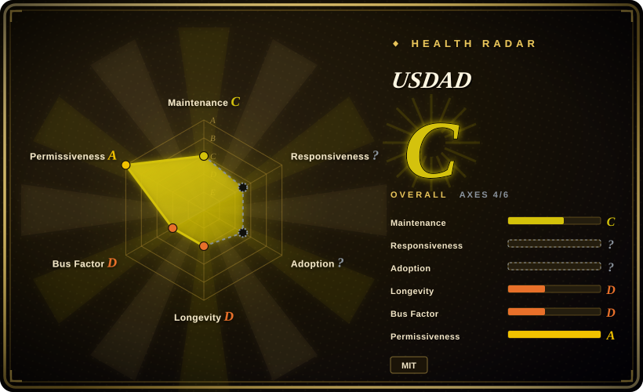

# USDAD

A document-first, spec-driven methodology that coordinates planner, adversary, architect, and executor agents through shared steering and project-context files; it is source material to adapt, not an installable runtime.

## When to use

You're leading an agent-assisted project that will span multiple sessions, models, or coding tools, and the recurring failure is context drift: one agent rewrites the requirements, another forgets an architectural constraint, and implementation starts before anyone has pressure-tested the plan. You want the specification to remain the shared source of truth, with explicit roles for drafting, adversarial review, synthesis, and task-by-task execution under human approval.

You choose USDAD when you want readable methodology source documents that you can inspect and reshape for your own harness, rather than a vendor CLI or a large prebuilt plugin. Its distinguishing choice is a three-layer context model: reusable global steering, project-specific requirements/design/tasks/context, and a human validation interface.

## When NOT to use

- **You need a CLI that creates and validates project specifications.** Use [Spec Kit](spec-kit.md) instead; USDAD provides Markdown conventions and prompts, but no executable generator, schema validator, or release-managed command line.
- **You want an installable brainstorm-to-TDD workflow across coding-agent harnesses.** Use [Superpowers](superpowers.md) instead; it packages runnable skills and platform manifests, while USDAD must be copied and adapted manually.
- **You need machine-checked intents, handoff schemas, freshness gates, and tested maintenance scripts.** Use [PURE](pure-agentic.md) instead; PURE turns similar file-based discipline into schemas and Shell tooling, whereas USDAD remains prose-first.
- **You need an agent workflow for a small fix or disposable prototype.** Use a short `AGENTS.md` plus the project's existing tests and CI instead; USDAD's planner/adversary/architect sequence and persistent context ledger add ceremony that a narrow change may not repay.
- **You want a full simulated software organization with PM, architect, developer, and QA roles.** Evaluate BMAD-METHOD instead; USDAD deliberately uses a smaller four-persona planning and execution model.

## Comparison

| Alternative | In index | Our verdict | Tradeoff |
|---|---|---|---|
| [Spec Kit](spec-kit.md) | ✅ | Choose Spec Kit when a maintained CLI and generated spec workflow matter more than owning the methodology as plain documents; choose USDAD when you want to edit the context model and role prompts directly. | Spec Kit adds executable tooling and vendor backing; USDAD is smaller and more inspectable but leaves all automation and enforcement to you. |
| [Superpowers](superpowers.md) | ✅ | Choose Superpowers when you want a drop-in skill library that drives brainstorm, planning, TDD, and verification; choose USDAD when persistent project context and adversarial spec refinement are the deciding requirements. | Superpowers is easier to install across harnesses; USDAD exposes a more explicit requirements/design/tasks/context structure but has no loader. |
| [PURE](pure-agentic.md) | ✅ | Choose PURE when intent schemas, registries, phase gates, and tested scripts must be executable controls; choose USDAD when a compact, prose-led spec methodology is enough. | PURE supplies more machine-readable governance and operational surface; USDAD is easier to read but depends on disciplined manual adoption. |
| [Get Shit Done](get-shit-done.md) | ✅ | Choose GSD when fresh-context phase execution and installed commands are central; treat its indexed canonical repository as frozen, while USDAD is a static methodology artifact rather than an execution engine. | GSD automates more of the delivery loop but its indexed upstream is archived; USDAD avoids runtime coupling but provides no orchestration. |
| BMAD-METHOD | not indexed | Choose BMAD-METHOD when you want a broader role-based software-organization workflow; choose USDAD when four explicit personas and a smaller context hierarchy are easier to own. | BMAD offers wider lifecycle role coverage at the cost of more process and prompt surface; USDAD is narrower and less automated. |

## Health & viability

- **Maintenance, as of 2026-07:** the public repository has one commit dated 2026-04-27, no tagged releases, no issue activity, and is not archived. Read it as a published methodology snapshot, not a release train.
- **Governance and bus factor:** the repository is owned and authored by one GitHub user, with one recorded contributor and no published governance or succession model. Long-term updates depend on that author.
- **Age and Lindy:** the public repository is under three months old. The README says the method grew out of work done in 2025, but the public artifact itself has no long maintenance record; durability is unproven.
- **Adoption signal:** the README names two related application repositories, but the methodology repository has 0 stars and no external contribution trail. This says little about intrinsic quality, but it provides no independent adoption evidence.
- **Risk posture:** MIT is permissive and there is no runtime supply chain. The main risk is process effectiveness: prompts and documents can guide an agent, but they do not mechanically enforce the workflow.

## Caveats (unverified)

- [未验证] The README says USDAD was used while building `ffb_calcs` and `ffb`; this review did not audit those repositories for faithful adoption or outcome quality.
- [未验证] The methodology's benefits for quality, continuity, and multi-model work have not been validated here against an independent benchmark or controlled comparison.
- [推断] Because the project consists of instructions and templates rather than executable gates, agent compliance depends on the chosen model and harness and is not guaranteed.
- [推断] The repository may be intentionally complete as a historical artifact rather than abandoned; the single-commit history alone cannot distinguish those states.
