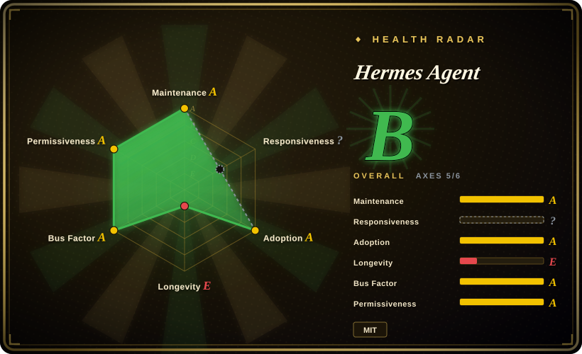

# Hermes Agent

The self-improving AI agent built by Nous Research. It is the only agent with a built-in learning loop — it creates skills from experience, improves them during use, nudges itself to persist knowledge, searches its own past conversations, and builds a deepening model of who you are across sessions. You can run it on a $5 VPS, a GPU cluster, or serverless infrastructure that costs nearly nothing when idle, and talk to it from Telegram while it works on a cloud VM.

## When to use

You are a solo developer or small team running AI agents on a $5 VPS or a GPU cluster, and you need an agent that gets better over time without manual prompt engineering. You have looked at OpenClaw, but OpenClaw is a messaging-native personal assistant with no learning loop — it does not evolve from your conversations. You have looked at AutoGPT, but AutoGPT is a workflow-automation platform focused on task execution, not on accumulating knowledge and skills across sessions. You choose Hermes Agent over both because it is the only one with a built-in learning loop that creates skills from experience, persists knowledge across sessions, and builds a deepening model of you. You also want to talk to it from Telegram while it works on a cloud VM, using any LLM provider you choose.

## When NOT to use

- **Deterministic, repeatable systems** — The learning loop means behavior changes over time, which can make outputs non-deterministic and harder to debug. If you need deterministic automation, use n8n or traditional scripts instead of Hermes Agent, because those tools produce repeatable, predictable outputs.
- **Simple, stateless chatbots** — Hermes is overkill for one-off Q&A; the value is in accumulated memory and skill evolution. If you just need a quick conversational assistant, use OpenClaw instead of Hermes Agent, because OpenClaw is lighter and designed for immediate messaging responses.
- **Enterprise security compliance** — Nous Research is an AI research lab, not an enterprise vendor; there are no SOC 2, SSO, or audit-trail guarantees. If you need enterprise governance, use Dify or AutoGPT's cloud beta instead of Hermes Agent, because those platforms are built for organizational compliance.
- **Coding-only agents** — Hermes is a general-purpose agent framework, not optimized for software engineering tasks. If you need a coding-specific agent, use OpenCode or Claude Code instead of Hermes Agent, because they are purpose-built for terminal-based code editing and execution.
- **Teams needing multi-agent orchestration** — Hermes focuses on single-agent self-improvement, not multi-agent collaboration. If you need multi-agent teams, use LangChain with LangGraph or CrewAI instead of Hermes Agent, because those frameworks are designed for multi-agent orchestration.

## Comparison

| Alternative | In index | Our verdict | Tradeoff |
| --- | --- | --- | --- |
| [OpenClaw](openclaw.md) | ✅ | Personal assistant focused on multi-channel ubiquity. | OpenClaw is a ready-to-run messaging assistant; Hermes is a learning framework you extend. |
| [AutoGPT](../workflow-builders/autogpt.md) | ✅ | Autonomous workflow platform with deployment focus. | AutoGPT targets autonomous task execution and deployment; Hermes targets self-improvement through learning. |
| [OpenCode](../coding-agents/opencode.md) | ✅ | Model-agnostic terminal coding agent. | OpenCode is for coding in the terminal; Hermes is a general conversational agent with a learning loop. |
| [LangChain](../workflow-builders/langchain.md) | ✅ | Lower-level framework for building custom agent pipelines. | LangChain is a toolkit for building from scratch; Hermes is a higher-level agent with built-in memory and skill synthesis. |
| CrewAI | 未收录 | Multi-agent orchestration framework. | CrewAI focuses on multi-agent teams; Hermes focuses on single-agent self-improvement. |

## Tech stack

- **Python** — primary implementation language
- **CLI tooling** — interactive shell, setup wizard, migration tools (`hermes`, `hermes setup`, `hermes doctor`, `hermes claw migrate`)
- **Gateway** — messaging gateway for Telegram, Discord, and other channels (`hermes gateway`)
- **Model-agnostic** — supports any LLM provider via `hermes model`

## Dependencies

- Python runtime (3.10+ recommended)
- An LLM provider (OpenAI, Anthropic, or local models)
- A server or VPS (can run on a $5 VPS)
- Messaging app credentials if using gateway features

## Ops difficulty

**Low to medium**. Installation is straightforward via CLI (`hermes setup`); the agent can run on minimal hardware. The learning loop and skill persistence add some operational complexity — you need to manage the knowledge store and monitor skill quality over time.

## Health & viability
- **Maintenance**: Grade A — 13/13 active weeks in trailing 13; last commit 0 days ago.
- **Responsiveness**: Cannot be scored — no_traffic.
- **Adoption**: Grade B — 377,785 monthly downloads via pypi.org (package: hermes-agent).
- **Longevity**: Grade D — 345 days old.
- **Governance**: Grade B — top-3 contributor share 61.9% (?).
- **Risk / License**: Grade A — MIT license.
## Caveats (unverified)

- [推断] With 207k stars in under a year, the star count may reflect hype rather than verified production adoption.
- [未验证] The "learning loop" that creates skills from experience may produce low-quality or unexpected skills; human review of generated skills may be necessary.
- [未验证] The $5 VPS claim is likely for minimal usage; production workloads with large models may require significantly more resources.
- [未验证] The long-term stability of the skill-persistence mechanism and knowledge store has not been proven in production environments.
