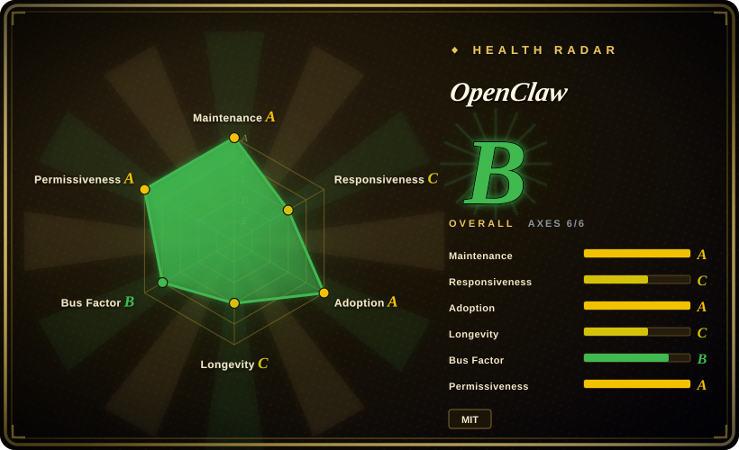

# OpenClaw

A personal AI assistant you run on your own devices. It answers you on the messaging channels you already use — WhatsApp, Telegram, Slack, Discord, Google Chat, Signal, iMessage, IRC, Microsoft Teams, Matrix, Feishu, LINE, Mattermost, Nextcloud Talk, Nostr, Synology Chat, Tlon, Twitch, Zalo, WeChat, QQ, and WebChat — and can speak and listen on macOS, iOS, and Android with a live Canvas you control.

## When to use

You are a privacy-conscious professional who wants a single AI assistant that follows you across all your devices and messaging apps. You have tried cloud-only assistants like Claude or ChatGPT, but you do not want your conversations stored on someone else's servers, and you want the assistant reachable on WhatsApp, Telegram, Slack, Discord, iMessage, and WeChat without switching between different bots. You choose OpenClaw over Hermes Agent because OpenClaw delivers multi-channel ubiquity out of the box — Hermes is a learning-loop framework, not a messaging-native assistant. You choose it over Claude Code or OpenCode because those are coding-specific tools, not general conversational assistants. You install OpenClaw on your own hardware, connect your preferred LLM provider, and it becomes a persistent personal agent that answers you on the channels you already use.

## When NOT to use

- **Multi-user or team scenarios** — OpenClaw is designed as a single-user personal assistant with no RBAC, team workspace, or shared admin dashboard. If you need team collaboration, use AutoGPT or Hermes Agent instead of OpenClaw, because those platforms support multi-user orchestration.
- **Zero-setup SaaS preference** — Self-hosting requires managing a Node.js runtime, LLM API credentials, and per-channel configuration. There is no managed cloud option. If you want something that works without installation, use Claude or ChatGPT instead of OpenClaw, because they are cloud-native with no setup burden.
- **Enterprise compliance needs** — No audit logs, enterprise SSO, or formal security certifications. This is a personal tool, not a governed enterprise platform. If you need enterprise governance, use Dify or n8n instead of OpenClaw, because those platforms offer RBAC, audit trails, and SSO.
- **Coding-specific agent work** — OpenClaw is a general-purpose conversational assistant. For software engineering tasks like code generation and refactoring, use OpenCode or Claude Code instead of OpenClaw, because they are purpose-built for coding with file-editing and terminal execution.
- **You need a learning loop that improves from experience** — OpenClaw does not create skills or persist knowledge across sessions in a self-improving way. If you want an agent that gets smarter over time, use Hermes Agent instead of OpenClaw, because Hermes has a built-in learning loop that synthesizes skills from conversations.

## Comparison

| Alternative | In index | Our verdict | Tradeoff |
| --- | --- | --- | --- |
| [Hermes Agent](hermes-agent.md) | ✅ | Self-improving agent with a learning loop from Nous Research. | Hermes focuses on skill evolution and memory; OpenClaw focuses on multi-channel ubiquity and conversational reach. |
| [AutoGPT](../workflow-builders/autogpt.md) | ✅ | Complex workflow-automation platform with deployment UI. | AutoGPT targets autonomous multi-step task execution; OpenClaw is a lightweight personal chat assistant. |
| [OpenCode](../coding-agents/opencode.md) | ✅ | Model-agnostic terminal coding agent. | OpenCode is for software engineering in the shell; OpenClaw is a general messaging chatbot. |
| [LangChain](../workflow-builders/langchain.md) | ✅ | Lower-level framework for building custom agent pipelines. | LangChain is a library you build on; OpenClaw is a ready-to-run personal assistant app. |
| Claude / ChatGPT native apps | 未收录 | Closed-source cloud-only assistants. | Proprietary and require internet; OpenClaw is self-hosted, MIT-licensed, and channel-agnostic. |

## Tech stack

- **TypeScript** — primary implementation language
- **Node.js** — runtime for the gateway and control plane
- **Cross-platform** — macOS, iOS, Android, and server OS support

## Dependencies

- An LLM provider (OpenAI API, Anthropic API, or a local model endpoint)
- Node.js runtime for the gateway
- A device or server to host the assistant

## Ops difficulty

**Low**. The gateway is a single control plane; installation is straightforward for users comfortable with running Node.js apps. The main ongoing burden is configuring messaging channels and rotating LLM credentials.

## Health & viability
- **Maintenance**: Grade A — 13/13 active weeks in trailing 13; last commit 0 days ago. This is a measured value, reliable.
- **Responsiveness**: Grade ? — 0 qualifying issues/PRs in window; no direct response-speed data. Maintenance=A only means the repo is still committing code; it says nothing about issue-response speed. If the repo has closed its issue tracker or uses Discord/forums, responsiveness is simply unmeasurable via GitHub data alone.
- **Adoption**: Grade A — 14,326,323 monthly downloads via npmjs.org (package: openclaw).
- **Longevity**: Grade C — 221 days old. No proven long-term track record; weak Lindy prior.
- **Governance**: Grade B — top-3 contributor share 75.2%, concentration risk exists; top-1 at 52.8%, so a core maintainer departure could significantly slow the project.
- **Risk / License**: Grade A — MIT license. [已验证] 2026-07-03: GitHub API returns `NOASSERTION`, but the LICENSE file body is standard MIT ("Permission is hereby granted..." complete paragraph). Recognition failure caused by a trailing third-party notice pointer. No relicense history.

## Caveats (unverified)

- [Verified → removable] The `NOASSERTION` license in GitHub metadata matches the MIT badge shown in the README. The LICENSE file is standard MIT; recognition failure is caused by a trailing third-party-notice pointer. Safe for commercial use, but review `THIRD_PARTY_NOTICES.md` for the licenses of incorporated code.
- [推断] With 381k stars on a repo created in late 2025, the star count may be inflated by hype rather than organic production adoption.
- [未验证] The "20+ messaging channels" list includes platforms like WeChat and QQ that may have unstable or unofficial integration APIs.
- [推断] The health radar shows volume tier A but graph tier E, which may indicate most npm downloads are direct installs rather than transitive dependencies, suggesting individual exploration rather than embedded production use.
