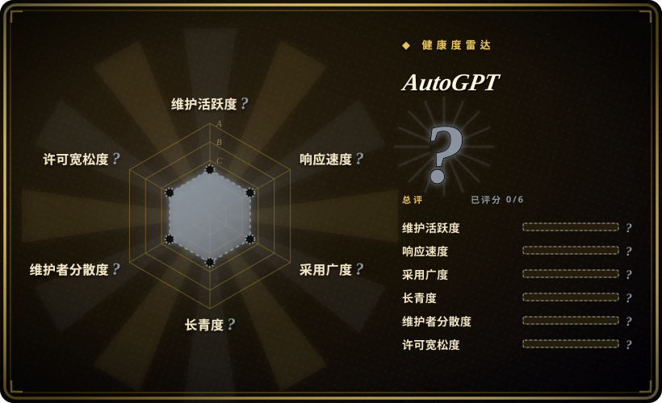

# AutoGPT

一款用于创建、部署和管理持续运行 AI 智能体以自动化复杂工作流的平台——可在自有基础设施上免费自托管，或加入云端托管测试版候补名单。

## 何时使用

你是开发者或团队，需要用无需人工干预即可持续运行的 AI 智能体来自动化复杂的多步任务。你看过 LangChain，但 LangChain 是代码优先的库——你需要自己构建智能体基础设施，没有内置 Web UI 或部署模型。你也看过 Hermes Agent，但 Hermes 是单智能体学习框架，聚焦个人技能进化，而非跨工具编排多步工作流。你选择 AutoGPT 而不是这两者，因为它提供了完整的平台，带有用于构建和监控智能体的 Web UI，以及让它们持续运行的部署模型。你想构建能研究主题、编写代码、管理文件并按计划与 API 交互的智能体，并需要在自己的基础设施上免费自托管的灵活性。

## 何时不用

- **简单、可靠的脚本**——AutoGPT 智能体非确定性，可能意外失败或陷入循环。确定性自动化请改用传统脚本或 n8n，因为这些工具产生可预测、可重复的工作流。
- **低资源边缘部署**——README 指定最低要求为 4 核 CPU、8GB 内存（推荐 16GB）及 10GB 以上可用存储。这不是轻量智能体。如需轻量助手，请改用 OpenClaw 或 Hermes Agent，因为两者都能在 5 美元 VPS 或最低硬件上运行。
- **编码专用智能体**——AutoGPT 是通用自主智能体平台；软件工程请改用 OpenCode 或 Claude Code，因为它们是专为编码设计的，具备文件编辑与终端执行能力。
- **企业支持保障**——Significant Gravitas 是社区组织，不是企业厂商。无 SLA 或正式支持合同。如需企业级支持，请改用 Dify 或 LangChain 配合 LangSmith，因为这些选项提供商业背书与支持层级。
- **成熟稳定的 API**——平台仍在快速演变；云端托管测试版尚未公开可用。如需稳定、已验证的 API，请改用 LangChain，因为 LangChain 有约 3.7 年记录且 API 模式已确立。

## 横向对比

| 替代品 | 是否收录 | 我们的评价 | 取舍 |
| --- | --- | --- | --- |
| [Hermes Agent](hermes-agent.zh.md) | ✅ | 带学习循环的自我改进智能体。 | Hermes 聚焦技能进化与记忆；AutoGPT 聚焦工作流自动化与部署。 |
| [OpenClaw](openclaw.zh.md) | ✅ | 个人多渠道助手。 | OpenClaw 是对话助手；AutoGPT 是带 Web UI 的任务自动化平台。 |
| [OpenCode](opencode.zh.md) | ✅ | 模型无关的终端编码智能体。 | OpenCode 是编码工具；AutoGPT 是带持续执行的通用智能体框架。 |
| [LangChain](langchain.zh.md) | ✅ | 构建智能体管线的底层框架。 | LangChain 是需集成到代码中的库；AutoGPT 是带 UI 和部署模型的高级平台。 |
| CrewAI | 未收录 | 多智能体编排框架。 | CrewAI 聚焦多智能体团队；AutoGPT 聚焦单智能体持续执行。 |

## 技术栈

- **Python**——主要实现语言
- **FastAPI**——后端 API 框架
- **React / Next.js**——平台 Web UI
- **PostgreSQL**——智能体状态与元数据库
- **Redis**——缓存与消息代理

## 依赖

- **硬件**：4 核以上 CPU，最低 8GB 内存（推荐 16GB），10GB 以上可用存储
- **操作系统**：Linux（推荐 Ubuntu 20.04+）、macOS 或带 WSL 的 Windows
- **数据库**：PostgreSQL 用于智能体状态持久化
- **LLM 提供商**：OpenAI API 或兼容端点
- **Docker**：推荐用于部署

## 运维难度

**高**。自托管 AutoGPT 平台需要多个服务（后端、前端、数据库、Redis）、环境配置和持续监控。系统资源密集，且智能体可能以意外方式失败，需要人工监督。

## 健康度与可持续性

- **维护**：Grade A——截至 2026-07 在 7 天内有推送，13 周中有 13 周活跃。454 个开放 issue 表明社区聚焦且可管理。
- **治理**：Grade A——由 Significant Gravitas 所有，过去 12 个月有 18 位活跃维护者。首位维护者占 29.2% 的提交，前三位占 56.2%，核心团队分布较均衡。
- **长期性**：Grade B——1,204 天历史（2023-03 创建），约 3.3 年记录。项目已从最初的“自主 GPT”演示转向完整平台，体现了适应性但也意味着方向变更。
- **采用**：Grade ?——健康雷达因包数据模糊未能评分。GitHub 185k star 虽高，但实际包下载量 footprint 不明。
- **风险旗标**：仓库未声明许可（`NOASSERTION`），为商用或再分发带来法律不确定性。云端托管测试版仍处于封闭测试，公开发布时间表未确认。

## 存疑（未验证）

- [未验证] 仓库未声明许可（`NOASSERTION`），为商用或再分发带来法律不确定性。
- [未验证] 云端托管测试版候补名单已开放较长时间；公开发布时间表不明。
- [推断] 185k star 数主要由 2023 年“自主 GPT”炒作周期推动；当前生产级采用可能显著低于 star 数所示。
- [未验证] 硬件要求（4 核以上、推荐 16GB 内存）针对完整平台；更轻量的使用可能可行，但无官方文档说明。
