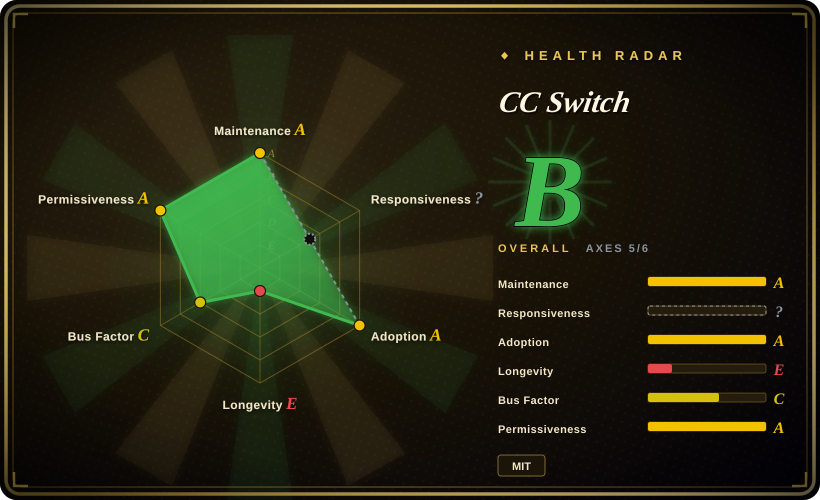

# CC Switch

A cross-platform desktop All-in-One manager for Claude Code, Claude Desktop, Codex, Gemini CLI, OpenCode, OpenClaw, and Hermes Agent — built with Rust and Tauri 2.

## When to use

You're a developer who juggles multiple AI coding agents and assistants across your daily workflow. You switch between Claude Code for deep codebase work, Codex for quick tasks, Gemini CLI for Google-integrated queries, and OpenClaw for personal messaging. Managing credentials, settings, and model providers for each tool is a hassle, and you want a single desktop control plane that unifies them. You install CC Switch, connect your providers once, and manage all your AI tools from one cross-platform interface with provider routing, skill management, and MCP integration.

## When NOT to use

- **Single-tool users** — If you only use one agent (e.g., just Claude Code), CC Switch adds unnecessary overhead.
- **Headless / server-only environments** — CC Switch is a desktop GUI app built on Tauri; it won't run on a headless server or CI pipeline.
- **Team-wide policy enforcement** — There's no RBAC or team-wide admin layer; it's a personal productivity tool, not an enterprise governance platform.
- **No need for provider management** — If you don't switch between LLM providers or manage custom skills/MCP servers, the added abstraction is unnecessary.
- **Lightweight terminal preference** — If you prefer staying entirely in the terminal without a GUI overlay, a Tauri desktop app is not your style.

## Comparison

| Alternative | In index | Our verdict | Tradeoff |
| --- | --- | --- | --- |
| [OpenClaw](openclaw.md) | ✅ | Personal multi-channel AI assistant. | OpenClaw is a self-hosted assistant across messaging apps; CC Switch is a desktop manager for coding agents, not a conversational bot. |
| [Hermes Agent](hermes-agent.md) | ✅ | Self-improving AI agent with a learning loop. | Hermes Agent is an autonomous agent; CC Switch is a management layer for other agents, not an agent itself. |
| [OpenCode](opencode.md) | ✅ | Open-source terminal coding agent. | OpenCode is one of the tools CC Switch manages; they complement rather than compete. |
| Claude Code / Claude Desktop | 未收录 | Official Anthropic desktop IDE integration. | First-party, closed-source; CC Switch adds multi-provider unification but at the cost of a third-party abstraction layer. |
| Cursor / Windsurf | 未收录 | AI-native IDEs with built-in multi-model support. | These are full editors with agent features; CC Switch is a meta-manager, not a code editor. |

## Tech stack

- **Rust** — core backend logic and Tauri 2 integration
- **TypeScript** — frontend UI layer
- **Tauri 2** — cross-platform desktop application framework
- **MCP (Model Context Protocol)** — for connecting custom skills and integrations

## Dependencies

- A supported desktop OS (Windows, macOS, or Linux)
- The AI tools you want to manage (Claude Code, Codex, Gemini CLI, etc.) installed separately
- API keys / credentials for each LLM provider you configure
- System webview (provided by the OS; Tauri 2 uses the native webview engine)

## Ops difficulty

**Low**. CC Switch is a desktop GUI application distributed via standard installer packages. The operational burden is limited to configuring your agent credentials and keeping the app updated. There is no server or database to maintain. However, you must still manage each underlying agent's credentials and updates independently.

## Health & viability

- **Maintenance**: Active — pushed daily as of 2026-07 with a large issue backlog (1,636 open issues) indicating engaged community.[推断]
- **Governance**: Owned by a single user (`farion1231`), not an organization — bus factor is effectively 1. [未验证]
- **Backing**: No corporate backing visible; appears to be an independent project. [未验证]
- **Adoption**: High star count (111.6k) but very young (created 2025-08). The star count likely reflects hype rather than proven longevity.
- **Risk flags**: Extremely young with no Lindy track record. Single maintainer raises bus-factor concerns. [未验证]

## Caveats (unverified)

- [未验证] The `111.6k` star count on a repo created in 2025-08 may be inflated by hype or bot activity rather than organic adoption.
- [未验证] `farion1231` is a personal GitHub account; there may be no team or backup maintainers.
- [未验证] The "official website" claim (`ccswitch.io`) has not been verified for authenticity or ongoing operation.
- [推断] As a meta-manager, CC Switch's value depends on the continued compatibility of the agents it manages; upstream API changes could break integrations quickly.
