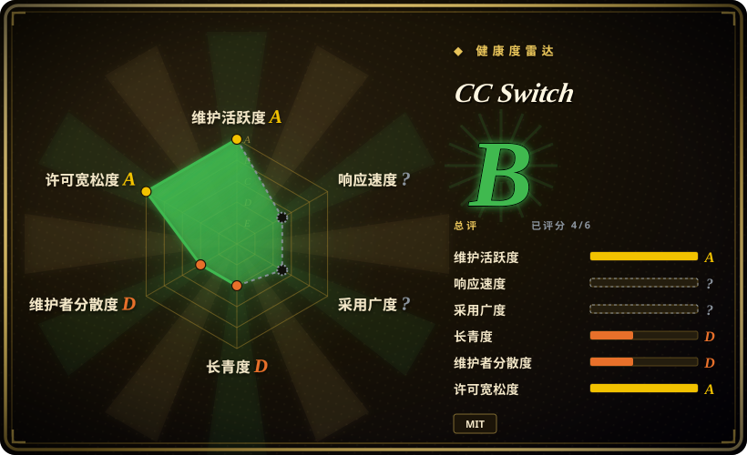

# CC Switch

一款跨平台桌面 All-in-One 管理器，用于管理 Claude Code、Claude Desktop、Codex、Gemini CLI、OpenCode、OpenClaw 和 Hermes Agent——基于 Rust 与 Tauri 2 构建。

## 何时使用

你是一名在日常工作流中同时使用多种 AI 编码智能体与助手的开发者。你在深度代码库工作中用 Claude Code，在快速任务中用 Codex，在需要 Google 集成查询时用 Gemini CLI，在个人消息中用 OpenClaw。你选择 CC Switch 而不是从每个工具各自的终端窗口管理它们，是因为它提供了一个桌面控制平面，统一凭证、设置和模型提供商，并支持可视化提供商路由、技能管理和 MCP 集成。你选择它而不是基于终端的工作流，是因为你想在无需记住 CLI 标志或维护每个工具单独配置文件的情况下切换智能体。你安装 CC Switch，一次性连接所有提供商，即可在一个跨平台 GUI 中管理所有 AI 工具，无需在不同界面之间来回切换。

## 何时不用

- **如果你只使用一个智能体**——请直接用该智能体（如 Claude Code CLI）而不是 CC Switch，因为 CC Switch 对单一工具来说会带来不必要的 GUI 开销和抽象。
- **如果你需要在无头服务器或 CI 流水线中运行**——请直接通过 SSH 或 shell 脚本使用 CLI 智能体而不是 CC Switch，因为 CC Switch 是基于 Tauri 的桌面应用，需要 GUI 环境，无法在无头环境中运行。
- **如果你需要团队级 RBAC、审计追踪或策略管控**——请用 Dify 或 n8n 等受治理平台而不是 CC Switch，因为 CC Switch 没有 RBAC、管理层面或企业合规功能。
- **如果你不在多个 LLM 提供商之间切换，也不管理自定义技能或 MCP 服务器**——请直接用 Claude Code 或 Gemini CLI 等单一智能体而不是 CC Switch，因为如果不需要提供商管理，这层抽象毫无意义。
- **如果你完全偏好终端环境**——请用 tmux 等终端复用器或 shell 别名系统而不是 CC Switch，因为 CC Switch 是基于 Tauri 的 GUI 覆盖层，不是终端原生方案。

## 横向对比

| 替代品 | 是否收录 | 我们的评价 | 取舍 |
| --- | --- | --- | --- |
| [OpenClaw](openclaw.zh.md) | ✅ | 跨多渠道的个人 AI 助手。 | OpenClaw 是自托管的跨消息应用助手；CC Switch 是编码智能体的桌面管理器，不是对话机器人。 |
| [Hermes Agent](hermes-agent.zh.md) | ✅ | 带学习循环的自我改进 AI 智能体。 | Hermes Agent 是自治智能体；CC Switch 是其他智能体的管理层，本身不是智能体。 |
| [OpenCode](opencode.zh.md) | ✅ | 开源终端编码智能体。 | OpenCode 是 CC Switch 管理的工具之一，两者互补而非竞争。 |
| Claude Code / Claude Desktop | 未收录 | Anthropic 官方桌面 IDE 集成。 | 第一方闭源工具；CC Switch 增加了多提供商统一能力，但代价是第三方抽象层。 |
| Cursor / Windsurf | 未收录 | 内置多模型支持的 AI 原生 IDE。 | 这些是带智能体功能的完整编辑器；CC Switch 是元管理器，不是代码编辑器。 |

## 技术栈

- **Rust**——核心后端逻辑与 Tauri 2 集成
- **TypeScript**——前端 UI 层
- **Tauri 2**——跨平台桌面应用框架
- **MCP（Model Context Protocol）**——用于连接自定义技能与集成

## 依赖

- 受支持的桌面操作系统（Windows、macOS 或 Linux）
- 你想管理的 AI 工具（Claude Code、Codex、Gemini CLI 等）需单独安装
- 每个配置的 LLM 提供商的 API 密钥/凭证
- 系统 Webview（由操作系统提供；Tauri 2 使用原生 Webview 引擎）

## 运维难度

**低**。CC Switch 是通过标准安装包分发的桌面 GUI 应用。运维负担仅限于配置你的智能体凭证和保持应用更新。无需维护服务器或数据库。但你需要独立管理每个底层智能体的凭证和更新。

## 健康度与可持续性
- **维护活跃度**：Grade A——最近 13 周中 13 周有提交；最后提交距今 1 天。
- **响应速度**：无法计算——no_traffic。
- **采用广度**：无法计算——unknown。
- **长青度**：Grade D——仓库已创建 333 天。
- **治理集中度**：Grade D——前三贡献者占比 91.5%（?）。
- **许可风险**：Grade A——MIT 许可证。
## 存疑（未验证）

- [未验证] 该仓库 2025-08 创建却已有 111.6k star，star 数可能受炒作或机器人活动推动，而非有机采用。
- [未验证] `farion1231` 是个人 GitHub 账户，可能没有团队或备份维护者。
- [未验证] 「官方网站」声明（`ccswitch.io`）尚未验证其真伪或持续运营情况。
- [推断] 作为元管理器，CC Switch 的价值取决于其所管理智能体的持续兼容性；上游 API 变动可能迅速破坏集成。
