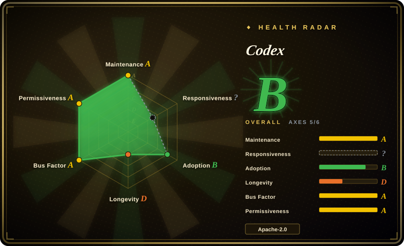

# Codex

A lightweight coding agent from OpenAI that runs locally in your terminal. It can read files, execute shell commands, edit code, and ship changes — all through a natural-language interface, with built-in sandboxing and Git integration.

## When to use

You're a developer who wants an AI assistant that lives inside your terminal and can actually modify your codebase. You describe what you want — "refactor this function to use async/await" or "add error handling to this API route" — and Codex reads the relevant files, makes the edits, runs tests, and commits the changes. You prefer to keep your workflow local rather than relying on a cloud IDE, and you want the agent to have real shell access (with sandboxing) so it can verify its own changes. You install it with a single curl command or via npm, and it works with your existing Git setup. Choose Codex over Open Interpreter because Codex is first-party OpenAI-backed with tighter GPT integration and more polish; choose it over GitHub Copilot because Codex is terminal-native and can execute commands, not just suggest code. The deciding tradeoff is a terminal-first coding agent with real file system and shell access, backed by OpenAI's model quality.

## When NOT to use

- If you need multi-model flexibility or want to use local models, use Open Interpreter instead of Codex, because Codex is optimized for OpenAI models and does not support other providers.
- If you are in a highly regulated environment where AI agents with shell access are forbidden, use GitHub Copilot or Cursor instead of Codex, because Codex executes code in a sandbox but still runs arbitrary commands on your machine.
- If you want a visual IDE experience with click-to-edit and inline suggestions, use GitHub Copilot or Cursor instead of Codex, because Codex is terminal-only and has no GUI.
- If you need complex multi-agent orchestration with multiple collaborating agents, use LangChain or AutoGPT instead of Codex, because Codex is a single-agent coding tool, not a multi-agent framework.
- If you require offline operation or local model inference, use Ollama or Open Interpreter instead of Codex, because Codex requires an internet connection to reach the OpenAI API.

## Comparison

| Alternative | In index | Our verdict | Tradeoff |
| --- | --- | --- | --- |
| [Open Interpreter](open-interpreter.md) | ✅ | Codex-fork with swappable harnesses for low-cost/open models. | Open Interpreter supports multiple providers and local models; Codex is OpenAI-only but has first-party integration and polish. |
| [OpenCode](opencode.md) | ✅ | Open-source terminal coding agent. | OpenCode is model-agnostic and community-driven; Codex is OpenAI-backed with tighter GPT integration. |
| [Gemini CLI](gemini-cli.md) | ✅ | Google's terminal AI agent. | Gemini CLI is Google-only with a free tier; Codex is OpenAI-only and may require API credits. |
| Claude Code | 未收录 | Official Anthropic terminal coding agent. | Closed-source, Anthropic-only; Codex is open-source and terminal-native but locked to OpenAI models. |
| GitHub Copilot | 未收录 | AI pair programmer IDE extension. | Copilot is IDE-integrated and subscription-based; Codex is terminal-first and standalone with shell execution. |

## Tech stack

- **Rust** — core implementation for performance and safety
- **OpenAI API** — backend LLM provider (GPT-4o / GPT-4.5 class models)
- **Sandboxing** — OS-level sandbox for code execution on macOS, Linux, and Windows
- **Git** — built-in version control integration for committing changes
- **MCP (Model Context Protocol)** — extensibility for custom tools and integrations

## Dependencies

- OpenAI API key (or subscription)
- macOS, Linux, or Windows terminal
- Git repository (recommended, for change tracking)
- Internet connectivity (to reach OpenAI API)

## Ops difficulty

**Low**. Codex is installed via a shell script or npm and runs as a local CLI process. There is no server to maintain. The operational burden is managing your OpenAI API credentials and reviewing the agent's changes before accepting them. The sandboxing provides safety, but you should still audit executed commands.

## Health & viability
- **Maintenance**: Grade A — 13/13 active weeks in trailing 13; last commit 0 days ago.
- **Responsiveness**: Grade C — median first-response time 360.0 hours across 0 qualifying issues/PRs.
- **Adoption**: Grade A — 45,794,237 monthly downloads via npmjs.org (package: @openai/codex).
- **Longevity**: Grade C — 445 days old.
- **Governance**: Grade A — top-3 contributor share 34.9% (?).
- **Risk / License**: Grade A — Apache-2.0 license.
## Caveats (unverified)

- [未验证] Codex requires an OpenAI API key; the exact pricing and rate limits for heavy usage have not been verified.
- [推断] As an OpenAI project, the roadmap may prioritize features that drive API usage or OpenAI ecosystem lock-in.
- [未验证] The sandboxing mechanism's security guarantees against determined adversarial prompts have not been independently audited.
- [推断] The star count is extremely high for a project created in 2025-04; some inflation from OpenAI brand recognition is likely, but genuine adoption is also strong.
