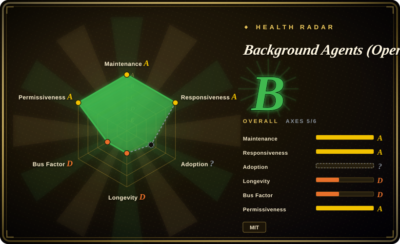

# Background Agents (Open-Inspect)

A self-deployed, single-tenant background coding-agent control plane: trusted colleagues launch OpenCode-powered cloud sandboxes from web, Slack, GitHub, Linear, schedules, or authenticated webhooks.

## When to use

You're operating one trusted engineering organization and need coding agents to keep working in isolated cloud sandboxes after the requester leaves the page. You want a self-hosted control plane that can start sessions from Web, Slack, GitHub, Linear, cron, Sentry, or webhooks; coordinate sub-tasks; operate across up to ten repositories; and create attributed pull requests. Pick Open-Inspect over a local coding CLI because its product is orchestration, sandbox lifecycle, integrations, and background automation.

Choose it only when you can own a Cloudflare control plane, a GitHub App, OAuth, one of the supported sandbox providers, secrets handling, and the single-tenant trust model. It is designed for internal engineering automation, not an out-of-the-box personal assistant.

## When NOT to use

- **You need multi-tenant SaaS or per-user, per-repository authorization boundaries.** Choose or build a platform with tenant isolation and access checks; Open-Inspect explicitly shares a GitHub App installation across trusted users and does not validate user repository access when creating a session.
- **You are an individual developer or only need terminal pair programming.** Choose [OpenCode](../terminal-agents/opencode.md); this project needs Cloudflare, Terraform, GitHub App/OAuth setup, sandbox infrastructure, and credentials that are disproportionate for a local workflow.
- **Your policy requires fully local or self-managed compute with no cloud sandbox provider.** Choose a local agent such as OpenCode or evaluate a self-managed [OpenHands](openhands.md) deployment; Open-Inspect requires Cloudflare and one of Modal, Daytona, Vercel Sandbox, or OpenComputer.
- **You cannot accept a system that can access multiple repositories, inject scoped secrets, and be triggered by schedules or webhooks.** Use a narrower single-repository workflow; this platform's automation and shared GitHub App model make blast-radius control a deployment responsibility.
- **You need a long-lived, versioned production platform with established releases.** Choose a more mature hosted or self-managed option; this young repository had no GitHub Releases at review time and its workspace version is `0.1.0`.

## Comparison

| Alternative | In index | Our verdict | Tradeoff |
|---|---|---|---|
| [OpenCode](../terminal-agents/opencode.md) | ✅ | Choose OpenCode for a local developer-operated coding agent; choose Open-Inspect when trusted-team background sessions and integrations justify a cloud control plane. | OpenCode avoids infrastructure and shared credentials; Open-Inspect adds sandbox scheduling, integrations, and multi-repository automation. |
| [OpenHands](openhands.md) | ✅ | Evaluate OpenHands when you need a broader self-hosted coding-agent platform; choose Open-Inspect only after accepting its explicit single-tenant GitHub App model. | Both are operationally heavy; Open-Inspect documents a specific Cloudflare-plus-sandbox architecture and a restrictive trust boundary. |
| GitHub Actions plus an agent CLI | not indexed | Choose CI-triggered agent scripts when a narrow, audited event flow is enough; choose Open-Inspect when interactive sessions, live collaboration, and reusable sandbox lifecycle are required. | CI scripts keep a smaller control plane but lack Open-Inspect's session UI, sandbox warming, and multi-channel interaction. |
| [CC Switch](cc-switch.md) | ✅ | Choose CC Switch for one person's desktop management of installed agents; choose Open-Inspect for organizational cloud execution and asynchronous automation. | CC Switch is low-ops and local; Open-Inspect introduces credentials, sandboxes, data-plane operations, and a shared trust boundary. |

## Tech stack

- **Control plane:** TypeScript on Cloudflare Workers, Durable Objects, D1, KV, R2, SQLite, and WebSockets.
- **Web:** Next.js 16, React 19, NextAuth, Tailwind CSS, and Radix UI.
- **Sandbox runtime:** OpenCode, Node.js, Python, Bun, Git, GitHub CLI, `agent-browser`, and headless Chromium.
- **Infrastructure:** Terraform plus Modal, Daytona, Vercel Sandbox, or OpenComputer provider integrations; Python is used for parts of sandbox infrastructure.

## Dependencies

- **Deployment core:** Node.js 22+, npm, Terraform 1.14+, Wrangler, Cloudflare account/API credentials, and a Cloudflare control-plane deployment.
- **Source control:** GitHub App/OAuth configuration and deliberately constrained installation scope.
- **Sandbox:** one supported sandbox provider and its credentials/resources.
- **Models / integrations:** Anthropic credentials for the documented default model path; optional Slack, GitHub, Linear, Google OAuth, Vercel, Sentry, and webhook configuration.
- **Documentation conflict:** one setup document mentions Node 20+, but the root manifest requires Node 22+; use the manifest constraint. [未验证]

## Ops difficulty

**High.** This is a distributed control plane with identity, GitHub installation credentials, secrets injection, worker state, cloud sandboxes, webhooks, and repository lifecycle scripts. Its own README limits deployment to one trusted tenant; secure operation means minimizing GitHub App scope, entry points, secret scope, and automation permissions.

## Health & viability

- **Maintenance snapshot (2026-07-13):** unarchived, committed and pushed on the review date, with CI, contributing guidance, and TypeScript/Python quality tooling present.
- **Governance / bus factor:** the repository is user-owned and contributor activity is heavily concentrated in ColeMurray. The project is actively developed but has a material key-maintainer risk. [推断]
- **Age / Lindy:** created 2026-01 and lacks GitHub Releases, so there is no long operational history or release-line stability signal.
- **Security / operational risk:** the documented single-tenant design deliberately shares GitHub App repository access among trusted users. That is a conscious architecture boundary, not a safe default for mixed-trust teams.

## Caveats (unverified)

- [未验证] The exact behavior and security posture of each Modal, Daytona, Vercel Sandbox, and OpenComputer backend were not independently deployed or audited.
- [未验证] README model/provider availability can change; verify enabled model paths and credential handling against the version you deploy.
- [未验证] Python mypy jobs run in CI but are configured non-blocking in the reviewed workflow, so they are not a mandatory type-quality gate.
- [推断] Because this system combines shared repository credentials, secrets injection, multiple integrations, background automation, and a young codebase, deployment should begin with a restricted internal pilot rather than broad repository access.
