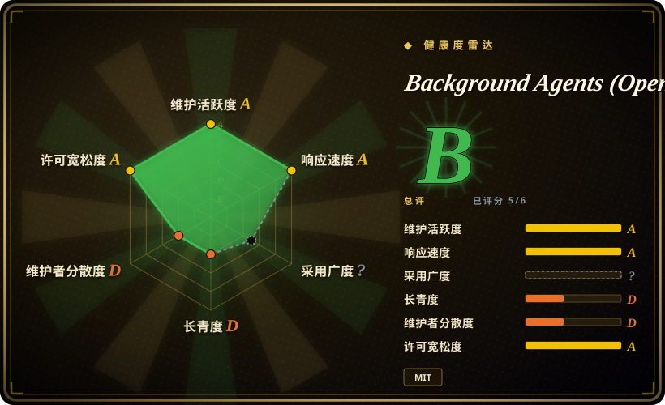

# Background Agents (Open-Inspect)

一个自部署、单租户的后台 coding-agent 控制面：受信任的同事可从 Web、Slack、GitHub、Linear、定时任务或认证 webhook 发起由 OpenCode 驱动的云沙箱。

## 何时使用

你运营的是一个受信任的工程组织，希望请求人离开页面后，coding agent 仍在隔离云沙箱中持续工作。你需要自托管控制面，从 Web、Slack、GitHub、Linear、cron、Sentry 或 webhook 发起会话，协调子任务，跨至多十个仓库操作，并创建可归属的 PR。此时选 Open-Inspect，而不是本地 coding CLI，因为它的产品本体是编排、沙箱生命周期、集成和后台自动化。

只有当你能承担 Cloudflare 控制面、GitHub App、OAuth、一个支持的沙箱提供商、secrets 管理，以及单租户信任模型时才应选择它。它面向内部工程自动化，不是开箱即用的个人助手。

## 何时不用

- **你需要多租户 SaaS，或逐用户、逐仓库的授权边界。**改选或构建具有租户隔离和访问校验的平台；Open-Inspect 明确让受信任用户共享 GitHub App 安装，创建会话时不校验用户是否有该仓库权限。
- **你是个人开发者，或只需终端结对编程。**改选 [OpenCode](../terminal-agents/opencode.zh.md)；Cloudflare、Terraform、GitHub App、OAuth、沙箱基础设施和凭据的成本，对本地工作流不成比例。
- **你的政策要求完全本地或自行管理计算，不能接受云沙箱提供商。**改用 OpenCode 这类本地 agent，或评估自管的 [OpenHands](openhands.zh.md) 部署；Open-Inspect 需要 Cloudflare 加上 Modal、Daytona、Vercel Sandbox、OpenComputer 中的一家。
- **你不能接受系统访问多个仓库、注入受限 secrets，并可被定时任务或 webhook 触发。**改用更窄的单仓库流程；该平台的自动化与共享 GitHub App 模型，使 blast radius 控制成为部署方责任。
- **你需要有长期版本线和正式发布的生产平台。**改选更成熟的托管或自管方案；本项目较新，审查时没有 GitHub Releases，workspace 版本为 `0.1.0`。

## 横向对比

| 替代品 | 是否收录 | 我们的评价 | 取舍 |
|---|---|---|---|
| [OpenCode](../terminal-agents/opencode.zh.md) | ✅ | 本地由开发者操作的 coding agent 选 OpenCode；可信团队的后台会话和集成足以证明云控制面成本合理时选 Open-Inspect。 | OpenCode 避开基础设施和共享凭据；Open-Inspect 加入沙箱调度、集成和多仓库自动化。 |
| [OpenHands](openhands.zh.md) | ✅ | 需要更宽泛的自托管 coding-agent 平台时评估 OpenHands；只有接受 Open-Inspect 明确的单租户 GitHub App 模型时才选本页项目。 | 两者都有较高运维成本；Open-Inspect 明确规定 Cloudflare 加沙箱架构和严格的信任边界。 |
| GitHub Actions 加 agent CLI | 未收录 | 窄而可审计的事件流足够时选 CI 触发的 agent 脚本；需要交互会话、实时协作和可复用沙箱生命周期时选 Open-Inspect。 | CI 脚本的控制面更小，但缺少 Open-Inspect 的会话 UI、沙箱预热和多渠道交互。 |
| [CC Switch](cc-switch.zh.md) | ✅ | 一个人在桌面管理已安装 agent 时选 CC Switch；组织级云端执行与异步自动化时选 Open-Inspect。 | CC Switch 是低运维、本地工具；Open-Inspect 引入凭据、沙箱、数据平面运维和共享信任边界。 |

## 技术栈

- **控制面：**Cloudflare Workers、Durable Objects、D1、KV、R2、SQLite、WebSockets 上的 TypeScript。
- **Web：**Next.js 16、React 19、NextAuth、Tailwind CSS、Radix UI。
- **沙箱运行时：**OpenCode、Node.js、Python、Bun、Git、GitHub CLI、`agent-browser`、无头 Chromium。
- **基础设施：**Terraform，以及 Modal、Daytona、Vercel Sandbox、OpenComputer 集成；部分沙箱基础设施用 Python。

## 依赖

- **部署核心：**Node.js 22 以上、npm、Terraform 1.14 以上、Wrangler、Cloudflare 账号与 API 凭据，以及 Cloudflare 控制面部署。
- **源码管理：**GitHub App/OAuth 配置，并刻意收窄安装范围。
- **沙箱：**一个支持的沙箱提供商及其凭据、资源。
- **模型与集成：**文档默认模型路径需要 Anthropic 凭据；Slack、GitHub、Linear、Google OAuth、Vercel、Sentry 和 webhook 配置为可选项。
- **文档冲突：**一份安装文档称 Node 20 以上，但根 manifest 要求 Node 22 以上，应以 manifest 为准。[未验证]

## 运维难度

**高。**这是含身份、GitHub 安装凭据、secrets 注入、worker 状态、云沙箱、webhook 和仓库生命周期脚本的分布式控制面。README 自己把部署限制为一个可信租户；安全运行意味着收窄 GitHub App 范围、入口、secret 范围和自动化权限。

## 健康度与可持续性

- **维护快照（2026-07-13）：**未归档，审查当天有提交和 push，仓库中存在 CI、贡献指南和 TypeScript/Python 质量工具。
- **治理与 bus factor：**仓库由个人账号拥有，贡献活动高度集中于 ColeMurray。项目正在活跃开发，但关键维护者风险实质存在。[推断]
- **年龄与 Lindy：**创建于 2026-01，且没有 GitHub Releases，因此尚无长期运维史或稳定发布线信号。
- **安全与运维风险：**文档化的单租户设计让可信用户共享 GitHub App 的仓库访问权。这是有意识的架构边界，不是混合信任团队的安全默认值。

## 存疑（未验证）

- [未验证] Modal、Daytona、Vercel Sandbox、OpenComputer 各后端的准确行为与安全属性均未被独立部署或审计。
- [未验证] README 中的模型、提供商可用性会变化；部署前应按所用版本核对已启用路径和凭据处理。
- [未验证] Python mypy 会在 CI 中执行，但审查到的 workflow 将其配置为非阻断，因此不是强制类型质量闸门。
- [推断] 此系统结合了共享仓库凭据、secrets 注入、多种集成、后台自动化和年轻代码库，应从受限的内部试点开始，而不是一次开放大量仓库访问权。
