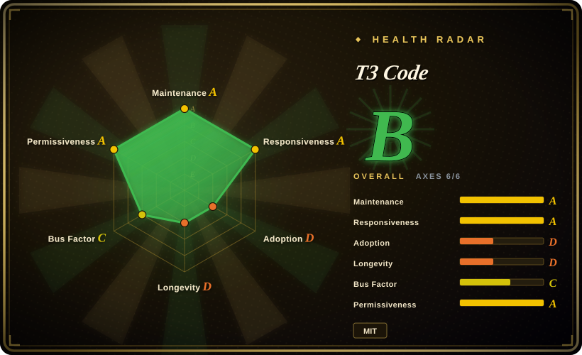

# T3 Code

A very early local web GUI, CLI, and optional desktop shell that lets one interface drive already authenticated Codex, Claude, Cursor, and OpenCode coding-agent CLIs.

## When to use

You're already authorized in more than one coding-agent CLI and want a single graphical workspace for sessions rather than several terminal windows. Pick T3 Code over writing your own wrapper because it exposes a local web UI, `npx t3@latest` entry point, and desktop builds around supported agent CLIs. Its deciding tradeoff is convenience across providers without becoming a model provider or replacing the underlying agents.

Use it when a browser or desktop interaction surface is worth the added local service, and when you can accept an early, fast-moving 0.0.x product. At least one supported CLI must be installed and logged in before it is useful.

## When NOT to use

- **You have no installed and authenticated supported coding-agent CLI.** Use Codex CLI, Claude Code, Cursor CLI, or OpenCode directly first; T3 Code is a frontend around those runtimes, not an independent model or coding agent.
- **You need mature documentation, predictable compatibility, or a stable production control plane.** Use a supported provider's native client; the README calls T3 Code very early, and current releases are still 0.0.x with frequent nightlies.
- **You want a minimal terminal-only workflow or the smallest local attack surface.** Use the selected provider's CLI directly; T3 Code adds a Node service, WebSocket UI, persistence, and optionally Electron.
- **You need an open contribution process and externally governed roadmap.** Choose a project that accepts outside contributions; its contribution policy says external PRs may be closed, held indefinitely, or not reviewed.
- **Grok support is a hard requirement.** Use a tool that publicly documents Grok support; code contains a driver but the public README only commits to Codex, Claude, Cursor, and OpenCode. [未验证]

## Comparison

| Alternative | In index | Our verdict | Tradeoff |
|---|---|---|---|
| [OpenCode](opencode.md) | ✅ | Choose OpenCode when a model-flexible terminal agent is sufficient; choose T3 Code when its GUI must coordinate an already installed OpenCode alongside other agents. | OpenCode is an agent runtime; T3 Code is an interface layer and adds local UI complexity. |
| Codex CLI | not indexed | Choose Codex CLI when OpenAI's terminal workflow is all you need; choose T3 Code only to unify it with other already authenticated providers. | Native CLI has fewer moving parts; T3 Code provides cross-provider session UX. |
| Claude Code | not indexed | Choose Claude Code when Anthropic's native workflow is the desired standard; choose T3 Code when switching to Codex, Cursor, or OpenCode in one GUI matters more. | Claude Code has focused vendor integration; T3 Code trades that focus for a multi-provider shell. |
| [CC Switch](../orchestration-and-review/cc-switch.md) | ✅ | Choose CC Switch for a desktop manager of agent configurations and providers; choose T3 Code for a session-oriented GUI around agent runs. | Both add a meta-layer; CC Switch focuses on tool management, while T3 Code hosts coding-agent interactions. |

## Tech stack

- **Core:** TypeScript pnpm monorepo with a Node.js server, HTTP/WebSocket transport, and stdio JSON-RPC to local agent processes.
- **Web:** React 19, Vite/Vite+, and Tailwind CSS 4.
- **Desktop / mobile:** Electron desktop application and Expo/React Native mobile code.
- **Integrations:** provider SDKs for Claude and OpenCode, local Codex app-server integration, SSH/Tailscale and relay-related packages.

## Dependencies

- **Required:** one installed and authenticated Codex, Claude, Cursor, or OpenCode CLI.
- **Runtime:** the published server package declares Node.js `^22.16 || ^23.11 || >=24.10`; repository development uses newer Node and pnpm.
- **Optional desktop:** Electron builds for supported desktop platforms.
- **Credentials:** inherited from the underlying agent CLIs, not supplied by T3 Code itself.

## Ops difficulty

**Low to medium.** Trying it with `npx` is local and straightforward once an agent CLI is authenticated. Operating it as a durable desktop or team workflow is more involved: provider compatibility, token/session persistence, nightly upgrades, and the added service/UI layer must be reviewed.

## Health & viability

- **Maintenance snapshot (2026-07-13):** unarchived and pushed that day; `main` is active and recent nightlies are published frequently.
- **Release discipline:** stable `v0.0.28` was released on 2026-06-29, while the newest releases are nightly prereleases. Active release automation does not equal a stable compatibility contract. [推断]
- **Governance / bus factor:** the repo belongs to the `pingdotgg` organization and has many contributors, but reported contributions are strongly concentrated in one maintainer and external contribution intake is deliberately restricted.
- **Age / Lindy:** created 2026-02, so its high early interest has not had time to become a long-term reliability signal. MIT is low-friction legally.

## Caveats (unverified)

- [未验证] The public support commitment is only Codex, Claude, Cursor, and OpenCode; a Grok driver visible in source is not enough to claim supported production behavior.
- [未验证] Exact desktop platform coverage, CLI compatibility, and package/runtime versions can change rapidly with the nightly channel.
- [未验证] GitHub stars, forks, and issue backlog are date-sensitive attention signals, not support or reliability metrics.
- [推断] The under-six-month age, 0.0.x versioning, and nightly-heavy release stream make a pinned, tested rollout safer than an automatic latest-version deployment.
