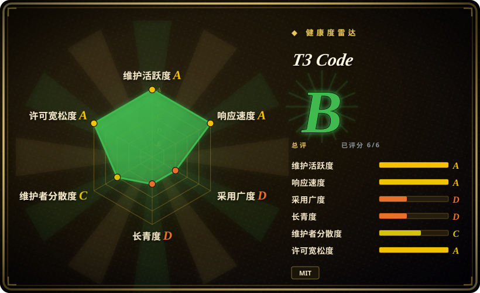

# T3 Code

一个仍很早期的本地 Web GUI、CLI 和可选桌面壳：用一个界面驱动已完成认证的 Codex、Claude、Cursor、OpenCode 编程 agent CLI。

## 何时使用

你已经登录了不止一个 coding-agent CLI，不想在多个终端窗口之间切换，而想要统一的图形化会话工作区。此时选 T3 Code，而不是自己写包装器，因为它为受支持 agent CLI 提供本地 Web UI、`npx t3@latest` 入口与桌面构建。决定性取舍是：用跨提供商便利性换取更多本地运行层，它不提供模型，也不替代底层 agent。

当浏览器或桌面交互面的价值大于新增本地服务的成本，并且你接受早期、高频变动的 0.0.x 产品时使用。至少要先安装并登录一个支持的 CLI。

## 何时不用

- **你没有安装并认证任何受支持的 coding-agent CLI。**先直接用 Codex CLI、Claude Code、Cursor CLI 或 OpenCode；T3 Code 是这些运行时的前端，不是独立模型或独立编程 agent。
- **你需要成熟文档、可预测兼容性或稳定的生产控制面。**改用对应提供商的原生客户端；README 明确称项目非常早期，当前仍是 0.0.x，且 nightlies 很频繁。
- **你只要极简终端工作流，或想把本地攻击面压到最低。**直接用所选提供商的 CLI；T3 Code 会增加 Node 服务、WebSocket UI、持久化以及可选 Electron 层。
- **你需要开放贡献流程和外部共同治理的路线图。**改选明确接收外部贡献的项目；其贡献政策说明外部 PR 可能被关闭、无限期搁置或不被审阅。
- **Grok 支持是硬需求。**改用公开文档明确承诺 Grok 的工具；源码虽包含 driver，但 README 只承诺 Codex、Claude、Cursor 与 OpenCode。[未验证]

## 横向对比

| 替代品 | 是否收录 | 我们的评价 | 取舍 |
|---|---|---|---|
| [OpenCode](opencode.zh.md) | ✅ | 只需模型灵活的终端 agent 时选 OpenCode；必须用 GUI 协调已安装的 OpenCode 与其他 agent 时选 T3 Code。 | OpenCode 是 agent runtime；T3 Code 是界面层，会增加本地 UI 复杂度。 |
| Codex CLI | 未收录 | 只需 OpenAI 的终端工作流时选 Codex CLI；只有在要和其他已认证提供商统一时才选 T3 Code。 | 原生 CLI 的运行部件更少；T3 Code 提供跨提供商会话体验。 |
| Claude Code | 未收录 | Anthropic 原生工作流是团队标准时选 Claude Code；在一个 GUI 里切换 Codex、Cursor、OpenCode 更重要时选 T3 Code。 | Claude Code 的厂商整合更聚焦；T3 Code 以多提供商外壳换取这种聚焦。 |
| [CC Switch](../orchestration-and-review/cc-switch.zh.md) | ✅ | 要管理 agent 配置与提供商的桌面工具时选 CC Switch；要围绕 agent 实际运行建立会话 GUI 时选 T3 Code。 | 两者都会增加元管理层；CC Switch 偏工具管理，T3 Code 承载编程 agent 交互。 |

## 技术栈

- **核心：**TypeScript 的 pnpm monorepo，含 Node.js 服务、HTTP/WebSocket 传输，以及到本地 agent 进程的 stdio JSON-RPC。
- **Web：**React 19、Vite/Vite+、Tailwind CSS 4。
- **桌面与移动：**Electron 桌面应用，以及 Expo/React Native 移动端代码。
- **集成：**Claude 和 OpenCode 的 provider SDK、本地 Codex app-server 集成，以及 SSH、Tailscale 和 relay 相关包。

## 依赖

- **必需：**已安装并认证的 Codex、Claude、Cursor 或 OpenCode CLI 中至少一个。
- **运行时：**发布的 server 包声明 Node.js `^22.16 || ^23.11 || >=24.10`；仓库开发使用更新的 Node 与 pnpm。
- **可选桌面端：**受支持桌面平台的 Electron 构建。
- **凭据：**继承底层 agent CLI 的登录凭据，不由 T3 Code 自行提供。

## 运维难度

**低到中。**已有 agent CLI 登录后，用 `npx` 试用是本地且直接的。把它作为长期桌面或团队工作流时更复杂：提供商兼容性、token 与会话持久化、nightly 升级，以及新增服务和 UI 层都需要评审。

## 健康度与可持续性

- **维护快照（2026-07-13）：**未归档且当天有 push，`main` 活跃，近期持续发布 nightly。
- **发布纪律：**稳定版 `v0.0.28` 发布于 2026-06-29，而最新发布是 nightly prerelease。活跃的发布自动化不等同于稳定兼容契约。[推断]
- **治理与 bus factor：**仓库归 `pingdotgg` 组织，贡献者较多，但公开统计显示贡献高度集中于一位维护者，且外部贡献入口被主动收紧。
- **年龄与 Lindy：**创建于 2026-02，早期高关注度尚未沉淀为长期可靠性信号。MIT 的法律摩擦较低。

## 存疑（未验证）

- [未验证] 公开支持承诺只有 Codex、Claude、Cursor、OpenCode；源码可见的 Grok driver 不足以证明生产支持。
- [未验证] 桌面端平台覆盖、CLI 兼容性与包、运行时版本会随 nightly 快速变化。
- [未验证] GitHub stars、forks、issue 积压都是随时间变化的关注度信号，不是支持或可靠性指标。
- [推断] 不足六个月的年龄、0.0.x 版本和以 nightly 为主的发布流，意味着固定版本并测试后上线，比自动跟随 latest 更稳妥。
