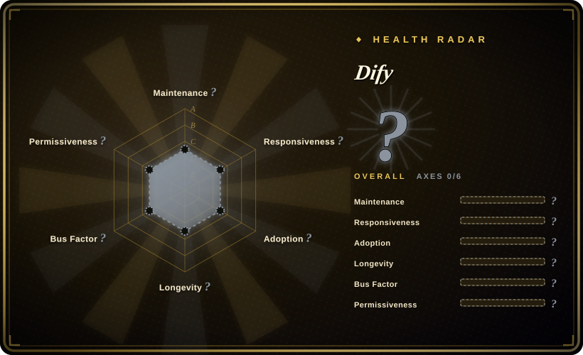

# Dify

A production-ready platform for building and deploying agentic workflows with low-code visual orchestration, RAG, and MCP support.

## When to use

You're a product team that needs to ship AI-powered workflows fast without writing everything from scratch. You want a visual builder where non-engineers can design agent flows, but developers can still drop into code when needed. You need built-in RAG for document Q&A, multi-step workflow orchestration, and the ability to connect various LLM providers (OpenAI, Anthropic, Gemini, local models) through a single platform. You deploy Dify self-hosted and iterate on chatbots, AI agents, and automated pipelines in one place.

## When NOT to use

- **Lightweight or single-purpose apps** — Dify is a full platform; using it for a simple one-off API call is overkill.
- **Pure code-first shops** — If your team prefers hand-rolling every agent loop in Python and dislikes visual builders, the low-code layer will feel like friction.
- **Strict license compliance** — The GitHub metadata lists `NOASSERTION` for license; verify terms before commercial redistribution. [未验证]
- **Small-resource deployments** — Self-hosting requires Docker, PostgreSQL, Redis, and a Weaviate/vector store; a tiny VPS will struggle.

## Comparison

| Alternative | In index | Our verdict | Tradeoff |
| --- | --- | --- | --- |
| [LangChain](langchain.md) | ✅ | Lower-level agent-engineering library. | LangChain is code-first and framework-shaped; Dify is a visual platform with built-in RAG and deployment. |
| [n8n](../workflow-orchestration/n8n.md) | ✅ | General workflow automation with AI nodes. | n8n is broader business-process automation; Dify is purpose-built for LLM/agent workflows. |
| [LangFlow](langflow.md) | 未收录 | Visual builder for AI agents and workflows. | Similar visual approach; LangFlow is Python-first and younger, while Dify has more mature deployment features. |
| [AutoGPT](autogpt.md) | ✅ | Autonomous continuous agent platform. | AutoGPT targets fully autonomous long-running agents; Dify focuses on orchestrated, human-designed workflows. |
| CrewAI / LlamaIndex | 未收录 | Specialized agent frameworks. | CrewAI is multi-agent team-oriented; LlamaIndex is RAG-first. Dify bundles both concerns into one platform. |

## Tech stack

- **TypeScript / Next.js** — frontend and API layer
- **Python** — backend workflow engine and AI logic
- **PostgreSQL** — primary metadata and config store
- **Redis** — caching and message broker
- **Docker** — containerized deployment

## Dependencies

- Docker and Docker Compose (recommended deployment path)
- PostgreSQL database
- Redis instance
- Vector database (Weaviate, Qdrant, or Milvus) for RAG
- LLM provider API keys or local model endpoints

## Ops difficulty

**Medium**. Docker Compose is the standard path, but running Dify in production requires managing a database, Redis, a vector store, and LLM credentials. Upgrades, backup of PostgreSQL, and scaling the worker tier add operational surface. The cloud offering offloads this but shifts to SaaS dependency.

## Health & viability

- **Maintenance**: Very active — daily pushes as of 2026-07, with a large engaged community (868 open issues, 23k forks). [推断]
- **Governance**: Backed by the LangGenius organization; appears to have a team behind it rather than a single maintainer.
- **Backing**: LangGenius appears to be a dedicated org for this project; no large foundation or corporate backing is clearly visible. [未验证]
- **Adoption**: High star count (147k) and significant fork volume suggest broad interest. The project has been active since 2023, giving it ~3 years of track record.
- **Risk flags**: The `NOASSERTION` license in GitHub metadata is a concern for commercial use — verify actual license terms. The project is young (~3 years) with high star count, which warrants caution about hype vs. proven longevity. [未验证]

## Caveats (unverified)

- [未验证] The GitHub API reports `NOASSERTION` as the license; the actual license terms must be verified before commercial use.
- [未验证] The exact resource requirements for production self-hosting (CPU, RAM, disk) are not confirmed from official docs.
- [推断] The 147k star count on a ~3-year-old repo may include significant hype-driven growth; organic enterprise adoption should be verified independently.
