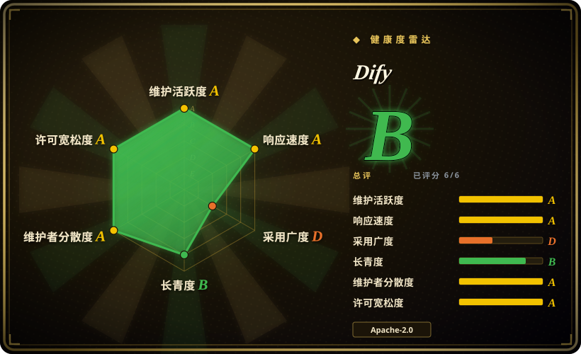

# Dify

一款用于构建和部署 agentic 工作流的低代码可视化编排平台，内置 RAG、MCP 支持，并可连接多种大模型提供商。

## 何时使用

你是一支产品团队，需要快速交付 AI 驱动的工作流，又不想从零写起。你想要一个可视化构建器，让非工程师也能设计 agent 流程，而开发者仍能在需要时写代码。你需要内置 RAG 来做文档问答，需要多步工作流编排，还需要通过一个平台连接多种大模型提供商（OpenAI、Anthropic、Gemini、本地模型）。你自托管 Dify，在一个地方迭代聊天机器人、AI 智能体和自动化流水线。选择 Dify 而不是 Langflow，因为 Dify 有更成熟的部署功能、内置 RBAC 和更强的企业导向；选择 Dify 而不是 n8n，因为 Dify 专为 LLM 和智能体工作流打造，而非通用业务自动化。决定取舍：生产就绪的 AI 平台功能，加上低代码的易用性。

## 何时不用

- 如果你需要轻量或一次性脚本，请用 LangChain 或直接 API 调用而不用 Dify，因为 Dify 是完整平台，用它做简单任务属于杀鸡用牛刀。
- 如果你的团队是纯代码优先且排斥可视化工具，请用 LangChain 或 CrewAI 而不用 Dify，因为低代码层对喜欢用 Python 手写每个 agent 循环的开发者来说会成为摩擦。
- 如果你需要严格的开源许可清晰度以进行商业再分发，请用 Langflow 或完全 MIT 许可的项目而不用 Dify，因为 GitHub 元数据将 Dify 许可列为 `NOASSERTION`，商用前必须核实实际条款。
- 如果你只有小资源部署环境，请用更轻量的 Python 脚本或 LangChain 而不用 Dify，因为自托管 Dify 需要 Docker、PostgreSQL、Redis 和向量存储，小 VPS 会吃力。

## 横向对比

| 替代品 | 是否收录 | 我们的评价 | 取舍 |
| --- | --- | --- | --- |
| [LangChain](langchain.zh.md) | ✅ | 底层 agent 工程库。 | LangChain 是代码优先的框架；Dify 是带内置 RAG 与部署能力的可视化平台。 |
| [n8n](../workflow-orchestration/n8n.zh.md) | ✅ | 通用工作流自动化，带 AI 节点。 | n8n 面向更广泛的业务流程自动化；Dify 专为 LLM 和 agent 工作流打造。 |
| [LangFlow](langflow.zh.md) | 未收录 | AI agent 与 workflow 可视化构建器。 | 两者都走可视化路线；LangFlow 偏 Python 优先且 MIT 许可，Dify 的部署功能和 RBAC 更成熟。 |
| [AutoGPT](autogpt.zh.md) | ✅ | 自治持续运行 agent 平台。 | AutoGPT 面向完全自主的长期运行 agent；Dify 聚焦有人参与设计的编排式工作流。 |
| CrewAI / LlamaIndex | 未收录 | 专业化 agent 框架。 | CrewAI 偏重多 agent 团队协作；LlamaIndex 偏重 RAG。Dify 把两者整合到一个平台。 |

## 技术栈

- **TypeScript / Next.js**——前端与 API 层
- **Python**——后端工作流引擎与 AI 逻辑
- **PostgreSQL**——主元数据与配置存储
- **Redis**——缓存与消息代理
- **Docker**——容器化部署

## 依赖

- Docker 与 Docker Compose（推荐部署路径）
- PostgreSQL 数据库
- Redis 实例
- 向量数据库（Weaviate、Qdrant 或 Milvus）用于 RAG
- LLM 提供商 API key 或本地模型端点

## 运维难度

**中等**。Docker Compose 是标准路径，但生产运行 Dify 需要管理数据库、Redis、向量存储和 LLM 凭证。升级、PostgreSQL 备份以及 worker 层扩容都会增加运维面。使用云端托管版可省去这些，但会转为 SaaS 依赖。

## 健康度与可持续性
- **维护活跃度**：Grade A——最近 13 周中 13 周有提交；最后提交距今 0 天。
- **响应速度**：Grade A——中位首次响应时间 0.2 小时，基于 18 个 qualifying issues/PRs。
- **采用广度**：Grade D——npmjs.org 上月下载量 8,835（包名：dify-client）。
- **长青度**：Grade B——仓库已创建 1177 天。
- **治理集中度**：Grade A——前三贡献者占比 22.6%（?）。
- **许可风险**：无法计算——unknown。
## 存疑（未验证）

- [未验证] GitHub API 返回的许可为 `NOASSERTION`，商用前必须核实实际许可条款。
- [未验证] 生产自托管所需的精确资源（CPU、内存、磁盘）尚未从官方文档确认。
- [推断] 约 3 年的仓库拥有 147k star，可能包含大量炒作驱动的增长；有机的企业级采用需独立验证。
