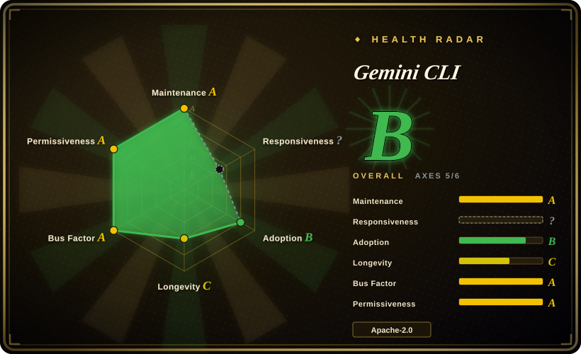

# Gemini CLI

An open-source AI agent that brings the power of Gemini directly into your terminal. Provides lightweight access to Gemini models with built-in tools, MCP support, and a free tier for personal Google accounts.

## When to use

You're a developer who lives in the terminal and wants an AI assistant that can reason about your codebase, run shell commands, search the web, and read files — all without leaving your command line. You pick Gemini CLI over [OpenCode](opencode.md) because its generous free tier (60 req/min, 1,000 req/day with a personal Google account) eliminates the need to bring and pay for your own API keys across every model provider. You pick it over Claude Code (Anthropic's closed-source terminal agent) because Gemini CLI is open-source under Apache-2.0 and free-tier accessible, whereas Claude Code requires an Anthropic subscription. You pick it over [Open Interpreter](open-interpreter.md) when you want deep Gemini integration — especially the 1M token context window and built-in Google Search grounding — rather than a model-agnostic harness where you must configure every provider yourself. You install via npm, authenticate with your Google account, and delegate tasks: refactoring code, explaining APIs, generating tests, or fetching documentation. The MCP extensibility means you can wire it into your existing tool ecosystem without switching to a different agent framework.

## When NOT to use

- **If you need to switch between OpenAI, Anthropic, or local models** — use [OpenCode](opencode.md) or [Open Interpreter](open-interpreter.md) instead of Gemini CLI, because Gemini CLI is tightly coupled to Google's Gemini API and does not support other providers.
- **If your organization blocks Google authentication or requires enterprise SSO** — use a self-hosted platform like [Dify](https://github.com/langgenius/dify) or [n8n](https://github.com/n8n-io/n8n) instead of Gemini CLI, because the free tier requires a personal Google account and there is no RBAC or admin layer.
- **If you work in an offline or air-gapped environment** — use Ollama with a local chat UI like [Open WebUI](../llm-chat-ui/open-webui.md) instead of Gemini CLI, because Gemini CLI requires internet access to reach the Gemini API and does not support local model inference.
- **If you need complex multi-agent orchestration** — use LangChain or AutoGPT instead of Gemini CLI, because Gemini CLI is a single-agent CLI tool without built-in workflows for multiple collaborating agents.
- **If you need enterprise audit logging, RBAC, or compliance guarantees** — use a governed platform like Dify or n8n instead of Gemini CLI, because it is a personal developer tool with no built-in audit logging or admin controls.

## Comparison

| Alternative | In index | Our verdict | Tradeoff |
| --- | --- | --- | --- |
| [OpenCode](opencode.md) | ✅ | Open-source terminal coding agent. | OpenCode is model-agnostic and self-hostable; Gemini CLI is Google-only but offers a generous free tier and deep Gemini integration. |
| [Open Interpreter](open-interpreter.md) | ✅ | Terminal coding agent with swappable harnesses for open models. | Open Interpreter supports multiple model providers and local models; Gemini CLI is Gemini-only but has stronger Google ecosystem integration. |
| Claude Code | 未收录 | Official Anthropic terminal coding agent. | Closed-source, Anthropic-only; Gemini CLI is open-source and free-tier friendly but locked to Google models. |
| [CC Switch](cc-switch.md) | ✅ | Desktop manager for multiple coding agents. | CC Switch can manage Gemini CLI alongside other agents; they are complementary, not competing. |
| GitHub Copilot CLI | 未收录 | AI-powered CLI from GitHub/Microsoft. | Copilot CLI is Copilot-subscription based and IDE-integrated; Gemini CLI is standalone and free-tier accessible. |

## Tech stack

- **TypeScript** — primary implementation language
- **Node.js** — runtime environment
- **Gemini API** — backend LLM provider (Google)
- **MCP (Model Context Protocol)** — extensibility layer for custom integrations
- **Google Search** — built-in grounding tool

## Dependencies

- Node.js runtime (npm-installable)
- A Google account (for the free tier API access)
- Internet connectivity (to reach Gemini API endpoints)
- Terminal / shell environment

## Ops difficulty

**Low**. Gemini CLI is installed via npm and runs as a local Node.js process. There is no server to maintain. The operational burden is limited to keeping the CLI updated and managing your Google API credentials. The free tier has rate limits that may require upgrading for heavy usage, but there is no infrastructure to operate.

## Health & viability

- **Responsiveness**: Cannot be scored — no_traffic.
- **Maintenance**: Active — pushed daily as of 2026-07, with a responsive issue tracker (1,347 open issues). [推断]
- **Governance**: Owned by the `google-gemini` organization, a Google-backed GitHub org. Bus factor is reasonable given Google's backing, but the project's future depends on Google's continued commitment to the open-source CLI. [未验证]
- **Backing**: Officially backed by Google (Gemini team). The Apache-2.0 license is permissive, but Google has a history of sunnsetting open-source projects. [推断]
- **Adoption**: Strong star count (105.7k) with a recent creation date (2025-04). The backing by Google and the generous free tier drive rapid adoption. [推断]
- **Risk flags**: Very young (created 2025-04) with no Lindy track record. Google's history of abandoning open-source projects (e.g., Google Reader, Google+) is a relevant prior, though the Gemini brand appears to be a strategic priority. [推断]

## Caveats (unverified)

- [未验证] The exact relationship between `google-gemini` and the broader Google DeepMind / Gemini product organization has not been verified.
- [推断] Google has a track record of launching and later deprecating open-source and consumer projects; the long-term commitment to Gemini CLI is unproven.
- [未验证] The free tier rate limits (60 req/min, 1,000 req/day) may be reduced or changed as the product matures.
- [未验证] The MCP server ecosystem and third-party integration quality are new and unverified.
