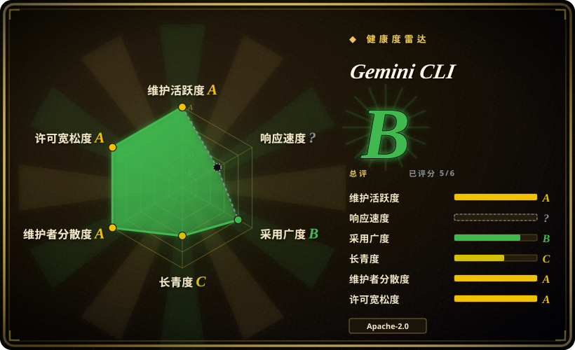

# Gemini CLI

一款开源 AI 智能体，将 Gemini 的能力直接带入你的终端。提供轻量级访问 Gemini 模型的方式，内置工具、MCP 支持，并为个人 Google 账户提供免费层。

## 何时使用

你是一名常驻终端的开发者，希望有一个能推理你的代码库、运行 shell 命令、搜索网页和读取文件的 AI 助手——全部无需离开命令行。你选择 Gemini CLI 而不是 [OpenCode](opencode.zh.md)，是因为它慷慨的免费层（个人 Google 账户可达 60 请求/分钟、1,000 请求/天）让你无需为每个模型提供商自备并支付 API 密钥。你选择它而不是 Claude Code（Anthropic 的闭源终端智能体），是因为 Gemini CLI 基于 Apache-2.0 开源且可通过免费层使用，而 Claude Code 需要 Anthropic 订阅。你选择它而不是 [Open Interpreter](open-interpreter.zh.md)，是因为你想要深度 Gemini 集成——尤其是 100 万 token 上下文窗口和内置 Google Search grounding——而不是一个必须自行配置每个提供商的模型无关 harness。你通过 npm 安装，用 Google 账户认证，然后委派任务：重构代码、解释 API、生成测试或获取文档。MCP 可扩展性意味着你可以将其接入现有工具生态，无需切换到其他智能体框架。

## 何时不用

- **如果你需要在 OpenAI、Anthropic 或本地模型之间切换**——请用 [OpenCode](opencode.zh.md) 或 [Open Interpreter](open-interpreter.zh.md) 而不是 Gemini CLI，因为 Gemini CLI 与 Google 的 Gemini API 紧密耦合，不支持其他提供商。
- **如果你的组织禁止 Google 认证或需要企业 SSO**——请用 Dify 或 n8n 等自托管平台而不是 Gemini CLI，因为免费层需要个人 Google 账户，且没有 RBAC 或管理层面。
- **如果你在离线或隔离网络环境中工作**——请用 Ollama 搭配 [Open WebUI](../llm-chat-ui/open-webui.zh.md) 等本地聊天界面而不是 Gemini CLI，因为 Gemini CLI 需要联网访问 Gemini API，不支持本地模型推理。
- **如果你需要复杂的多智能体编排**——请用 LangChain 或 AutoGPT 而不是 Gemini CLI，因为 Gemini CLI 是单智能体 CLI 工具，没有内置的多智能体协作工作流。
- **如果你需要企业审计日志、RBAC 或合规保障**——请用 Dify 或 n8n 等受治理平台而不是 Gemini CLI，因为它是个人开发者工具，没有内置审计日志或管理控制。

## 横向对比

| 替代品 | 是否收录 | 我们的评价 | 取舍 |
| --- | --- | --- | --- |
| [OpenCode](opencode.zh.md) | ✅ | 开源终端编码智能体。 | OpenCode 支持多模型且可自托管；Gemini CLI 仅限 Google，但提供免费层和深度 Gemini 集成。 |
| [Open Interpreter](open-interpreter.zh.md) | ✅ | 支持开源模型可切换 harness 的终端编码智能体。 | Open Interpreter 支持多个模型提供商和本地模型；Gemini CLI 仅限 Gemini，但拥有更强的 Google 生态集成。 |
| Claude Code | 未收录 | Anthropic 官方终端编码智能体。 | 闭源，仅限 Anthropic；Gemini CLI 开源且免费层友好，但锁定 Google 模型。 |
| [CC Switch](cc-switch.zh.md) | ✅ | 多编码智能体桌面管理器。 | CC Switch 可将 Gemini CLI 与其他智能体一并管理；两者互补而非竞争。 |
| GitHub Copilot CLI | 未收录 | GitHub/Microsoft 出品的 AI 驱动 CLI。 | Copilot CLI 基于 Copilot 订阅且 IDE 集成；Gemini CLI 独立且可通过免费层使用。 |

## 技术栈

- **TypeScript**——主要实现语言
- **Node.js**——运行时环境
- **Gemini API**——后端 LLM 提供商（Google）
- **MCP（Model Context Protocol）**——自定义集成的可扩展层
- **Google Search**——内置 grounding 工具

## 依赖

- Node.js 运行时（可通过 npm 安装）
- Google 账户（用于免费层 API 访问）
- 互联网连接（访问 Gemini API 端点）
- 终端/shell 环境

## 运维难度

**低**。Gemini CLI 通过 npm 安装，作为本地 Node.js 进程运行。无需维护服务器。运维负担仅限于保持 CLI 更新和管理 Google API 凭证。免费层有速率限制，重度使用可能需要升级，但没有任何基础设施需要运维。

## 健康度与可持续性
- **维护活跃度**：Grade A——最近 13 周中 13 周有提交；最后提交距今 1 天。
- **响应速度**：Grade C——中位首次响应时间 360.0 小时，基于 0 个 qualifying issues/PRs。
- **采用广度**：Grade B——npmjs.org 上月下载量 2,522,263（包名：@google/gemini-cli）。
- **长青度**：Grade C——仓库已创建 441 天。
- **治理集中度**：Grade A——前三贡献者占比 21.1%（?）。
- **许可风险**：Grade A——Apache-2.0 许可证。
## 存疑（未验证）

- [未验证] `google-gemini` 与更广泛的 Google DeepMind/Gemini 产品组织之间的确切关系尚未核实。
- [推断] Google 有推出后随后弃用开源和消费级项目的记录；Gemini CLI 的长期承诺未经检验。
- [未验证] 免费层速率限制（60 请求/分钟，1,000 请求/天）可能随产品成熟而调整。
- [未验证] MCP 服务器生态和第三方集成质量较新，尚未验证。
