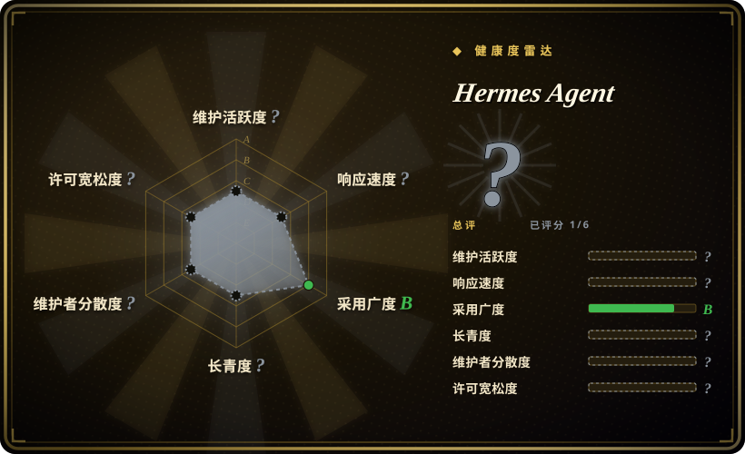

# Hermes Agent

Nous Research 构建的自我改进 AI 智能体。它是唯一内置学习循环的智能体——从经验中创建技能，在使用过程中持续改进，促使自己持久化知识，搜索过往对话，并在跨会话中建立对你越来越深的模型。你可以在 5 美元 VPS、GPU 集群或空闲时几乎无成本的服务器基础设施上运行它，并在它于云端 VM 上工作时通过 Telegram 与之对话。

## 何时使用

你是一位独立开发者或小团队，在 5 美元 VPS 或 GPU 集群上运行 AI 智能体，需要一个无需手工提示工程就能越用越好的智能体。你看过 OpenClaw，但 OpenClaw 是消息原生个人助手，没有学习循环——它不会从你的对话中进化。你也看过 AutoGPT，但 AutoGPT 是工作流自动化平台，聚焦任务执行，而不是跨会话积累知识与技能。你选择 Hermes Agent 而不是这两者，因为它是唯一内置学习循环的智能体：从经验中创建技能、跨会话持久化知识、建立对你越来越深的模型。你还想在它于云端 VM 上工作的同时通过 Telegram 与它对话，并可使用任意 LLM 提供商。

## 何时不用

- **确定性、可重复的系统**——学习循环意味着行为随时间变化，可能让输出非确定性且更难调试。如需确定性自动化，请改用 n8n 或传统脚本，因为这些工具产生可重复、可预测的输出。
- **简单的无状态聊天机器人**——Hermes 对一次性问答来说过重；其价值在于累积记忆与技能进化。如果你只需要快速对话助手，请改用 OpenClaw，因为 OpenClaw 更轻量，专为即时消息响应设计。
- **企业安全合规**——Nous Research 是 AI 研究实验室，不是企业厂商；无 SOC 2、SSO 或审计轨迹保障。如需企业治理，请改用 Dify 或 AutoGPT 云端测试版，因为这些平台面向组织合规构建。
- **编码专用智能体**——Hermes 是通用智能体框架，未针对软件工程任务优化。如需编码专用智能体，请改用 OpenCode 或 Claude Code，因为它们是专为终端代码编辑与执行设计的。
- **需要多智能体编排的团队**——Hermes 聚焦单智能体自我改进，而非多智能体协作。如需多智能体团队，请改用 LangChain 配合 LangGraph 或 CrewAI，因为这些框架专为多智能体编排设计。

## 横向对比

| 替代品 | 是否收录 | 我们的评价 | 取舍 |
| --- | --- | --- | --- |
| [OpenClaw](openclaw.zh.md) | ✅ | 侧重多渠道无处不在的个人助手。 | OpenClaw 是开箱即用的消息助手；Hermes 是可扩展的学习框架。 |
| [AutoGPT](autogpt.zh.md) | ✅ | 面向部署的自主工作流平台。 | AutoGPT 面向自主任务执行与部署；Hermes 面向通过学习实现自我改进。 |
| [OpenCode](opencode.zh.md) | ✅ | 模型无关的终端编码智能体。 | OpenCode 用于终端编码；Hermes 是带学习循环的通用对话智能体。 |
| [LangChain](langchain.zh.md) | ✅ | 构建自定义智能体管线的底层框架。 | LangChain 是从头搭建的工具包；Hermes 是内置记忆与技能合成的高级智能体。 |
| CrewAI | 未收录 | 多智能体编排框架。 | CrewAI 聚焦多智能体团队；Hermes 聚焦单智能体自我改进。 |

## 技术栈

- **Python**——主要实现语言
- **CLI 工具**——交互式 shell、安装向导、迁移工具（`hermes`、`hermes setup`、`hermes doctor`、`hermes claw migrate`）
- **Gateway**——面向 Telegram、Discord 等渠道的消息网关（`hermes gateway`）
- **模型无关**——通过 `hermes model` 支持任意 LLM 提供商

## 依赖

- Python 运行时（推荐 3.10+）
- LLM 提供商（OpenAI、Anthropic 或本地模型）
- 服务器或 VPS（可在 5 美元 VPS 上运行）
- 如使用网关功能，需消息应用凭证

## 运维难度

**低至中等**。通过 CLI（`hermes setup`）安装简单；智能体可在最低硬件上运行。学习循环与技能持久化增加了一些运维复杂度——你需要管理知识库并长期监控技能质量。

## 健康度与可持续性
- **维护活跃度**：Grade A——最近 13 周中 13 周有提交；最后提交距今 0 天。
- **响应速度**：Grade C——中位首次响应时间 360.0 小时，基于 0 个 qualifying issues/PRs。
- **采用广度**：Grade B——pypi.org 上月下载量 383,111（包名：hermes-agent）。
- **长青度**：Grade D——仓库已创建 345 天。
- **治理集中度**：Grade B——前三贡献者占比 61.9%（?）。
- **许可风险**：Grade A——MIT 许可证。
## 存疑（未验证）

- [推断] 不足一年即达 207k star，star 数可能反映炒作而非已验证的生产级采用。
- [未验证] 从经验中创建技能的“学习循环”可能产生低质量或意外的技能；生成技能可能需要人工审核。
- [未验证] “5 美元 VPS”的说法可能仅针对最低用量；大模型生产工作负载可能需要显著更多资源。
- [未验证] 技能持久化机制与知识库的长期稳定性尚未在生产环境中得到验证。
