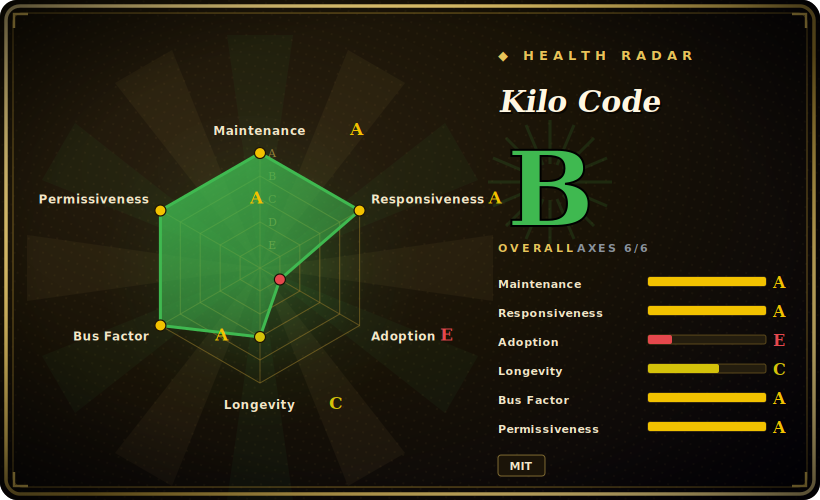

# Kilo Code

An open-source AI coding agent that lives inside your IDE: a VS Code (and JetBrains) extension that plans, edits code across files, runs commands, and switches between specialized modes — bring-your-own-key across 500+ models, billed at the provider's rate.

## When to use

You're a developer who wants an autonomous coding agent *inside the editor you already use*, not a separate chat window you copy-paste between. You're working through a multi-file change — refactor a service, wire up a new endpoint, chase a bug across the call graph — and you want the agent to read the repo, propose a plan, edit the files in place, run the test command, and show you a diff to approve. You also don't want to be locked to one model vendor or one opaque subscription price: you'd rather plug in your own Anthropic/OpenAI/Gemini/OpenRouter key (or a local model) and pay the provider directly. You install the Kilo Code extension from the VS Code Marketplace, point it at a model, and drive it in natural language.

You reach for it specifically when you want an *open-source*, in-IDE coding agent with an explicit mode/orchestrator workflow — a `Plan` mode that designs the change before any code is written, a `Code` mode that implements it, plus `Ask`/`Debug`/`Review` modes — rather than a single undifferentiated chat loop. It's a good fit when your bottleneck is *getting an agent to do real edits in your repo* and you value MIT-licensed, self-hostable-keyed tooling over a closed product; less so when you want a library to build *your own* agents on (see "When NOT to use").

## When NOT to use

- **You want a framework to build your own agents on.** This is the sharpest filter: Kilo Code is an **end-user coding agent**, not a library/SDK. If you're building a custom multi-agent application or your own agent runtime, you want a framework ([DSPy](dspy.md), [AgentScope](agentscope.md)), not a finished VS Code extension. There's no provider-agnostic "agent core" you import.
- **You're not in a supported IDE.** It's a VS Code / JetBrains extension. Outside those editors (or in a pure-terminal/CI workflow) the in-IDE value evaporates — for headless/CLI use you'd want a CLI-shaped agent instead.
- **You need a stable, slow-moving surface.** The project ships extremely aggressively (current release is v7.x, with releases landing within days; created only ~2025-03). That velocity is great for features but is churn you'd be coupling to if you standardize a team on it.
- **You want costs fully managed/predictable for you.** BYOK means *you* own provider-cost management — token spend tracks whatever model you pick and how hard the agent works. A closed product with a flat subscription removes that variable; Kilo deliberately doesn't.
- **You need the most battle-tested option.** Against Cursor / GitHub Copilot (years of polish, huge install base) and even its older siblings Cline / Roo Code, Kilo Code is younger as a named project; for risk-averse, load-bearing adoption weigh that maturity gap.

## Comparison

| Alternative | In index | Our verdict | Tradeoff |
|---|---|---|---|
| Cline | 未收录 | Use this page for its stated niche; choose Cline when you need open-source VS Code coding agent. | Open-source VS Code coding agent; part of Kilo Code's lineage [推断]. Similar in-IDE agent loop; Kilo layers on modes/orchestrator and its own model marketplace. Compare directly if you want the leaner upstream. |
| Roo Code | 未收录 | Use this page for its stated niche; choose Roo Code when you need open-source VS Code agent that Kilo Code descends from [推断]. | Open-source VS Code agent that Kilo Code descends from [推断]; overlapping mode model. Kilo is the further-developed, org-backed continuation — but Roo Code is its own active project. |
| Cursor | 未收录 | Use this page for its stated niche; choose Cursor when you need closed-source AI-first *editor* (a VS Code fork), not an extension. | Closed-source AI-first *editor* (a VS Code fork), not an extension; deeply integrated, paid subscription, no BYOK-at-provider-cost openness. More polished, less open. |
| GitHub Copilot | 未收录 | Use this page for its stated niche; choose GitHub Copilot when you need closed, Microsoft-backed completion+chat+agent in VS Code/JetBrains. | Closed, Microsoft-backed completion+chat+agent in VS Code/JetBrains; huge adoption and stability, vendor-managed pricing, no self-keyed multi-provider model. |
| [oh-my-claudecode](oh-my-claudecode.md) | ✅ | Use this page for its stated niche; choose oh-my-claudecode when you need orchestration *layer on top of* Anthropic's Claude Code CLI (team pipelines, model routing, tmux). | Orchestration *layer on top of* Anthropic's Claude Code CLI (team pipelines, model routing, tmux). Kilo Code is a standalone in-IDE agent, not a wrapper around another agent CLI. |

## Tech stack

- **Language:** TypeScript (primary, per repo metadata 2026-06-28).
- **Host:** distributed as a **VS Code extension** (VS Code Marketplace) and a **JetBrains plugin** (JetBrains Marketplace).
- **Agent surface:** specialized modes — `Code`, `Plan`, `Ask`, `Debug`, `Review` — for plan-then-implement workflows, plus tool use (file edits, terminal command execution) over your workspace.
- **Models:** multi-provider / BYOK across 500+ models (Anthropic, OpenAI, Gemini, OpenRouter, local, …), with mid-task model switching, billed at provider rate.

## Dependencies

- **Required:** VS Code (or a JetBrains IDE) to host the extension; **an LLM provider API key** (or access to a local model) — the agent does nothing without a model behind it.
- **Install (VS Code):** install the Kilo Code extension from the VS Code Marketplace (or `vscode:extension/kilocode.kilo-code`).
- **Install (JetBrains):** install the Kilo Code plugin from the JetBrains Marketplace.
- **Optional:** the project also references a Kilo CLI / broader "agentic engineering platform"; the IDE extension is the core dependency surface here.

## Ops difficulty

**Low.** As an end-user tool there's no service to deploy or operate: install the extension, paste in a provider key, pick a model, and go. The real "ops" is (1) **provider-cost management** — watching token spend, since BYOK puts billing on you — and (2) keeping up with a fast release cadence and the occasional breaking change. There's no datastore, no server, no clustering. The harder, non-obvious cost is reviewing the agent's edits and command execution carefully — an in-repo agent that runs commands and rewrites files needs a human in the loop and sane git hygiene, which is workflow discipline rather than operational burden.

## Health & viability

- **Maintenance — very active (as of 2026-06).** Last push 2026-06-28; release cadence is aggressive (current release ~v7.x, with releases landing within days of each other). Not archived. Actively, heavily maintained.
- **Governance / backing — org-owned, appears funded.** Owned by an **Organization** (`Kilo-Org`), not a single user — a better bus-factor signal than a solo repo, and the "all-in-one agentic engineering platform" positioning suggests a commercial/funded effort building a paid platform around the open extension. [未验证] funding/commercial details and roadmap ownership.
- **Age & Lindy — young, unproven.** Created 2025-03, ~1 year old (as of 2026-06). High activity and rapid adoption (~24.9k stars), but no long track record — **active-but-unproven**, not Lindy-safe. Fast-moving surface ⇒ expect churn.
- **Lineage as a continuity signal.** Widely understood to descend from the Roo Code / Cline coding-agent lineage [推断]; if accurate, that's accumulated design maturity beyond the project's own calendar age — but it also means the "real" upstream history sits in sibling projects, and the current README does not state the lineage. [未验证]
- **Lock-in & risk — low.** MIT-licensed and BYOK-at-provider-cost, so low vendor lock-in: you keep your model keys and can walk to a sibling/alternative agent. Main risk is the youth + velocity, not licensing.

## Caveats (unverified)

- [未验证] ~24.9k stars, v7.3.54 latest release (~2026-06-23) as of 2026-06-28 — GitHub stars and version churn fast in the AI-coding-tool space; treat as indicative only.
- [推断] Lineage from Roo Code and Cline (Kilo as a Roo Code fork that absorbed Cline features) is widely reported and the basis for the "superset/merge" framing, but the current repo README does **not** state it — historical, not re-confirmed from the repo here.
- [未验证] "500+ models," "zero markup," and the "all-in-one agentic engineering platform" positioning are the project's own README/marketing framing; not independently benchmarked, and the platform may include paid/hosted components beyond the open extension.
- [未验证] The five modes (`Code`/`Plan`/`Ask`/`Debug`/`Review`) and the internal orchestrator behavior are per README/docs, not verified against code; mode set shifts release-to-release.
- [未验证] JetBrains plugin existence is confirmed from marketplace links, but its feature parity with the VS Code extension was not verified.
- [推断] Classifying it as `app` (an end-user product) rather than `framework`/`library` is a judgment call — it is a packaged coding agent you use, not a toolkit you build agents with.
