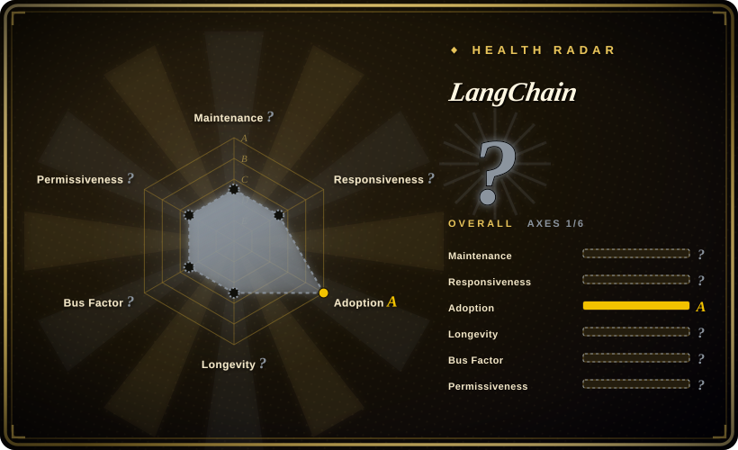

# LangChain

The agent engineering platform — a framework for building agents and LLM-powered applications by chaining interoperable components and third-party integrations.

## When to use

You're a Python developer building an AI application that needs to connect LLMs to external tools, databases, and APIs. You want a structured way to compose prompt templates, manage conversation memory, and route between different models and tools. You need a large ecosystem of pre-built integrations (vector stores, document loaders, model providers) so you don't have to write every adapter yourself. You plan to build agents that can reason, use tools, and maintain state across multiple steps.

## When NOT to use

- **Simple single-prompt apps** — If you just need to call an LLM API once, LangChain adds abstraction overhead with no benefit.
- **Production latency sensitivity** — The framework's abstraction layers can introduce overhead; for millisecond-critical paths, consider direct API calls or lighter wrappers. [推断]
- **Vendor lock-in aversion** — Deep integration with LangChain's ecosystem can create migration friction if you later want to move away from it. [推断]
- **Small resource budgets** — The full framework with all integrations can pull in many dependencies; verify your deployment target's capacity.

## Comparison

| Alternative | In index | Our verdict | Tradeoff |
| --- | --- | --- | --- |
| [Dify](dify.md) | ✅ | Visual platform for agentic workflows. | Dify is a low-code platform with built-in RAG and deployment; LangChain is a code-first library for building custom agents. |
| LlamaIndex | 未收录 | RAG-first data framework for LLMs. | LlamaIndex specializes in retrieval and data ingestion; LangChain is broader, covering agents, chains, and tools. |
| [DSPy](dspy.md) | ✅ | Prompt optimization via metrics. | DSPy optimizes prompts/weights against a metric; LangChain is a general composition framework. |
| OpenAI SDK | 未收录 | Direct vendor SDK for OpenAI models. | The OpenAI SDK is minimal and fast but lacks the multi-provider, multi-tool abstraction of LangChain. |
| [smolagents](smolagents.md) | ✅ | Tiny transparent agent loop from Hugging Face. | smolagents is minimal and transparent; LangChain is comprehensive and integration-rich. |

## Tech stack

- **Python** — primary implementation (also has TypeScript/JS packages)
- **Pydantic** — data validation and serialization
- **LangGraph** — companion library for building multi-agent workflows
- **LangServe** — deployment layer for LangChain chains

## Dependencies

- Python 3.9+ environment
- LLM provider API keys (OpenAI, Anthropic, Gemini, etc.) or local model endpoints
- Optional: vector databases (Pinecone, Weaviate, Chroma, FAISS) for RAG
- Optional: various tool integrations (search APIs, databases, etc.)

## Ops difficulty

**Low**. LangChain is a pip-installable library, not a service. The ops burden is in your application code: managing API keys, handling model rate limits, and optimizing chain latency. Deployment is standard Python application deployment. The main complexity is dependency management due to the large integration ecosystem.

## Health & viability

- **Maintenance**: Very active — daily pushes as of 2026-07, with a well-maintained codebase (415 open issues) and regular releases. [推断]
- **Governance**: Backed by LangChain AI, Inc. — a dedicated company behind the project. The commercial entity provides sustainability but also means roadmap decisions may prioritize enterprise/ paid features. [未验证]
- **Backing**: LangChain AI has raised significant venture funding; this provides resources but also creates pressure for commercialization. [未验证]
- **Adoption**: Very high star count (141k), massive fork volume (23k+), and extensive ecosystem adoption. The project has been active since 2022, giving it a ~4-year track record — a solid Lindy signal for an AI project. [推断]
- **Risk flags**: The company behind LangChain offers commercial products (LangSmith, LangGraph Cloud) that may create open-core/feature-gating pressure. The framework's rapid evolution has historically caused breaking changes between versions. [未验证]

## Caveats (unverified)

- [未验证] The exact roadmap and open-source vs. commercial feature boundaries for LangSmith and LangGraph Cloud are not confirmed.
- [未验证] The historical frequency of breaking changes between minor versions may have stabilized, but verify for production use.
- [推断] As a venture-backed company, LangChain AI may shift focus toward revenue-generating products; evaluate the community fork or alternative if vendor independence is critical.
