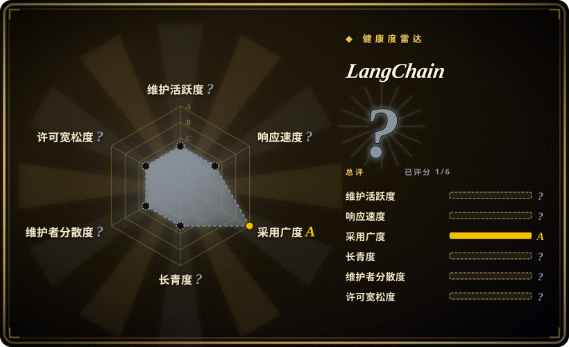

# LangChain

agent 工程平台——通过组合可互操作组件与第三方集成，构建 agent 与 LLM 驱动应用的框架。使用 `uv add langchain` 安装。

## 何时使用

你是一位 Python 开发者，正在构建需要把大模型连接到外部工具、数据库和 API 的 AI 应用。你看过 Dify，但 Dify 是低代码平台，带可视化构建器——你想要代码级别的控制，对每个 prompt、chain 和 tool 调用都有完全掌控。你也看过 AutoGPT，但 AutoGPT 是更高级的平台，带 Web UI 和部署模型；你需要构建自定义应用，而不是运行预置智能体。你选择 LangChain 而不是这两者，因为它是代码优先的框架，给你完整的组合控制能力：你用 Python 编排 prompt 模板、管理对话记忆、在不同模型与工具之间路由，并借助庞大的预构建集成生态，无需自己写每个适配器。你正在构建需要推理、使用工具并在多步之间保持状态的 agent——并且你想拥有架构主导权。

## 何时不用

- **简单单 prompt 应用**——如果你只需要调用一次大模型 API，LangChain 会增加抽象开销而无实际收益。请直接使用 OpenAI SDK 或 Anthropic SDK，因为直接调用更快，没有框架依赖。
- **低代码或无代码平台需求**——如果你希望用可视化拖拽界面构建 agent 而无需写代码，请改用 Dify 或 LangFlow，因为这些平台提供可视化构建器和内置部署能力。
- **生产级延迟敏感场景**——框架的抽象层可能引入开销。对毫秒级关键推理路径，请改用直接 API 调用或 LiteLLM，因为这些选项去除了框架间接层。
- **在框架层面厌恶供应商锁定**——与 LangChain 生态的深度集成可能在你后续想迁移时产生摩擦。如需最大厂商独立性，请改用 LiteLLM 或直接 SDK 配合自研编排，因为这些方式让你更接近底层 API。
- **你需要开箱即用的现成智能体**——LangChain 是构建 agent 的库，不是预配置智能体。如果你希望无需编写编排代码即可立即运行，请改用 AutoGPT 或 Hermes Agent，因为它们是更高级的平台，包含运行时和 UI。

## 横向对比

| 替代品 | 是否收录 | 我们的评价 | 取舍 |
| --- | --- | --- | --- |
| [Dify](dify.zh.md) | ✅ | agentic 工作流可视化平台。 | Dify 是带内置 RAG 与部署能力的低代码平台；LangChain 是构建自定义 agent 的代码优先库，提供完全控制。 |
| [DSPy](dspy.zh.md) | ✅ | 通过指标优化 prompt。 | DSPy 按指标优化 prompt/权重；LangChain 是用于 agent、chain 和 tool 的通用组合框架。 |
| [AutoGPT](autogpt.zh.md) | ✅ | 用于自主工作流自动化的平台。 | AutoGPT 是带 Web UI 和部署模型的高级平台；LangChain 是需在其上构建的底层框架。 |
| [smolagents](smolagents.zh.md) | ✅ | Hugging Face 出品的极简透明 agent 循环。 | smolagents 极简透明；LangChain 全面且集成丰富。 |
| LlamaIndex | 未收录 | 面向 LLM 的 RAG 优先数据框架。 | LlamaIndex 专长于检索与数据摄入；LangChain 更广义，涵盖 agent、chain、tool 和编排。 |

## 技术栈

- **Python**——主要实现（也有 TypeScript/JS 包）
- **Pydantic**——数据验证与序列化
- **LangGraph**——构建多 agent 工作流的配套库
- **LangServe**——LangChain chain 的部署层

## 依赖

- Python 3.9+ 环境
- LLM 提供商 API key（OpenAI、Anthropic、Gemini 等）或本地模型端点
- 可选：向量数据库（Pinecone、Weaviate、Chroma、FAISS）用于 RAG
- 可选：各类工具集成（搜索 API、数据库等）

## 运维难度

**低**。LangChain 是可 pip 安装的库，不是服务。运维负担在你的应用代码中：管理 API key、处理模型限速、优化 chain 延迟。部署是标准 Python 应用部署。主要复杂度来自庞大集成生态带来的依赖管理。

## 健康度与可持续性

- **响应速度**：无法计算——no_traffic。
- **维护**：Grade A——截至 2026-07 在 1 天内有推送，13 周中有 13 周活跃。对如此规模的项目，415 个 open issue 管理良好。
- **响应度**：Grade A——首次响应中位时间 0.3 小时，表明维护团队极其高效。
- **治理**：Grade B——由 LangChain AI, Inc. 支持，过去 12 个月有 48 位活跃维护者。首位维护者占 53% 的提交，存在集中度风险。
- **长期性**：Grade B——1,354 天历史（2022-10 创建），约 3.7 年记录。对一款仍在积极维护的 AI 项目而言，这是不错的 Lindy 信号。
- **采用**：Grade A——据健康雷达，GitHub 141k star，23k+ fork，PyPI 月下载量 4470 万。volume tier 为 A，生态采用广泛。
- **风险旗标**：LangChain AI 提供商业产品（LangSmith、LangGraph Cloud），可能产生 open-core 或功能阉割压力。框架的快速演进历史上曾导致版本间破坏性变更。

## 存疑（未验证）

- [未验证] LangSmith 和 LangGraph Cloud 的精确路线图以及开源与商业功能边界尚未确认。
- [未验证] 小版本间破坏性变更的历史频率可能已趋于稳定，但生产使用前请验证。
- [推断] 作为风险投资支持的公司，LangChain AI 可能将重心转向创收产品；若厂商独立性对你至关重要，请评估社区 fork 或替代方案。
