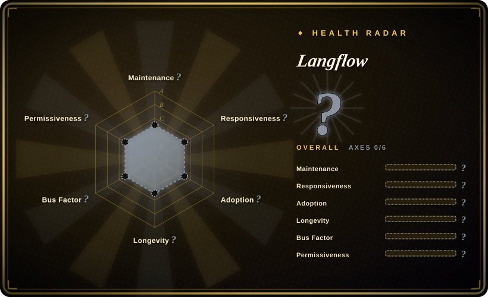

# Langflow

A visual platform for building and deploying AI-powered agents and workflows, with a drag-and-drop interface, built-in API and MCP servers, and component-level customization in Python.

## When to use

You're a developer or AI engineer who needs to prototype and deploy LLM-powered workflows — RAG pipelines, multi-agent orchestration, or chatbot backends — without writing boilerplate integration code for every LLM provider and vector database. You want a visual canvas where you can connect nodes (LLM, retriever, tool, memory) into a flow, test it interactively, and then expose it as an API endpoint or MCP tool. You need support for major models (OpenAI, Anthropic, local), vector stores (Pinecone, Weaviate, Chroma), and the ability to drop into Python when the visual editor isn't enough. Langflow gives you both the GUI for rapid prototyping and the source-code access for production customization.

## When NOT to use

- **Pure-code developers who dislike visual editors.** If you find node-based GUIs limiting and prefer writing agents directly in Python or TypeScript, Langflow's visual layer adds friction rather than value. Frameworks like LangChain or CrewAI are more natural for code-first teams.
- **Simple one-off scripts.** For a single API call or a 50-line Python script, standing up a Langflow instance is overkill. Use it when the workflow complexity justifies the orchestration overhead.
- **Strict git-based workflow versioning.** Visual flows are harder to diff, review in PRs, and merge than code. If your team requires text-based version control for all logic, the visual format creates governance friction. [推断]
- **Production without observability.** While Langflow can deploy workflows as APIs, it does not replace a full production MLOps platform with built-in monitoring, tracing, and A/B testing. Budget for additional observability tooling.
- **Teams needing deep multi-tenancy or RBAC.** Self-hosted Langflow has basic auth, but enterprise-grade tenant isolation, fine-grained permissions, and audit trails are not its primary focus.

## Comparison

| Alternative | In index | Our verdict | Tradeoff |
|---|---|---|---|
| [LangChain](../agent-frameworks/langchain.md) | 未收录 | Lower-level Python/JS framework for building custom agents. | LangChain is a library to code with; Langflow is a visual layer on top of similar concepts. Code-first teams prefer LangChain; visual-first teams prefer Langflow. |
| [n8n](../workflow-orchestration/n8n.md) | ✅ | Fair-code workflow automation with 400+ integrations and AI nodes. | n8n is general-purpose automation with AI bolted on; Langflow is purpose-built for LLM/agent workflows with deeper model and vector-DB integration. |
| Dify | 未收录 | Production-ready platform for agentic workflow development. | Similar visual builder with stronger enterprise RBAC and cloud offering; Langflow is more open and community-driven. |
| [AutoGPT](autogpt.md) | ✅ | Platform for autonomous continuous AI agents. | AutoGPT targets autonomous task execution; Langflow targets composed, interactive workflows with human oversight. |
| CrewAI | 未收录 | Framework for multi-agent role-based teams. | CrewAI is code-first role-based multi-agent orchestration; Langflow is visual flow-based orchestration. |
| Flowise | 未收录 | Open-source visual LLM workflow builder (similar to Langflow). | Very similar feature set; Langflow has a larger community and more active GitHub presence as of 2026-07. [推断] |

## Tech stack

- **Python** — backend runtime and component logic
- **React / React Flow** — visual frontend for the drag-and-drop canvas
- **FastAPI** — API layer for exposing workflows as REST endpoints
- **SQLAlchemy** — database abstraction for persistence
- **LangChain** — underlying LLM integration and chaining primitives (components wrap LangChain concepts)

## Dependencies

- **Python 3.10+** — backend runtime
- **Database** — SQLite for local dev, PostgreSQL recommended for production persistence
- **LLM API keys** — OpenAI, Anthropic, or local model endpoints (Ollama, vLLM, etc.)
- **Optional vector database** — Chroma, Pinecone, Weaviate, or Qdrant for RAG workflows
- **Node.js** — for building the frontend if modifying the UI

## Ops difficulty

**Medium.** Local development is straightforward (`pip install langflow` or Docker). Production deployment requires managing a Python backend, a database for flow persistence, and potentially a vector database. The visual flows themselves need versioning discipline — flows saved as JSON can be committed to git, but diffing and code-reviewing them is awkward. The main ongoing burden is keeping the Langflow version, LangChain dependencies, and model provider APIs in sync.

## Health & viability

- **Maintenance**: Very active — pushed daily as of 2026-07, with a sustained release cadence and a large but manageable open-issue volume (970). The commit activity indicates healthy development velocity.
- **Governance**: Owned by the `langflow-ai` organization; a dedicated team rather than a single maintainer. This provides reasonable bus factor, though the org is relatively young and independent of a major foundation. [未验证]
- **Backing**: No major corporate or foundation backing publicly visible; the project appears to be independently operated by the Langflow organization. [未验证]
- **Adoption**: Very popular (150k stars) with a growing community. The PyPI download badge suggests strong adoption in the Python ecosystem. Active Discord and YouTube presence indicate community investment.
- **Age & Lindy**: Created 2023-02 (~3.5 years old). Young, but has outlasted the initial 2023 AI-agent hype cycle and sustained active development through 2026. It has a partial Lindy signal: it survived the early hype and kept building.
- **Risk flags**: MIT license is clean. The main risk is the dependency on the broader LangChain ecosystem — if LangChain's API or community shifts, Langflow is affected. Also, being a visual tool, it faces competition from both code-first frameworks and no-code platforms; its long-term niche depends on the "visual + code hybrid" model continuing to resonate.

## Caveats (unverified)

- [未验证] The exact relationship between `langflow-ai` and any commercial entity or funding source is not publicly documented.
- [未验证] The LangChain dependency means Langflow inherits LangChain's API stability and versioning decisions; breaking changes upstream may propagate.
- [推断] Visual workflow diff/merge remains awkward compared to code; teams using Langflow in production should establish a JSON-flow review discipline.
- [未验证] The MCP server and built-in API features are relatively new; their production stability and performance characteristics under load are not independently verified.
- [未验证] Some advanced features or integrations may require specific dependency versions that conflict with other packages in a project's environment.
