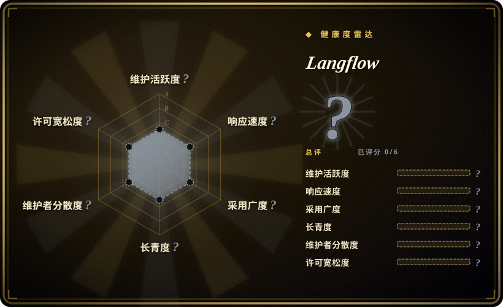

# Langflow

一款可视化平台，用于构建和部署 AI 驱动的智能体与工作流，支持拖拽式界面、内置 API 和 MCP 服务器，可在组件级别用 Python 自定义，并支持所有主流大模型与向量数据库。

## 何时使用

你是一名开发者或 AI 工程师，需要原型化和部署 LLM 驱动的工作流——RAG 管线、多智能体编排或聊天机器人后端——又不想为每个大模型提供商和向量数据库写样板集成代码。你想要一个可视化画布，把节点（LLM、检索器、工具、记忆）连接成流，交互式测试，然后将其暴露为 API 端点或 MCP 工具。你需要支持主流模型（OpenAI、Anthropic、本地模型）、向量库（Pinecone、Weaviate、Chroma），并在可视化编辑器不够用时能下沉到 Python。选择 Langflow 而不是 LangChain，因为 Langflow 既提供可视化画布又提供源码访问，无需手写链式代码；选择 Langflow 而不是 Dify，因为 Langflow 是完全 MIT 许可，更开放于社区驱动的定制。决定取舍：可视化构建器用于快速原型，加上可用 Python 自由定制任何组件的自由度。

## 何时不用

- 如果你排斥可视化编辑器，偏爱纯代码，请用 LangChain 或 CrewAI 而不用 Langflow，因为可视化层对代码优先团队会增加摩擦，而非价值。
- 如果你只需要简单的一次性脚本或单次 API 调用，请用直接 Python 脚本或 HTTP 客户端而不用 Langflow，因为起 Langflow 实例对 trivial 任务来说是杀鸡用牛刀。
- 如果你的团队要求严格的基于 git 的工作流版本控制，需要干净的 diff 和 PR 审查，请用 LangChain 或 Prefect 而不用 Langflow，因为保存为 JSON 的可视化流比代码更难做 diff、审查和合并。
- 如果你需要完整的生产 MLOps 平台，内置监控、tracing 和 A/B 测试，请用 MLflow 或 Weights & Biases 而不用 Langflow，因为 Langflow 不能替代完整的可观测性栈。
- 如果你需要企业级多租户、细粒度 RBAC 和审计追踪，请用 Dify 或商业平台而不用 Langflow，因为自托管 Langflow 只有基础认证，租户隔离不是其首要焦点。

## 横向对比

| 替代品 | 是否收录 | 我们的评价 | 取舍 |
|---|---|---|---|
| [LangChain](langchain.zh.md) | 未收录 | 用于构建自定义智能体的底层 Python/JS 框架。 | LangChain 是编码库；Langflow 是在类似概念之上的可视化层。代码优先团队偏爱 LangChain；可视化优先团队偏爱 Langflow。 |
| [n8n](../workflow-orchestration/n8n.zh.md) | ✅ | fair-code 工作流自动化，带 400+ 集成和 AI 节点。 | n8n 是通用自动化加 AI 能力；Langflow 专为 LLM/智能体工作流设计，模型和向量库集成更深。 |
| Dify | 未收录 | 面向生产级智能体工作流开发的平台。 | 类似的可视化构建器，企业 RBAC 和云服务更强；Langflow 是完全 MIT 许可，更开放于社区驱动的定制。 |
| [AutoGPT](autogpt.zh.md) | ✅ | 用于自主持续运行 AI 智能体的平台。 | AutoGPT 面向自主任务执行；Langflow 面向组合式、可交互、带人工监督的工作流。 |
| CrewAI | 未收录 | 面向多智能体角色化团队的框架。 | CrewAI 是代码优先、基于角色的多智能体编排；Langflow 是可视化流式编排。 |
| Flowise | 未收录 | 开源可视化 LLM 工作流构建器（与 Langflow 类似）。 | 功能集非常相似；截至 2026-07，Langflow 社区更大、GitHub 更活跃。 |

## 技术栈

- **Python**——后端运行时与组件逻辑
- **React / React Flow**——拖拽式画布的可视化前端
- **FastAPI**——将工作流暴露为 REST 端点的 API 层
- **SQLAlchemy**——持久化的数据库抽象层
- **LangChain**——底层 LLM 集成与链式原语（组件包装 LangChain 概念）

## 依赖

- **Python 3.10+**——后端运行时
- **数据库**——本地开发用 SQLite，生产持久化推荐 PostgreSQL
- **LLM API key**——OpenAI、Anthropic 或本地模型端点（Ollama、vLLM 等）
- **可选向量数据库**——Chroma、Pinecone、Weaviate 或 Qdrant，用于 RAG 工作流
- **Node.js**——修改 UI 时用于构建前端

## 运维难度

**中等**。本地开发简单（`pip install langflow` 或 Docker）。生产部署需要管理 Python 后端、用于流持久化的数据库，以及可能的向量数据库。可视化流本身需要版本控制纪律——保存为 JSON 的流可以提交到 git，但做 diff 和代码审查很别扭。主要的持续负担是保持 Langflow 版本、LangChain 依赖和模型提供商 API 的同步。

## 健康度与可持续性

- **维护**：非常活跃——截至 2026-07 每日推送，保持稳定的发布节奏，开放 issue 数量较大但可控（970）。提交活跃度表明健康的开发速度。
- **治理**：由 `langflow-ai` 组织所有；是专注团队而非单人维护者。这提供了合理的 bus factor，但组织相对年轻，且独立于大型基金会。
- **背书**：无公开可见的大型企业或基金会背书；项目似乎由 Langflow 组织独立运营。
- **采用**：非常受欢迎（150k star），社区不断增长。PyPI 下载徽章显示其在 Python 生态中的强劲采用。活跃的 Discord 和 YouTube 存在表明社区投入度高。
- **年龄与 Lindy**：2023-02 创建（约 3.5 年）。虽年轻，但已活过 2023 年 AI 智能体炒作周期，并在 2026 年前保持活跃开发。它拥有部分 Lindy 信号：挺过了早期炒作并持续建设。
- **风险旗标**：MIT 许可干净。主要风险在于对更广泛的 LangChain 生态的依赖——若 LangChain 的 API 或社区转向，Langflow 会受影响。此外，作为可视化工具，它同时面临代码优先框架和无代码平台的竞争；其长期 niche 取决于“可视化 + 代码混合”模式能否持续获得共鸣。

## 存疑（未验证）

- [未验证] `langflow-ai` 与任何商业实体或资金来源之间的确切关系未公开记录。
- [未验证] 对 LangChain 的依赖意味着 Langflow 继承 LangChain 的 API 稳定性和版本决策；上游破坏性变更可能传导。
- [推断] 可视化流的 diff/merge 相比代码仍然别扭；在生产中使用 Langflow 的团队应建立 JSON 流审查纪律。
- [未验证] MCP 服务器和内置 API 功能相对较新；它们在负载下的生产稳定性和性能特征未经独立验证。
- [未验证] 某些高级功能或集成可能需要特定依赖版本，可能与项目环境中其他包冲突。
