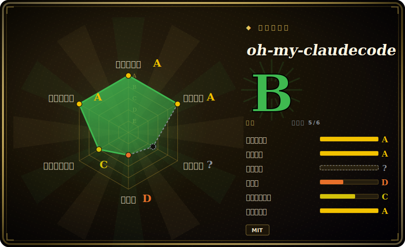

# oh-my-claudecode

架在 Anthropic Claude Code CLI 之上的多智能体编排层：把一队专职 agent 按阶段串成流水线（plan → prd → exec → verify → fix），为每个子任务路由到更便宜或更强的模型，并在 tmux 下跑并行 worker——以 Claude Code 插件形式安装，或通过 `oh-my-claude-sisyphus` npm 包安装。

## 何时使用

你是天天泡在 Claude Code 里的开发者，做大一点的活时总撞上单 agent 的天花板：一个多文件特性，你希望一遍负责规划、另一遍写 PRD、再用并行 worker 实现、还要一个独立的 reviewer/tester 来验证——而不想在多个对话 session 之间手动来回拷贝上下文，也不想每一步都盯着。你还注意到自己在琐碎改动上烧着 Opus 的 token，而这些活 Haiku 就能干。oh-my-claudecode（OMC）架在 Claude Code 之上，给你一条规范的 "team" 流水线（`team-plan → team-prd → team-exec → team-verify → team-fix`），外加模型路由——把简单活推给更便宜的档位、把贵模型留给硬推理，还有 HUD 状态栏让你看清每个 agent 在干什么。

你之所以选它，正是因为想要编排发生在*你本来就在付费的 Claude Code 生态里*——你的 Max/Pro 订阅或 API key——而不是另起一个带自己运行时的 Python agent 框架。你以插件方式安装（`/plugin install`）或 `npm i -g`，跑 `/setup`，之后就用自然语言或斜杠命令驱动它（`/team`、`/autopilot`、`/ralph`）；要用 tmux 撑起的并行 CLI worker 就用 `omc team`。当你的瓶颈是*协调多个 Claude agent*、而不是搭一个通用的多 LLM 应用时，它很合适。

## 何时不用

- **你不用 Claude Code。** OMC 是 Claude Code 的插件 / 伴生 CLI。如果你要在自己的应用里用任意 LLM 供应商编排 agent，该选通用框架（[DSPy](dspy.zh.md)、[AgentScope](agentscope.zh.md)），而非这种绑死 Claude Code 的层。它没有供应商无关的内核。
- **你跑不了 tmux。** 并行 `omc team` worker 和限流检测都依赖 tmux；在受限的 CI、被锁死的企业 shell、或纯 Windows 环境下会有摩擦。最近的版本还在加固 Windows/tmux 路径，所以跨平台并行能力可视为尚未定型。
- **你要一个稳定、慢节奏的 API 来做产品。** 项目发版很猛（一个月多次，常见 “若干新特性 / 大量修复” 的补丁），暴露面又宽又快变——19 个 agent 角色、多种执行模式（Autopilot、Ralph、Ultrawork、UltraQA）、关键词触发。这种速度对资深用户是福音，但你要耦合的就是这份 churn。
- **你想要一条可审计、确定性的单 agent 循环。** 带自动模型路由和并行 worker 的多阶段多 agent 流水线，天然比单 agent 脚本更难推理、更难复现；排查 “哪个 agent 在哪个档位干了什么” 会增加表面积。
- **你是单人、单维护者、规避风险的团队。** 这实质上是个一人项目 [推断]；对任何承载关键路径的东西，bus-factor 和长期支持都是真实考量。
- **成本本就完全可预测。** “省 30-50% token” 是项目自己的说法，完全取决于你的工作负载；如果你已经手动控制模型选择，路由带来的增益就小。

## 横向对比

| 替代品 | 是否收录 | 取舍 |
|---|---|---|
| [DSPy](dspy.zh.md) | ✅ | 供应商无关的 Python 框架，用于编程/优化 LLM 流水线；应用得你自己搭。OMC 更窄：编排发生在 *Claude Code 内部*，没有模型程序编译。 |
| [AgentScope](agentscope.zh.md) | ✅ | 通用多智能体平台（任意模型、消息传递、可视化 studio）；是你自己托管的完整框架。OMC 则骑在 Claude Code 上，不是独立运行时。 |
| [claude-octopus](claude-octopus.zh.md) | ✅ | 同样以 Claude Code 为中心的并行/多 agent 工具；最接近的同类。在暴露面和编排模型上有别——已经在 Claude Code 上的话，直接两者对比。 |
| [Symphony](symphony.zh.md) | ✅ | OpenAI 出品的编排；绑定在与 Claude Code 不同的供应商生态。 |
| [openfang](openfang.zh.md) | ✅ | 另一种 agent 框架取向；其模型见其页面。 |
| claude-flow | 未收录 | 另一个流行的 Claude-Code 多 agent / swarm 编排层；问题域重叠，抽象和成熟度不同。 |
| Claude Code 原生 subagent | 未收录 | Anthropic 原生的 subagent/并行能力已覆盖 OMC 的部分价值，且无第三方依赖；OMC 在其上叠加了 team 流水线、路由、模式和 HUD。 |

## 技术栈

- **语言：** TypeScript（主语言，仓库元数据 2026-06-26）。
- **宿主：** Anthropic Claude Code CLI——既以 Claude Code marketplace 插件分发，也作为 npm 包（`oh-my-claude-sisyphus`）分发。
- **编排底座：** tmux，用于并行 CLI worker（`omc team`）和限流检测。
- **模型路由：** 在 Anthropic 模型档位间分配任务（如简单活给 Haiku、硬推理给 Opus）[未验证] 具体路由规则。
- **可选集成：** 其它 agent CLI（Antigravity/agy、Gemini CLI、Codex CLI、Grok Build）和通知渠道（Telegram、Discord、Slack），据 README。

## 依赖

- **必需：** Claude Code CLI;Claude Max/Pro 订阅**或** Anthropic API key;Node.js（走 npm 安装时）;**tmux**（用于 `omc team` 与限流处理）。
- **安装（插件）:** `/plugin marketplace add https://github.com/Yeachan-Heo/oh-my-claudecode` → `/plugin install oh-my-claudecode` → `/setup`。
- **安装（CLI）:** `npm i -g oh-my-claude-sisyphus@latest` → `omc setup`。
- **可选：** Antigravity/Gemini/Codex/Grok 等 CLI；通知集成。

## 运维难度

**低到中。** 顺路径确实简单：装插件、跑 `/setup`、用自然语言驱动——“零配置”加智能默认值是其明确设计目标。难度升到**中**的场景：依赖 tmux 撑起的并行 worker（shell/终端环境很关键，而 Windows/tmux 支持还在逐版加固）、接外部 CLI 或通知渠道、或试图在项目的快速发版节奏里 pin 住行为。因为它是 Claude Code 之上偏薄的一层，大部分 “运维” 其实是 Claude Code 自身的鉴权/限流现实，再加上把插件/npm 版本保持更新。

## 健康度与可持续性

- **维护——非常活跃（截至 2026-06）。** 最后推送 2026-06，发版很猛（一月多次，当前 v4.15.0）；未归档。在被积极维护，但这份速度本身就是「何时不用」里点到的 churn。
- **治理与 bus factor——单维护者 + 巨量 star 失配 ⇒ 红旗。** 一个 `User` 持有的仓库（`Yeachan-Heo`）背着约 37k star，是典型的 bus-factor 信号：一个人掌握着一个可见度极不成比例之物的路线图。在让它承重前，请把这份热度与维护深度解耦看待。[推断]
- **年龄与 Lindy——年轻、未经证明。** 2026-01 创建，约 6 个月（截至 2026-06）。活跃度高但无历史沉淀；是「活跃但未经证明」，而非 Lindy 安全——寿命与单作者的延续性都未被证明。
- **风险信号——快速变动的表面 + 薄层。** MIT 许可、重许可风险低，但它是架在 Claude Code 之上的一层又薄又快变的层（19 个角色、多种执行模式）；升级与跨平台（Windows/tmux）路径仍在定型中。

## 存疑（未验证）

- [未验证] 截至 2026-06-26 star 约 37k——Claude-Code 工具生态的 GitHub star 不可靠且对时间敏感，仅供参考。
- [未验证] “省 30-50% token”“零配置”“19 个专职 agent” 都是项目自己的 README 表述；实际节省和 agent 数量取决于工作负载与版本，未经独立基准测试。
- [未验证] 具体模型路由规则（哪个档位接哪类任务）来自 README 描述，未对照代码核实。
- [未验证] 完整执行模式集合（Autopilot、Ralph、Ultrawork、UltraQA）和关键词触发均据 README；精确行为/可用性随版本变动。
- [推断] 单一主维护者 / 低 bus-factor——由仓库 owner 模式推断，未经确认；依赖其上生产前请核实。
- [推断] 把它归为 `framework` 是判断：它同时是 Claude Code 插件和 CLI;“架在 Claude Code 之上的编排框架” 是最贴近的归类。
