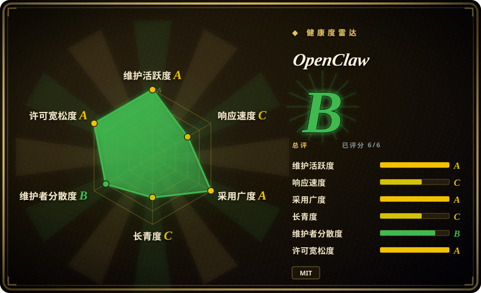

# OpenClaw

一款在自有设备上运行、跨 20 余条消息渠道应答你的个人 AI 助手——以“龙虾之道”掌控自己的数据。

## 何时使用

你是一位注重隐私的专业人士，想要一个能跟随你穿梭于所有设备与消息应用之间的单一 AI 助手。你不愿把对话交给纯云服务，也希望在 WhatsApp、Telegram、Slack、Discord、iMessage、WeChat 等渠道上无需切换不同机器人即可被助手响应。你在自己的硬件上安装 OpenClaw，连接偏好的 LLM 提供商，它就成了一个常驻的个人智能体，在你已用的渠道上随时应答。

## 何时不用

- **多用户或团队场景**——OpenClaw 设计为单用户个人助手，不是带 RBAC 的团队共享平台。
- **零配置 SaaS 偏好**——自托管需要管理 Node.js 运行时、LLM 凭证和渠道配置。
- **企业合规需求**——无管理后台、审计日志或企业 SSO；这是个人工具。
- **编程专用智能体工作**——OpenClaw 是通用对话助手，不是 Codex 或 Claude Code 这类软件开发智能体。

## 横向对比

| 替代品 | 是否收录 | 我们的评价 | 取舍 |
| --- | --- | --- | --- |
| [Hermes Agent](hermes-agent.zh.md) | ✅ | 类似个人助手角度，但带学习循环。 | Hermes 内置自我改进与技能创建；OpenClaw 侧重多渠道无处不在。 |
| [AutoGPT](autogpt.zh.md) | ✅ | 复杂的工作流自动化平台。 | AutoGPT 面向自主任务执行与部署；OpenClaw 是对话助手。 |
| [Open Interpreter](open-interpreter.zh.md) | ✅ | 终端优先的编码智能体，带可切换 harness。 | Open Interpreter 用于终端编码；OpenClaw 是跨消息应用的聊天机器人。 |
| LangChain | 未收录 | 构建自定义智能体的底层库。 | LangChain 是从头搭建的框架；OpenClaw 是开箱即用的个人助手。 |
| Claude / ChatGPT 原生应用 | 未收录 | 闭源、纯云端的助手。 | 专有且需联网；OpenClaw 可自托管、不绑定渠道。 |

## 技术栈

- **TypeScript**——主要实现语言
- **Node.js**——网关/控制平面运行时
- **跨平台**——支持 macOS、iOS、Android 及服务器操作系统

## 依赖

- LLM 提供商（OpenAI API、Anthropic API 或本地模型端点）
- 网关所需的 Node.js 运行时
- 托管助手的设备或服务器

## 运维难度

**低**。网关是单一控制平面；对习惯运行 Node.js 应用的用户来说安装简单。主要持续负担是配置消息渠道和轮换 LLM 凭证。

## 健康度与可持续性

- **维护**：非常活跃——截至 2026-07 每日推送，大量开放 issue（6,749）表明社区参与度高。
- **治理**：由 OpenClaw 组织所有；bus factor 尚可，但项目很年轻（2025-11 创建）。
- **背书**：无显著企业背书可见；社区驱动，Discord 活跃。
- **采用**：star 数极高（381k），但项目非常年轻（不足 8 个月）。star 数反映的是炒作而非已验证的长期存续。
- **风险旗标**：项目极其年轻，毫无 Lindy 记录。GitHub 元数据中的 `NOASSERTION` 许可与 README 上的 MIT badge 存在出入，需澄清。[未验证]

## 存疑（未验证）

- [未验证] GitHub 元数据中的 `NOASSERTION` 许可可能与 README 上显示的 MIT badge 不一致；商用前请核实。
- [推断] 该仓库 2025 年末创建却已有 381k star，star 数可能受炒作推动，而非有机的生产级采用。
- [未验证] “20 余条消息渠道”列表中包含 WeChat、QQ 等平台，其集成 API 可能不稳定或为非官方方案。
