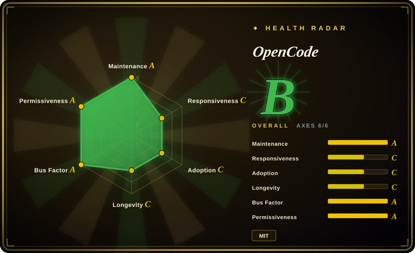

# OpenCode

An open-source AI coding agent that runs in your terminal, edits files, executes commands, and works with your existing codebase.

## When to use

You're a developer who wants an AI coding agent you can run locally in your terminal, audit its source code, and extend when needed. You've outgrown copy-pasting into chat UIs and want the agent to read your project files, suggest edits across multiple files, run tests, and iterate on its own errors. You install OpenCode via npm, connect your LLM API key, and point it at a repo — it acts as a pair programmer that lives in your shell and understands your codebase context.

## When NOT to use

- **Non-technical users or terminal-averse teams.** OpenCode is a CLI-first tool; if your team lives in IDEs or web UIs and doesn't want to learn terminal commands, this is the wrong fit.
- **Enterprise compliance needs.** No built-in audit logs, RBAC, or admin dashboards; it's a personal developer tool, not a governed team platform.
- **Zero-setup SaaS preference.** You must bring your own LLM API key and manage local Node.js runtime; there's no managed cloud offering.
- **Non-coding tasks.** OpenCode is purpose-built for software engineering workflows, not general chat, data analysis, or document generation.
- **Heavy IDE integration.** It does not ship as a VS Code or JetBrains extension; if you want in-IDE AI completion, look at Kilo Code or Copilot.

## Comparison

| Alternative | In index | Our verdict | Tradeoff |
|---|---|---|---|
| [Open Interpreter](open-interpreter.md) | ✅ | Terminal coding agent with swappable harnesses for open models. | Open Interpreter is a Rust rewrite with OS sandbox execution; OpenCode is TypeScript/npm-based and younger. |
| [Hermes Agent](hermes-agent.md) | ✅ | Self-improving AI agent with a learning loop from Nous Research. | Hermes focuses on skill creation and personal growth across sessions; OpenCode is a focused coding agent. |
| [AutoGPT](autogpt.md) | ✅ | Platform for autonomous workflow automation. | AutoGPT targets complex multi-step autonomous tasks; OpenCode is a terminal pair-programmer for code. |
| Claude Code | 未收录 | Closed-source terminal coding agent from Anthropic. | Proprietary, no source access, subscription-bound; OpenCode is open-source and BYOK. |
| Gemini CLI | 未收录 | Google's open-source terminal AI agent. | Apache-2.0, backed by Google; OpenCode is MIT and community-driven. |

## Tech stack

- **TypeScript** — primary implementation language
- **Node.js** — runtime environment
- **npm** — distribution via `npm install opencode-ai`
- **Monorepo** — packages for console app and core logic

## Dependencies

- **Node.js** runtime (check package requirements for version)
- **LLM API key** — OpenAI, Anthropic, or compatible provider
- **Terminal / shell** — primary interaction surface
- **Git** — for working with repositories

## Ops difficulty

**Low**. Installation is `npm install -g opencode-ai` or similar; the agent runs as a local process with no persistent service to manage. The ongoing burden is API key rotation and keeping the npm package updated.

## Health & viability

- **Maintenance**: Very active as of 2026-07, with daily pushes and a large issue volume (7,113 open issues) indicating high community engagement.
- **Governance**: Owned by the `anomalyco` organization; bus factor is reasonable but the project is young (created 2025-04) and the core team's long-term commitment is unproven.
- **Backing**: No major corporate backing visible; community-driven with an active Discord.
- **Adoption**: Extremely high star count (181k) for a project under 15 months old. The star count signals hype rather than proven, organic production adoption. [推断]
- **Risk flags**: The project is extremely young with no Lindy track record. MIT license is clean, but the velocity of a v0.x project this young means breaking changes should be expected.

## Caveats (unverified)

- [推断] 181k GitHub stars on a repo created in April 2025 may be inflated by hype rather than organic production adoption.
- [未验证] The exact npm package name and installation path may change as the project is still in v0.x.
- [未验证] Multi-language README support (18+ languages listed) suggests global ambition, but the depth of non-English documentation quality is unverified.
- [未验证] The relationship between `anomalyco` and any commercial entity or monetization plan is not publicly documented.
