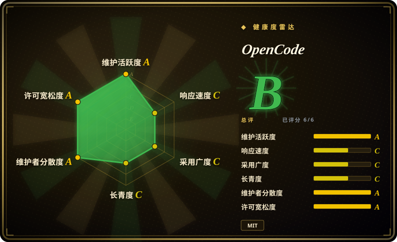

# OpenCode

一款开源的终端 AI 编码智能体，可编辑文件、执行命令并与现有代码库协同工作。通过 npm 以 `opencode-ai` 安装。

## 何时使用

你是一位开发者，想用 AI 辅助编码，但拒绝被单一 LLM 厂商锁定。你已经试过 Claude Code（只能调 Claude）和 Codex（只能调 OpenAI），发现一旦模型价格暴涨或能力倒退，你就被困住了。你需要一个模型无关的编码智能体——同一个工具，今天接 GPT-4，明天切 Claude 3.5，后天跑本地 Llama，完全由你决定。你选择 OpenCode 而不是 Claude Code，因为 OpenCode 让你自由切换模型，而 Claude Code 被锁死在 Anthropic。你选择它而不是 Open Interpreter，因为 OpenCode 基于 TypeScript/npm，与你已在使用的 JavaScript 生态更自然地集成。OpenCode 是 MIT 许可的，源码可审计，架构可扩展，你甚至能 fork 出来改适合自己团队的工作流。安装只需 `npm install opencode-ai`，连接 API key，指向仓库——它是驻留在 shell 里、不挑模型的结对编程搭档。

## 何时不用

- **你已经在用 Claude Code 且对 Anthropic 路线图有信心**——如果你只调 Claude、预算固定、对厂商方向有信心，Claude Code 是更 polished 的选择（Claude 专属的上下文优化、Artifacts 集成）。切换到 OpenCode 只会增加配置负担，没有额外收益。请继续使用 Claude Code 而不是 OpenCode，因为当你不需要模型自由时，厂商锁定体验反而更优。
- **团队需要 IDE 内无缝集成**——OpenCode 是 CLI 工具，不是 VS Code 插件。如果你习惯在编辑器里点击按钮让 AI 改代码，请改用 Kilo Code 或 GitHub Copilot，因为它们的 IDE 原生集成提供更顺滑的编辑体验。
- **非技术用户或终端恐惧者**——纯命令行交互，没有 GUI。如果团队里有人不会用终端，这就是门槛。请改用 Claude 网页版或 ChatGPT，因为它们提供熟悉的聊天界面，无需技术设置。
- **追求企业级治理**——无 RBAC、无审计日志、无 admin 面板。它是个人/小团队的开发工具，不是企业平台。如需组织治理，请改用 Dify 或 GitHub Copilot for Business，因为这些平台提供管理控制、审计轨迹和团队管理。
- **你 100% 确定只用一个模型且永远不会换**——OpenCode 的核心价值是模型自由切换。如果你知道未来只用 Claude（或只用 GPT-4），模型无关性对你为零价值。请改用 Claude Code 或 Codex CLI，因为单一厂商工具更简单，且对该模型优化得更紧密。

## 横向对比

| 替代品 | 是否收录 | 我们的评价 | 取舍 |
| --- | --- | --- | --- |
| [Open Interpreter](open-interpreter.zh.md) | ✅ | 带可切换 harness 的终端编码智能体，面向开源模型。 | Open Interpreter 是 Rust 重写，带 OS 沙箱执行；OpenCode 基于 TypeScript/npm，与 JS/TS 工作流更自然集成。 |
| [Hermes Agent](hermes-agent.zh.md) | ✅ | Nous Research 出品的带学习循环的自我改进智能体。 | Hermes 侧重跨会话技能创建与个人成长；OpenCode 是专注的编码智能体，没有学习循环。 |
| [AutoGPT](autogpt.zh.md) | ✅ | 用于自主工作流自动化的平台。 | AutoGPT 面向复杂多步自主任务；OpenCode 是终端结对编程助手。 |
| Claude Code | 未收录 | Anthropic 出品的闭源终端编码智能体。 | 专有、无源码、需订阅；OpenCode 开源且 BYOK。 |
| Gemini CLI | 未收录 | Google 出品的开源终端 AI 智能体。 | Apache-2.0，Google 背书；OpenCode 是 MIT，社区驱动。 |

## 技术栈

- **TypeScript**——主要实现语言
- **Node.js**——运行时环境
- **npm**——通过 `npm install opencode-ai` 分发
- **Monorepo**——包含 console app 与核心逻辑的多个包

## 依赖

- **Node.js** 运行时（需满足包的版本要求）
- **LLM API key**——OpenAI、Anthropic 或兼容提供商
- **终端 / shell**——主要交互界面
- **Git**——用于与仓库协作

## 运维难度

**低**。安装方式类似 `npm install -g opencode-ai`；智能体作为本地进程运行，无需管理常驻服务。持续负担主要是 API key 轮换与保持 npm 包更新。

## 健康度与可持续性

- **维护**：Grade A——截至 2026-07 每日推送，13 周中有 13 周活跃。7,113 个开放 issue 表明社区参与度高。
- **治理**：Grade A——由 `anomalyco` 组织所有，过去 12 个月有 475 位活跃维护者。首位维护者仅占 16.1% 的提交，前三位占 45.1%，核心团队分布良好。
- **长期性**：Grade C——428 天历史（2025-04 创建）。毫无 Lindy 记录；项目年轻，但已活跃超一年。
- **采用**：Grade C——据健康雷达，GitHub 181k star，npm 月下载量 127k。volume tier 为 C，graph tier 为 E，表明项目尚处早期采用阶段。
- **风险旗标**：项目极其年轻，无已验证的 Lindy 记录。MIT 许可干净，但 v0.x 项目如此年轻意味着应预期破坏性变更。

## 存疑（未验证）

- [推断] 2025 年 4 月创建的仓库已有 181k GitHub star，可能受炒作推动，而非有机生产级采用。
- [未验证] 具体 npm 包名与安装路径可能因项目尚处 v0.x 而变动。
- [未验证] 多语言 README 支持（列出 18 余种语言）显示全球化野心，但非英语文档深度未经检验。
- [未验证] `anomalyco` 与任何商业实体或盈利计划之间的关系未公开说明。
