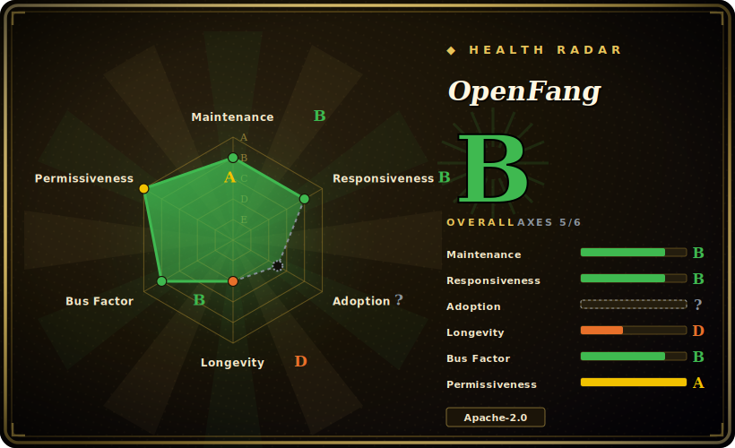

# OpenFang

A Rust "agent operating system" that ships as a single self-contained binary: it runs autonomous agents ("Hands") on schedules — 24/7, without you prompting them — with a built-in kernel, scheduler, WASM tool sandbox, MCP support, and 40 messaging-channel adapters.

## When to use

You're a solo founder or small ops team and you want an agent that *does work on a timer*, not one you babysit in a chat box. Think: scrape leads and score them against your ICP every morning, run an OSINT change-detection sweep on competitors, draft and schedule X/Twitter posts, or have a research agent cross-reference sources and hand you a cited brief — all running unattended on a box you control. You don't want to stitch together a Python framework plus a cron daemon plus a queue plus a dashboard plus per-channel webhook glue; you want one process that already has the scheduler, the persistence, the channel adapters, and the guardrails baked in. OpenFang resolves this by being an "OS" rather than a library: you `openfang init`, drop in a Hand (a `HAND.toml` manifest + system prompt + skill doc + approval gates), and it runs on its schedule, talks to you over Telegram/Discord/Slack/WhatsApp, and logs every action to a tamper-evident audit chain.

It also fits when you care about footprint and self-hosting. The whole thing is one ~32 MB Rust binary with low idle memory, so it's plausible on a small VPS or a homelab box where a heavyweight Python agent stack would feel wrong, and the WASM sandbox plus capability-based access control give you a security story for letting an agent touch the open web and your accounts. If you're migrating off OpenClaw, OpenFang explicitly courts that crowd with a migration path. [推断]

## When NOT to use

- **You want a conversational, in-the-loop orchestration library, not an OS.** If you're building a request/response agent inside your own app and need fine-grained control over the graph of LLM calls, a library like [DSPy](dspy.md), LangGraph, or [AgentScope](agentscope.md) fits the shape better — OpenFang owns the runtime, scheduler, and process model, which is the opposite of "drop into my service."
- **You need a mature, API-stable foundation.** It is explicitly pre-1.0: the README warns to expect rough edges and breaking changes between minor versions and to pin a specific commit for production. Building a business-critical pipeline on it today means absorbing churn.
- **Single-vendor, young project risk.** Created 2026-02 and driven by one company (RightNow); a ~4-month-old single-org project carries abandonment and direction-change risk that a multi-maintainer foundation project does not. [推断]
- **You don't trust the benchmark/feature framing.** The README leads with self-run comparisons (cold start, idle memory, "16 security systems", "only one with channel adapters"). These are first-party and unaudited — do not select on them without your own measurement. [未验证]
- **You need a language/runtime your team can extend.** It's Rust end-to-end; if nobody on the team writes Rust, authoring new tools/Hands beyond the bundled ones (vs. just configuring) will be costly.
- **Compliance/data-residency or multi-tenant SaaS at scale.** It targets self-hosted single-operator/small-team autonomy on SQLite-backed local persistence; it is not a managed, horizontally-scaled multi-tenant control plane.

## Comparison

| Alternative | In index | Tradeoff |
|---|---|---|
| [DSPy](dspy.md) | ✅ | A Python framework for *programming* (and optimizing) LLM pipelines; you embed it in your app. OpenFang is the opposite: an autonomous runtime/OS that owns scheduling and execution, not a library you call. |
| [AgentScope](agentscope.md) | ✅ | Developer framework for building/orchestrating multi-agent apps with explicit control; OpenFang trades that control for a batteries-included, schedule-driven OS with channels and guardrails built in. |
| [Symphony](symphony.md) | ✅ | Sibling in this category; different orchestration philosophy — compare directly if you're choosing an agent framework. |
| [claude-octopus](claude-octopus.md) | ✅ | Sibling; narrower Claude-centric tooling vs. OpenFang's broad 27-provider, OS-shaped scope. |
| LangGraph | 未收录 | The default Python choice for stateful, interactive agent graphs inside your own service; no built-in scheduler/channels/binary distribution. OpenFang inverts this as a standalone OS. |
| OpenClaw | 未收录 | The project OpenFang positions itself against and offers a migration path from; OpenFang claims smaller footprint and the OS framing. Verify the comparison yourself. |
| CrewAI / AutoGen | 未收录 | Role/conversation-oriented multi-agent Python frameworks for in-app workflows; not single-binary autonomous runtimes. |

## Tech stack

- **Language:** Rust (primary, ~91% by bytes), with HTML/JS/CSS for the dashboard and a Tauri 2.0 desktop shell; small Python/Shell/PowerShell installers.
- **Structure:** a Cargo workspace of ~14 crates — kernel (orchestration/scheduler/RBAC), runtime (agent loop, LLM drivers, tools, WASM sandbox, MCP), api (REST/WS/SSE, OpenAI-compatible), channels, memory, wire (P2P protocol), CLI, desktop, migrate (crate count/LOC per README).
- **Datastore:** SQLite for persistence plus vector embeddings for memory.
- **Sandbox/security:** WASM tool sandbox, capability-based access control, Merkle hash-chain audit trail, Ed25519 signing, prompt-injection scanning, SSRF protection.
- **LLM/MCP:** Model Context Protocol support; many provider drivers (Anthropic, OpenAI, Gemini, Groq, DeepSeek, Ollama, vLLM, and more — README claims 27 providers / 123+ models).
- **Channels:** ~40 messaging adapters (Telegram, Discord, Slack, WhatsApp via QR gateway, Signal, Matrix, Email, Teams, etc.).

## Dependencies

- **Runtime:** a single self-contained binary (~32 MB per README); no external service required to start. Installs via `curl … | sh` (macOS/Linux) or PowerShell (Windows).
- **Optional:** Node.js ≥ 18 only for the WhatsApp Web (QR) gateway, which listens on port 3009; dashboard on port 4200 by default.
- **Build-from-source:** a recent Rust toolchain / Cargo (it's a large workspace; full builds are non-trivial).
- **External:** API keys for whichever LLM provider(s) you route to; for local models, an Ollama/vLLM endpoint.

## Ops difficulty

**Low to run, medium to operate seriously.** The happy path is genuinely light: one binary, `openfang init` / `openfang start`, a local dashboard — closer to running a CLI daemon than deploying a Python ML stack, and the small footprint suits a VPS or homelab. Difficulty rises once it's doing real autonomous work: you're now responsible for an agent acting unattended against live accounts and the open web, so you must configure approval gates, scope capabilities, manage secrets/API keys, watch the audit log, and — given the pre-1.0 status — pin to a known-good commit and budget for breaking changes on upgrade. Building from source or authoring new Rust tools/Hands moves it toward **high** for non-Rust teams.

## Health & viability

- **Maintenance — active, pre-1.0 (as of 2026-06).** Last push 2026-06; latest release v0.6.9 (2026-05, security patches for RUSTSEC advisories); not archived. Actively developed but explicitly pre-1.0, so expect breaking changes between minor versions.
- **Governance & backing — single vendor.** Driven by one company (RightNow / `RightNow-AI`), not a foundation or multi-org community; the roadmap and continuity ride on that vendor. A single-vendor pre-1.0 project carries direction-change and abandonment risk a foundation project does not.
- **Age & Lindy — very young, unproven.** Created 2026-02, ~4 months old (as of 2026-06). No track record; firmly "young and hyped," not Lindy-safe — do not bet a business-critical pipeline on it without absorbing churn.
- **Risk flags — first-party benchmarks + young single-vendor.** All headline numbers (cold start, memory, "27 providers / 40 channels", LOC) are unaudited README figures; license is dual MIT OR Apache-2.0 (no relicense history). The dominant risk is youth + single-vendor concentration, not licensing.

## Caveats (unverified)

- [未验证] Star count ~17.9k as of 2026-06 — GitHub stars in the agent-framework space are unreliable and time-sensitive; treat as indicative only.
- [未验证] All benchmark numbers (cold start ~180 ms, idle memory ~40 MB, install size ~32 MB) and "16 security systems / 40 channels / 27 providers / 123+ models / 14 crates / 137k LOC / 1,767+ tests" are first-party README figures, not independently audited.
- [未验证] The "only framework with messaging channel adapters" and head-to-head latency/memory comparisons vs LangGraph/CrewAI/AutoGen/OpenClaw are the project's own framing; no third-party verification found.
- [推断] License is dual MIT OR Apache-2.0 (both LICENSE-MIT and LICENSE-APACHE present in repo; GitHub's API surfaces only Apache-2.0) — confirm acceptable terms for your use.
- [推断] Single-vendor (RightNow), created 2026-02; maintenance breadth and long-term direction are unproven for a project this young.
- [未验证] v0.6.9 released 2026-05-12 ("security patches" for RUSTSEC advisories) is the latest release at time of writing; newer versions may exist.
- [推断] Exact crate/component layout, provider list, and channel list are summarized from the README; verify specific provider/channel/Hand support against the current repo before relying on it.
