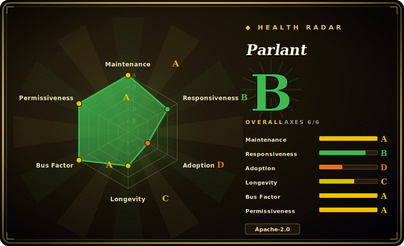

# Parlant

A Python framework for building reliable, controllable customer-facing LLM agents, where you steer behavior with declarative "guidelines" (behavioral rules that constrain what the agent does) rather than hand-tuning a mega-prompt and hoping it holds.

## When to use

You're an engineer at a company shipping a customer-facing support or sales agent — it talks to real customers, quotes prices, processes refunds, and answers policy questions. The bar isn't "demos well in a notebook"; it's "never promises a refund the policy forbids, never invents a discount, never goes off-script when a frustrated user pushes on it." You tried a single big system prompt and it mostly works, but under adversarial or long conversations it drifts: it follows instructions inconsistently, contradicts an earlier turn, or improvises a policy that doesn't exist. You need the agent to stay *on-rails* in ways you can audit and explain to compliance, not just "usually behave."

Parlant is built for exactly this lane. Instead of cramming everything into one prompt, you express behavior as **guidelines** — condition/action rules ("when the customer asks for a refund outside the return window, explain the policy and offer store credit instead") — plus tools the agent may call. The framework's job is to model the conversation and enforce that the agent actually applies the relevant guidelines at each turn, so the controllable, predictable behavior you'd otherwise try to coax out of prompt engineering becomes a structured, inspectable layer. Reach for it when the cost of an off-script answer is real (money, legal, brand) and you'd rather constrain the agent than trust it.

## When NOT to use

- **Your agent is simple or internal.** If it's a personal assistant, an internal dev tool, or a thin "call this LLM with a prompt" loop, Parlant's guideline/conversation-modeling machinery is overkill — a minimal agent library like [smolagents](smolagents.md) (or a raw provider SDK) has far less to learn for a low-stakes bot.
- **You want a free-form research/autonomous agent.** Parlant's whole point is *constraint*. For an exploratory ReAct/research agent that should range widely and improvise tool use, an opinionated guardrails-first model fights you; reach for a generic agent runtime instead.
- **Your problem is prompt/program *optimization*, not behavioral control.** If you're trying to compile and tune prompts/pipelines for quality, [DSPy](dspy.md) is a different tool entirely — Parlant constrains behavior, it doesn't optimize prompts.
- **You need generic multi-agent orchestration / arbitrary control flow.** For graph/state-machine orchestration of many cooperating agents, a generic framework like [AgentScope](agentscope.md) or LangGraph is the closer fit; Parlant is opinionated toward *one* controllable conversational agent, not an orchestration substrate.
- **You're wary of single-vendor, young projects.** It's a ~2-year-old project driven by one company (Emcie) [推断]; if you need a foundation-governed, long-proven framework with years of third-party recipes, that risk may outweigh the control benefits.
- **Lock-in to its modeling.** Behavior lives in Parlant's guideline/conversation abstractions. Adopting it means writing to its model; migrating off later means re-expressing that behavior elsewhere. Weigh that before betting a production support flow on it.

## Comparison

| Alternative | In index | Our verdict | Tradeoff |
|---|---|---|---|
| [AgentScope](agentscope.md) | ✅ | Use this page for its stated niche; choose AgentScope when you need generic multi-agent serving framework (service/permission/sandbox/observability). | Generic multi-agent serving framework (service/permission/sandbox/observability); "trust the model" loop, not a guardrails-first conversation model. Pick AgentScope to orchestrate/serve agents, Parlant to constrain one customer-facing agent. |
| [smolagents](smolagents.md) | ✅ | Use this page for its stated niche; choose smolagents when you need minimal, code-first agent library. | Minimal, code-first agent library — small surface, great for simple/autonomous loops; no built-in behavioral-rule/guardrail layer, so high-stakes on-rails control is on you. |
| Rasa | 未收录 | Use this page for its stated niche; choose Rasa when you need mature open-source conversational-AI/chatbot framework (intents/stories/dialogue management). | Mature open-source conversational-AI/chatbot framework (intents/stories/dialogue management); more classic NLU pipeline, heavier to operate, less LLM-native guideline modeling. |
| LangGraph | 未收录 | Use this page for its stated niche; choose LangGraph when you need graph/state-machine orchestration with explicit control flow and a large ecosystem. | Graph/state-machine orchestration with explicit control flow and a large ecosystem; you build guardrails yourself rather than getting a guideline-enforcement model out of the box. |
| Guidance / Guardrails (AI) | 未收录 | Use this page for its stated niche; choose Guidance / Guardrails (AI) when you need output-constraint / structured-generation libraries (constrain a single LLM call's format/validity). | Output-constraint / structured-generation libraries (constrain a single LLM call's format/validity); narrower than Parlant's conversation-level behavioral control across a multi-turn dialogue. |

## Tech stack

- **Language:** Python.
- **Core model:** declarative **guidelines** (condition → action behavioral rules) plus **tools** the agent may invoke, layered over a conversation-modeling/interaction-control engine that decides which guidelines apply per turn.
- **LLM backends:** provider-agnostic — works against hosted LLM APIs; the agent calls models under the hood while the framework enforces the guideline layer. The exact supported-provider set should be read from current docs.
- **Surface:** ships as a Python package you embed/run as the agent backend, with its own session/conversation handling for a customer-facing chat surface.

## Dependencies

- **Runtime:** Python plus the `parlant` package (`pip install parlant`).
- **Model provider:** at least one LLM API key — Parlant orchestrates and constrains model calls, it does not ship a model.
- **Tools/integrations (yours):** any backend tools the agent should call (refund API, CRM, knowledge base) are code you write and register as tools; those services are your infra to run.
- **External infra:** no heavyweight datastore/cluster is required to start; persistence/session storage specifics should be confirmed against current docs.

## Ops difficulty

**Medium.** Getting a first guideline-driven agent talking is straightforward — install the package, define a few guidelines and tools, point it at a model API. The work that justifies picking Parlant is the modeling: authoring and maintaining the guideline set so the agent behaves correctly across the messy long-tail of real customer conversations, testing that it actually stays on-rails under adversarial input, and versioning that behavioral spec as the policy changes. You also own the usual production concerns of an LLM service — model API keys/cost, latency, logging of conversations for audit, and the tool integrations behind the agent. It's not infrastructure-heavy; the difficulty is behavioral correctness and keeping the guideline model coherent as it grows.

## Health & viability

- **Maintenance (2026-06):** actively maintained — default branch last pushed 2026-06-25, not archived; latest release v3.3.2 (2026-04-28), a reasonably recent tag with a v3.x line, reads as a live project rather than coasting. [推断]
- **Governance & bus factor (2026-06):** Organization-owned (`emcie-co` / Emcie), i.e. a single-vendor commercial startup rather than a neutral foundation (no Apache/LF/CNCF governance). That's a real **bus-factor and commercial-risk** consideration: roadmap and continuity follow one company's priorities and funding. [推断]
- **Age & Lindy (2026-06):** created 2024-02, ~2 years old — **young**, so the **Lindy prior is unproven**: it has momentum but not the multi-year track record that de-risks long-term bets. Use age × still-active here as "active but not yet seasoned."
- **Adoption & ecosystem:** ~18.2k GitHub stars and a clear, well-marketed niche (controllable customer-facing agents) point to **growing adoption** and mindshare; third-party recipes and integrations are still thinner than for older, larger frameworks. [未验证]
- **Risk flags:** Apache-2.0 (permissive; no relicense/CLA concerns observed). Main risks are **single-vendor governance** and **youth**, plus **lock-in** to its guideline/conversation modeling. No CVEs were reviewed.

## Caveats (unverified)

- [未验证] Star count ~18.2k (18,152) as of 2026-06, from the GitHub API. Stars are unreliable and date-sensitive — treat as indicative only.
- [未验证] Latest release v3.3.2 published 2026-04-28; default branch last pushed 2026-06-25 (per GitHub API). Versions/dates shift — re-verify against the repo.
- [推断] The internal mechanism (how guidelines are matched/enforced per turn, the conversation-modeling engine) is inferred from the project's framing — refunds/guardrails/"interaction control" — not read line-by-line from source; confirm the architecture in current docs before relying on specifics.
- [未验证] Supported LLM providers, install/runtime details, and persistence/session storage are not confirmed here and may vary by version — read the current docs.
- [未验证] "Reliable / controllable / predictable" is the project's own framing (README), not an independently benchmarked claim about behavioral guarantees; LLM behavior is not guaranteed even under guideline constraints.
- [未验证] Relative comparisons (Rasa, LangGraph, Guidance/Guardrails, and indexed siblings) are positioning sketches, not benchmarked head-to-heads; verify each alternative's current scope before deciding.
- [推断] Single-vendor (Emcie) backing and commercial/funding model are inferred from the GitHub owner being an Organization; the company's runway and roadmap are not independently verified.
