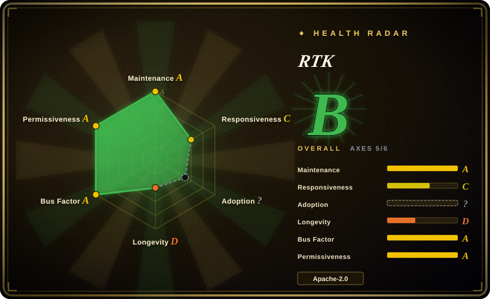

# RTK

A high-performance CLI proxy that filters and compresses command outputs before they reach your LLM context, reducing token consumption by 60–90% on common dev commands with sub-10ms overhead.

## When to use

You're a developer or team using AI coding agents (Claude Code, Codex, Open Interpreter) and your LLM API bills are climbing because every `git diff`, `ls -la`, `find`, and `cat` output is dumped raw into the context window. You pick RTK over manually piping every command through `| head` or `grep` because RTK is a transparent proxy that sits between your shell and the agent, automatically compressing repetitive output, truncating verbose listings, and summarizing large diffs — without you having to remember which command needs filtering. You pick it over Claude Code's built-in compression when you want a deterministic, shell-level layer that works across any CLI agent, not just one tool. You pick it over custom shell wrappers because RTK supports 100+ commands out of the box with zero configuration, whereas hand-rolled pipelines are fragile and per-command. You need it as a single static binary with zero runtime dependencies and sub-10ms overhead so you don't notice it's there.

## When NOT to use

- **If you use IDE-based agents (Cursor, Copilot) or web UIs** — use Cursor or GitHub Copilot directly instead of RTK + a CLI agent, because RTK is a proxy for shell output and IDE agents do not expose shell streams to intercept.
- **If your agent already has smart context management that suffices** — use Claude Code or Codex directly instead of RTK, because their built-in compression may be sufficient and adding RTK introduces another moving part with no marginal gain.
- **If you need every byte of output preserved for the LLM** — use the agent's direct shell execution without RTK, or pipe manually through `cat`, because RTK compresses and filters by design and may drop information (e.g., precise binary diffs, exact byte counts).
- **If you primarily interact with AI agents through file edits and natural language** — use [Aider](https://github.com/paul-gauthier/aider) instead of RTK + a CLI agent, because Aider focuses on diff-based file edits without requiring frequent shell command execution, where RTK's savings would be minimal.
- **If you are on an exotic architecture not covered by prebuilt binaries** — compile from source or use the agent's native shell, because RTK provides prebuilt binaries for common platforms only and compiling from source requires a Rust toolchain.

## Comparison

| Alternative | In index | Our verdict | Tradeoff |
| --- | --- | --- | --- |
| Claude Code (built-in) | 未收录 | AI agent with native context management. | Claude Code already compresses some output; RTK provides an additional deterministic layer and works across agents. |
| Open Interpreter | 已收录 | Terminal coding agent with swappable harnesses. | Open Interpreter runs commands in a sandbox; RTK is a proxy that can sit in front of any agent's shell. |
| Aider | 未收录 | AI pair programming assistant with diff-based edits. | Aider manages file edits and diffs; RTK focuses on compressing shell command output, not code edits. |
| Custom shell wrappers | 未收录 | Hand-rolled `head`, `grep`, `awk` pipelines. | Custom wrappers are fragile and per-command; RTK is automatic, supports 100+ commands, and requires no manual piping. |

## Tech stack

- **Rust** — single static binary with zero runtime dependencies
- **Regex and pattern matching** — for identifying compressible output sections
- **Streaming compression** — for real-time output filtering with minimal latency

## Dependencies

- A supported platform (macOS, Linux, Windows; x86_64 and ARM64)
- No additional runtime dependencies — self-contained binary
- A CLI-based AI agent or coding tool that invokes shell commands

## Ops difficulty

**Low**. A single static binary — install via `curl`, Homebrew, or download from releases. No daemon, no configuration file required. It transparently intercepts shell output when invoked as a proxy.

## Health & viability

- **Maintenance**: Active — regular commits and releases. 67k stars, 4.1k forks, relatively low open issue count for the star volume.
- **Governance**: Owned by rtk-ai, an organization focused on AI developer tooling. Appears to be a small but dedicated team.
- **Backing**: Unknown funding status — the organization appears purpose-built for RTK. No visible foundation or major corporate backing.
- **Adoption**: Rapidly adopted in the AI coding community due to the immediate cost savings. 67k stars in ~6 months suggests strong viral growth.
- **Longevity**: Extremely young — created in January 2026, so only ~6 months old. No Lindy track record whatsoever. The star count is suspiciously high for such a young repo, which may indicate artificial inflation or exceptional viral marketing.
- **Risk flags**: Apache-2.0 is safe. The suspiciously high star count for a 6-month-old project is a concern — it may not reflect genuine organic adoption. The single-vendor governance and lack of funding transparency mean the project could stall if the team loses interest.

## Caveats (unverified)

- [未验证] The claimed 60–90% token reduction is based on the project's own benchmarks and may vary by workflow, command frequency, and agent behavior.
- [未验证] The exact list of 100+ supported commands and their compression rules have not been independently verified.
- [推断] The star count growth pattern for a 6-month-old project is unusually high; genuine adoption vs. artificial inflation is uncertain.
