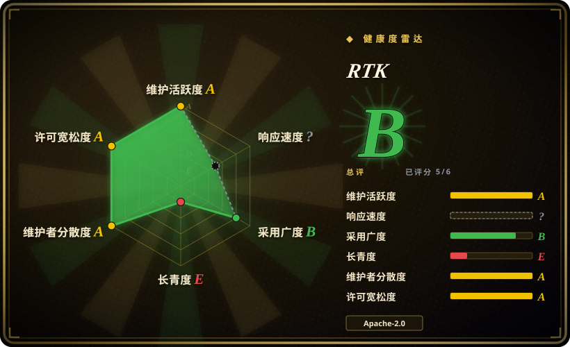

# RTK

高性能 CLI 代理，在命令输出到达 LLM 上下文前先过滤和压缩，对常见开发命令可减少 60–90% 的 token 消耗，开销低于 10 毫秒。

## 何时使用

你是一位开发者或团队，正在使用 AI 编码智能体（Claude Code、Codex、Open Interpreter），而 LLM API 账单因每个 `git diff`、`ls -la`、`find` 和 `cat` 输出都被原样丢进上下文窗口而不断攀升。你选择 RTK 而不是手动为每个命令通过 `| head` 或 `grep` 管道，是因为 RTK 是一个透明代理，坐在 shell 与智能体之间，自动压缩重复输出、截断冗长列表、总结大型 diff——无需你记住哪个命令需要过滤。你选择它而不是 Claude Code 的内置压缩，是因为你想要一个确定性、shell 层面的过滤层，可以跨任何 CLI 智能体工作，不限于单一工具。你选择它而不是自定义 shell 包装器，是因为 RTK 开箱支持 100 余种命令、零配置，而手写管道脆弱且按命令维护。你需要它是单一静态二进制、零运行时依赖，且开销低于 10 毫秒，让你感知不到它的存在。

## 何时不用

- **如果你使用 IDE 内置智能体（Cursor、Copilot）或 Web UI**——请直接用 Cursor 或 GitHub Copilot 而不是 RTK + CLI 智能体，因为 RTK 是 shell 输出的代理，IDE 智能体不暴露可供拦截的 shell 流。
- **如果你的智能体已有足够智能的上下文管理**——请直接用 Claude Code 或 Codex 而不是 RTK，因为它们的内置压缩可能已经足够，添加 RTK 只是引入另一个活动部件且没有边际收益。
- **如果你需要为 LLM 保留每个字节的输出**——请使用不带 RTK 的智能体直接 shell 执行，或手动通过 `cat` 管道，因为 RTK 的设计就是压缩和过滤，可能会丢弃信息（如精确二进制 diff、准确字节数）。
- **如果你主要通过文件编辑和自然语言与 AI 智能体交互**——请用 Aider 而不是 RTK + CLI 智能体，因为 Aider 专注于基于 diff 的文件编辑，无需频繁执行 shell 命令，RTK 的节省在此场景下很有限。
- **如果你在使用预编译二进制未覆盖的 exotic 架构**——请从源码编译或使用智能体的原生 shell，因为 RTK 仅为常见平台提供预编译二进制，从源码编译需要 Rust 工具链。

## 横向对比

| 替代品 | 是否收录 | 我们的评价 | 取舍 |
| --- | --- | --- | --- |
| Claude Code（内置） | 未收录 | 自带原生上下文管理的 AI 智能体。 | Claude Code 已压缩部分输出；RTK 提供额外的确定性层，并可跨智能体工作。 |
| Open Interpreter | 已收录 | 带可切换 harness 的终端编码智能体。 | Open Interpreter 在沙箱中运行命令；RTK 是可置于任何智能体 shell 之前的代理。 |
| Aider | 未收录 | 基于 diff 编辑的 AI 结对编程助手。 | Aider 管理文件编辑与 diff；RTK 专注于压缩 shell 命令输出，而非代码编辑。 |
| 自定义 shell 包装器 | 未收录 | 手写的 `head`、`grep`、`awk` 管道。 | 自定义包装器脆弱且按命令维护；RTK 自动支持 100 余种命令，无需手动管道。 |

## 技术栈

- **Rust**——单一静态二进制，零运行时依赖
- **正则与模式匹配**——识别可压缩的输出片段
- **流式压缩**——实时过滤输出，保持极低延迟

## 依赖

- 受支持的平台（macOS、Linux、Windows；x86_64 与 ARM64）
- 无额外运行时依赖——自包含二进制
- 调用 shell 命令的 CLI 基 AI 智能体或编码工具

## 运维难度

**低**。单一静态二进制——通过 `curl`、Homebrew 或 release 下载安装。无需守护进程、无需配置文件。作为代理调用时，它透明地拦截 shell 输出。

## 健康度与可持续性
- **维护活跃度**：Grade A——最近 13 周中 13 周有提交；最后提交距今 1 天。
- **响应速度**：Grade A——中位首次响应时间 1.5 小时，基于 5 个 qualifying issues/PRs。
- **采用广度**：无法计算——unknown。
- **长青度**：Grade D——仓库已创建 162 天。
- **治理集中度**：Grade A——前三贡献者占比 59.0%（?）。
- **许可风险**：Grade A——Apache-2.0 许可证。
## 存疑（未验证）

- [未验证] 所声称的 60–90% token 削减基于项目自身的基准测试，可能因工作流、命令频率和智能体行为而异。
- [未验证] 100 余种支持命令及其压缩规则的确切列表尚未经独立验证。
- [推断] 6 个月项目的 star 增长模式异常高；真实采用与人为刷量之间尚不确定。
