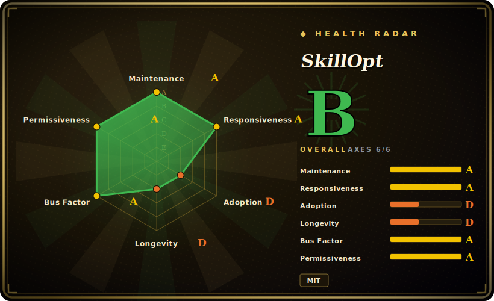

# SkillOpt

A text-space optimizer that "trains" reusable natural-language skill documents for a frozen LLM agent — applying validation-gated, trajectory-driven edits to produce a compact, deployable `best_skill.md`.

## When to use

You're an applied-AI engineer who's hit a wall hand-tuning a long skill/prompt document for an agent: you keep tweaking the instructions, but you can't fine-tune the model (it's frozen behind an API) and you can't tell whether each edit actually helps or just feels better. SkillOpt treats the *skill document itself* as the thing to optimize. You point it at a benchmark/task with a scoring function, and an optimizer LLM proposes bounded edits (add/delete/replace) to the skill text; each edit is kept only if it raises a held-out validation score, driven by actual agent rollouts rather than vibes. The output is a small `best_skill.md` (~300–2,000 tokens) you drop into your agent — no extra inference at deploy time, and it's plain text you can read, diff, and version. It supports multiple LLM backends (OpenAI, Azure, Claude, Qwen, MiniMax) and integrates with direct-chat, Codex CLI, and Claude Code execution harnesses, so you can optimize skills against the harness you actually ship on.

## When NOT to use

- **You don't have a scorable benchmark.** The whole method is validation-gated — without a task with a reliable score/eval, there's nothing to gate edits on and the optimizer has no signal.
- **Your bottleneck is the model, not the prompt.** SkillOpt optimizes *text*, not weights. If the frozen model fundamentally can't do the task, a better skill doc won't fix it — you need a different/fine-tuned model.
- **You want a mature, stable framework.** This is a v0.1.0 research release (2026) with no documented failure modes, cost bounds, or scalability limits — expect rough edges and API churn. [推断]
- **Optimization cost is a concern.** Trajectory-driven edits mean many agent rollouts and optimizer-LLM calls across epochs; the API/compute cost of a run isn't bounded in the docs — budget before committing. [推断]
- **You need offline / no-egress.** It drives external LLM APIs for the optimizer and target models; primary workloads run via those APIs, not locally. [推断]

## Comparison

| Alternative | In index | Tradeoff |
|---|---|---|
| DSPy | 未收录 | Mature framework for programmatic prompt/pipeline optimization (compilers, teleprompters) over frozen LLMs; broader and battle-tested, but optimizes prompts/programs rather than a single deployable skill doc. |
| TextGrad | 未收录 | "Backprop through text" — optimizes prompts/text via natural-language gradients; similar text-space spirit, different update mechanism, not skill-doc-artifact-centric. |
| PromptBreeder / APE / OPRO | 未收录 | LLM-driven prompt-search/evolution methods; overlap on automated prompt improvement, but typically prompt strings, not validation-gated reusable skill artifacts. |
| Manual prompt engineering | 未收录 | No tooling, full control, zero infra; but unmeasured, non-reproducible, and exactly the toil SkillOpt automates. |

## Tech stack

- **Language:** Python (3.10+).
- **Method:** text-space optimization — an optimizer LLM emits bounded add/delete/replace edits to a skill doc; updates are validation-gated on held-out scores from agent rollouts.
- **LLM backends:** OpenAI, Azure, Claude (Anthropic), Qwen, MiniMax — pluggable optimizer/target models.
- **Harnesses:** direct chat, Codex CLI, Claude Code CLI integrations; six built-in benchmarks.
- **Output:** a `best_skill.md` text artifact (~300–2,000 tokens), zero extra inference at deploy.

## Dependencies

- **LLM API access:** keys for the optimizer and target models (one or more of OpenAI/Azure/Claude/Qwen/MiniMax). Primary workloads run via these APIs.
- **Benchmarks/datasets:** the six built-in benchmark packages, or your own scorable task wired in.
- **Hardware:** optional GPU for local testing; the main loop is API-driven, not GPU-bound.
- **Network:** outbound to the chosen LLM providers — not an offline tool.

## Ops difficulty

**Medium.** There's no service or datastore to run — it's a Python training/optimization loop you invoke with config (epochs, batch size, etc.). The operational work is: provisioning API keys for optimizer + target models, defining or wiring a scorable benchmark, and managing the *cost and runtime* of many rollouts/edits across epochs. Output is a static text file, so deployment is trivial (drop in `best_skill.md`); the burden is the optimization run itself — its API spend, reproducibility, and tuning the optimizer — not operating anything long-lived.

## Health & viability

- **Maintenance (2026-06).** Created 2026-05; last pushed/committed 2026-06 — very actively committed in its first weeks. v0.1.0. **Active** and **not archived**, but this is initial-release velocity, not a track record. [推断]
- **Governance / backing.** Published under the **microsoft** org — strong institutional backing and a multi-contributor team (better bus factor than a solo repo). Caveat: Microsoft/MSR research repos vary widely in long-term support; org backing is not a maintenance guarantee. [推断]
- **Age & Lindy verdict.** **~1 month old** (created 2026-05) — **no Lindy whatsoever**. Treat durability as entirely unproven; this is a fresh research artifact. [推断]
- **Adoption.** Stars (~9.6k) and forks (~912) are anomalously high for a one-month-old repo — likely a launch/visibility spike (Microsoft + topical "skills" framing), **not** evidence of production adoption. Treat as a hype signal, not social proof. [未验证]
- **Risk flags.** MIT (clean). Main flags: brand-new (no longevity), research-grade v0.1.0 with undocumented failure modes/cost bounds, and adoption metrics that read as launch hype rather than usage. [推断]

## Caveats (unverified)

- [未验证] ~9.6k stars / ~912 forks as of 2026-06 on a ~1-month-old repo — the star count is API-verified, but it is unusually high for the age and may reflect launch/Microsoft-org visibility, not evidence of production adoption; treat with strong skepticism.
- [未验证] The "52 model-benchmark-harness combinations" and skill-doc size range (~300–2,000 tokens) are the project's own claims from the README — not independently reproduced.
- [推断] Python 3.10+ and GPU-optional are inferred from the README; not verified against the manifest here.
- [推断] Cost/runtime of an optimization run is unbounded in the docs ("doesn't detail … computational cost thresholds") — the "budget before committing" warning is an inference from the trajectory-driven method, not a measured figure.
- [推断] "Microsoft backing ≠ maintenance guarantee" is a general inference about MSR/Microsoft research repos, not a statement about this project's specific roadmap commitment.
