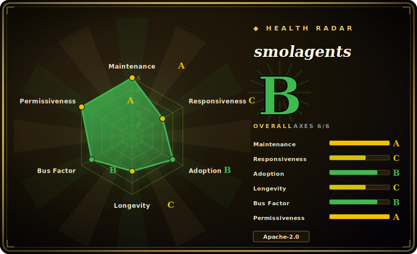

# smolagents

A barebones library for building agents that "think in code": instead of emitting JSON tool calls, the LLM writes Python snippets as its actions (`CodeAgent`), run in a ReAct loop — the whole agent logic fits in ~1,000 lines, model-agnostic, and wired into the Hugging Face Hub.

## When to use

You're an engineer or researcher who wants an agent loop you can read end-to-end in an afternoon. You've looked at the heavier frameworks and bounced off the abstraction tax — graph builders, node registries, callback managers — when all you actually want is "LLM proposes an action, we run it, feed back the result, repeat." You reach for smolagents because its core is a few hundred lines you can step through in a debugger, and its distinctive bet is that the agent *writes Python* as its action (`CodeAgent`) rather than filling JSON tool schemas — which composes naturally (loops, conditionals, intermediate variables) and tends to need fewer steps for multi-tool tasks. You define a couple of `@tool` functions, point it at any model through LiteLLM or the HF Inference API, and you have a working code-acting agent without adopting a framework's worldview.

It's also a good fit when you're model-shopping or staying close to the Hugging Face ecosystem: the same agent runs across hosted and local models, and tools/agents can be pushed to and pulled from the Hub. If your value is in a *small, transparent, hackable* loop you can fork and own — not a managed platform — that's smolagents' sweet spot.

## When NOT to use

- **You need complex, stateful orchestration — graphs, branches, durable state, human-in-the-loop checkpoints.** smolagents is minimal *by design*; it gives you a loop, not a workflow engine. For explicit graphs, conditional edges, and persistence, LangGraph is the better-fit tool, and you'll fight smolagents trying to bolt that on.
- **You can't take on the code-execution security burden.** The agent's whole premise is *running model-generated Python*. The built-in `LocalPythonExecutor` is explicitly **not a security boundary** — safe use means wiring up sandboxing (E2B, Modal, Docker, etc.), which is real operational work you must not skip in any untrusted or production context.
- **You need a stable, frozen API.** It's young (created 2024-12) and on a fast v1.x release cadence; surfaces still move release-to-release [推断]. Pin a version and expect occasional migration on upgrade.
- **You want a batteries-included production agent OS** — multi-agent runtime, message passing, observability, deployment story out of the box. smolagents is a library, not a platform; for that, look at a heavier runtime like [AgentScope](agentscope.md).
- **You're optimizing prompts/programs against a metric, not just running a loop.** If the goal is compiled, measurable LM programs rather than a hand-written action loop, that's [DSPy](dspy.md)'s job, not this.

## Comparison

| Alternative | In index | Our verdict | Tradeoff |
|---|---|---|---|
| LangGraph | 未收录 | Use this page for its stated niche; choose LangGraph when you need graph-based orchestration (nodes/edges, durable state, checkpoints, human-in-the-loop). | Graph-based orchestration (nodes/edges, durable state, checkpoints, human-in-the-loop); far more powerful for complex stateful workflows, but heavier and more abstraction to learn. smolagents trades all of that away for a tiny readable loop. |
| [AgentScope](agentscope.md) | ✅ | Use this page for its stated niche; choose AgentScope when you need multi-agent runtime/platform (message passing, observability, deployment). | Multi-agent runtime/platform (message passing, observability, deployment); a production "agent OS" where smolagents is a single-loop library you embed and own. |
| [DSPy](dspy.md) | ✅ | Use this page for its stated niche; choose DSPy when you need *Compiles/optimizes* LM programs against a metric. | *Compiles/optimizes* LM programs against a metric; different paradigm — smolagents just runs a code-acting loop, it doesn't optimize prompts or weights. |
| CrewAI | 未收录 | Use this page for its stated niche; choose CrewAI when you need role/crew-based multi-agent orchestration with a higher-level "team of agents" model. | Role/crew-based multi-agent orchestration with a higher-level "team of agents" model; more structure and opinion, less minimal than smolagents' single transparent loop. |
| Pydantic AI | 未收录 | Use this page for its stated niche; choose Pydantic AI when you need type-safe, Pydantic-centric agent framework emphasizing structured/validated outputs. | Type-safe, Pydantic-centric agent framework emphasizing structured/validated outputs; smolagents leans into code-as-action instead of schema-validated tool calls. |

## Tech stack

- **Language:** Python.
- **Core abstraction:** a ReAct-style agent loop; the headline variant is `CodeAgent`, where the model's action is a Python snippet that's executed, with `ToolCallingAgent` as the JSON-tool-call alternative. Tools are plain Python functions (`@tool`) or `Tool` subclasses.
- **Code execution:** a built-in `LocalPythonExecutor` (sandboxed-ish, but explicitly *not* a security boundary) plus integrations for remote/managed sandboxes (E2B, Modal, Docker, Blaxel).
- **Model gateway:** model-agnostic — Hugging Face Inference API / local `transformers`, and provider-agnostic access via LiteLLM (OpenAI, Anthropic, local servers, etc.).
- **Ecosystem hooks:** Hugging Face Hub (push/pull tools and agents), MCP tool servers, and LangChain tool interop. (Exact integration/version support per the docs — see Caveats.)

## Dependencies

- **Runtime:** Python (modern 3.x). No GPU required for the framework itself when you call hosted models; running models locally pulls in `transformers`/`torch` and whatever hardware that implies.
- **Models:** at least one LM backend — an HF Inference endpoint or API key, a LiteLLM-supported provider, or a local model.
- **Sandboxing (for any untrusted use):** an external sandbox — E2B / Modal (cloud) or Docker (self-hosted) — which is its own dependency and operational surface, not bundled.
- **Install:** `pip install smolagents` (extras exist for specific integrations, e.g. tooling/telemetry).

## Ops difficulty

**Low for prototyping, medium once it's real.** As a library it's `pip install` and a few lines to a working loop — no servers, no datastore, no cluster. The difficulty is concentrated in two places, both downstream of "the agent runs generated code": first, **sandboxing** — the moment inputs aren't fully trusted you must stand up E2B/Modal/Docker isolation and treat the local executor as unsafe; second, the usual agent-ops concerns (token cost, loop/step limits, retries, observability) are yours to add since this is a thin loop, not a managed platform. Pin your version to insulate against the fast-moving API.

## Health & viability

- **Maintenance — very active (as of 2026-06).** Last push 2026-06; releasing on a brisk v1.x cadence (1,000+ commits on main). Reads as actively developed, not coasting; not archived.
- **Governance & backing — Hugging Face (strong signal).** Owned by the `huggingface` org, not a lone maintainer. HF backing is a meaningful durability signal: a well-resourced, central player in the open-model ecosystem with a track record of sustaining tooling — which materially offsets the project's youth. [推断]
- **Age & Lindy — young, Lindy-unproven, but offset by the backer.** Created 2024-12, ~1.5 years old (as of 2026-06). By age × still-active alone it does **not** clear the Lindy bar that older frameworks like [DSPy](dspy.md) do — there's no long track record yet — but the HF backing + fast adoption substantially de-risks the "will it still be here" question relative to a hyped solo project. [推断]
- **Adoption & ecosystem — fast-growing.** ~28k stars (2026-06) and broad mindshare for the "code agent" idea; integrates with the HF Hub, LiteLLM, and MCP. Stars are noisy, but the adoption trajectory and ecosystem hooks are healthy. [未验证]
- **Risk flags — standing code-execution security risk + API churn, not licensing.** Apache-2.0, no relicense history found. The durable risk is intrinsic: the agent executes model-generated code, so unsafe deployment (no sandbox) is a real attack surface — that's a property of the design, not a bug to wait out. Secondary risk is migration cost across a churning young API.

## Caveats (unverified)

- [未验证] ~28.1k GitHub stars and latest release v1.26.0 (dated 2026-05) per the GitHub repo page; star counts are unreliable and date-sensitive, and a newer release likely exists by the time you read this — treat as indicative only.
- [未验证] Created 2024-12 (~1.5y as of 2026-06) is inferred from the repo's history; confirm the exact creation date if it's load-bearing.
- [未验证] "~1,000 lines of core agent logic" is the project's own framing from its README, not a measured count of the current tree.
- [未验证] The specific sandbox integrations (E2B, Modal, Docker, Blaxel) and ecosystem hooks (LiteLLM provider list, MCP, LangChain interop) are per smolagents' docs/README; confirm the exact integration and version support before depending on it.
- [推断] Fast-moving v1.x API / occasional breaking changes across releases is inferred from the release cadence and is typical of young agent libraries, not confirmed against a specific changelog here — check the changelog before upgrading.
- [推断] `LocalPythonExecutor` being "not a security boundary" is the project's own stated position; the practical takeaway (use a real sandbox for untrusted input) follows from it, but exact isolation guarantees of any chosen sandbox are yours to verify.
