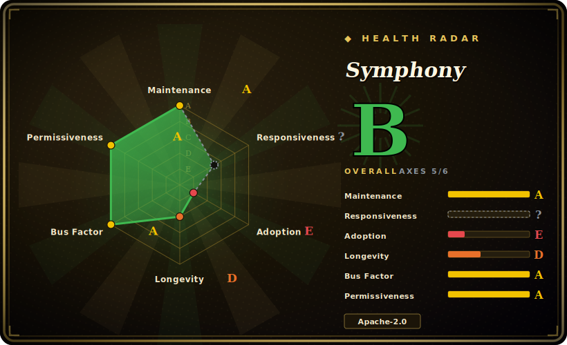

# Symphony

A long-running orchestrator from OpenAI that polls an issue tracker (Linear), spins up an isolated workspace per issue, and drives a coding-agent session (Codex) to completion — so you manage *work* instead of babysitting agents.

## When to use

You're an engineering lead on a team that already runs a Codex-based coding agent, and your bottleneck has shifted: the agent can implement tasks, but a human still has to babysit each run — kick it off, watch the turns, shepherd it to a PR, and start the next one. Your backlog lives in Linear and you want the queue itself to be the interface: an issue moves into a "ready" state, something picks it up, gives it a clean isolated workspace, runs the agent against it, and reports back. Symphony is built for exactly this loop. It's a polling orchestrator: it reads work from your Linear board, renders a prompt from the issue context, launches a Codex `app-server` subprocess inside a per-issue workspace, streams the turns, and reconciles tracker state after each turn — retrying or cleaning up based on the outcome.

Because the orchestration contract is published as a language-agnostic spec ("Draft v1") with Elixir as the *reference* implementation, it also fits if you want to study or fork the dispatch/reconciliation model rather than adopt the binary as-is. The isolation-per-issue design (one workspace per ticket, preserved after success for reuse) is the part you reach for when you're trying to run several autonomous attempts in parallel without them stepping on each other's working trees.

## When NOT to use

- **You're not on Linear.** The current spec supports **`tracker.kind: linear` only** — Linear's GraphQL API via `LINEAR_API_KEY`. GitHub Issues, Jira, and other trackers are not wired in. If your work queue lives elsewhere, you'd be implementing the tracker adapter yourself.
- **You don't use Codex.** The agent session is a `codex app-server` subprocess; sandbox policy and model selection are Codex's. There's no first-class adapter for Claude Code, Aider, or other CLIs — swapping the agent means rewriting the session layer. [推断]
- **You need production-grade durability.** State is a single **in-memory** state machine — "Blocked entries are in memory only; restarting the orchestrator clears that blocked map." There's no Postgres/Redis backing store, so a crash or restart loses dispatch/retry/blocked state. This is a coordinator for trusted runs, not an HA job system.
- **You want a stable, versioned product.** It's self-described as a **"low-key engineering preview for testing in trusted environments"** with **no tagged release** as of 2026-06. Expect breaking changes, sparse docs, and that you are the QA.
- **You want strong multi-tenant security boundaries.** Isolation is filesystem-level (a workspace per issue) plus whatever Codex's sandbox policy enforces (`read-only` / `workspace-write` / `danger-full-access`). It is not VM/container-per-run isolation by default, and `danger-full-access` exists — running untrusted issues this way is a real risk.
- **You want a heavy multi-agent framework (planner/critic/tools graph).** Symphony orchestrates *runs* of one agent against tracker issues; it is not a role-based agent graph like AutoGen/CrewAI.

## Comparison

| Alternative | In index | Tradeoff |
|---|---|---|
| [openfang](openfang.md) | ✅ | Same "fleet of autonomous coding agents" lane; different stack/integration assumptions — compare tracker, isolation model, and agent backend before choosing. |
| [claude-octopus](claude-octopus.md) | ✅ | Orchestrates multiple Claude Code agents in parallel; Symphony is Codex-centric and tracker-driven (Linear), so the choice often follows which agent CLI you've standardized on. |
| [AgentScope](agentscope.md) | ✅ | General multi-agent runtime/framework for building agent apps; Symphony is narrower — a queue→workspace→agent-run orchestrator, not a framework to compose agents. |
| [DSPy](dspy.md) | ✅ | Programs/optimizes LLM pipelines; orthogonal problem — DSPy builds the agent's reasoning, Symphony schedules and isolates whole implementation runs. |
| Devin / Cognition (hosted) | 未收录 | Hosted "autonomous engineer" SaaS covering a similar manage-the-work pitch; closed, no self-host, no fork. Symphony is OSS and self-hosted but preview-stage. |
| GitHub Actions + agent CLI (DIY) | 未收录 | Roll-your-own: CI triggers an agent on issues. More control and durable infra (CI runners), but you build the dispatch/reconciliation/isolation that Symphony gives you. |

## Tech stack

- **Language:** Elixir (~92% of repo bytes; small Python/CSS/Shell/Dockerfile/Makefile tail). [未验证] exact percentages.
- **Runtime/observability:** Elixir/OTP application; an optional Phoenix-based observability service started via a `--port` flag.
- **Toolchain:** `mise` for version management; `mix` for build/run (`mix setup`, `mix build`, `./bin/symphony ./WORKFLOW.md`).
- **Agent backend:** OpenAI Codex via `codex app-server`, configured by `codex.command` and `codex.turn_sandbox_policy`.
- **Work source:** Linear GraphQL API (`tracker.kind: linear`).
- **Config:** a `WORKFLOW.md` workflow file plus per-issue workspace hooks (e.g. `hooks.after_create` running `git clone`).

## Dependencies

- **Runtime:** Elixir/OTP (versions not pinned in docs — managed via `mise install`). [未验证] exact version floor.
- **Agent:** a working Codex install/CLI reachable as `codex app-server` (you supply OpenAI credentials/model access to Codex).
- **Tracker:** a Linear account + `LINEAR_API_KEY` for the GraphQL integration.
- **Git:** git available for per-issue workspace `git clone` in workspace hooks.
- **No database/cache required:** orchestrator state is in-memory only (so no Postgres/Redis to operate, but also no durability).
- **Optional:** Docker (`docker compose`) only for SSH-worker testing; Phoenix observability dashboard via `--port`.

## Ops difficulty

**Medium.** The dependency surface is modest — no database to run, a single Elixir service plus an external Codex CLI and a Linear key — and a small team comfortable with the BEAM toolchain (`mise` + `mix`) can stand it up from the Elixir README. The difficulty is operational rather than installational: because state is in-memory, you own restart/recovery semantics, and because it's a preview with no releases, expect to read source and track `main` rather than pin a version. Running real implementation runs safely (sandbox policy, what `danger-full-access` is allowed to touch, secret handling for Codex/Linear) is where the actual ops burden lives.

## Health & viability

- **Maintenance — active, preview-stage (as of 2026-06).** Last push 2026-06; not archived. But there is **no tagged release / semver** — it's self-described as a "low-key engineering preview," so you track `main` rather than pin a version, and config keys can change without notice. Few open issues (~8), consistent with low external usage rather than a settled API.
- **Governance & backing — strong vendor (OpenAI), weak product commitment.** Owned by `openai`, so the backing org's resources and longevity are not in doubt — but a "low-key preview" carries no product/SLA commitment, and large vendors do shelve experiments. Backing strength does not equal roadmap guarantee here.
- **Age & Lindy — young, unproven.** Created 2026-02, ~4 months old (as of 2026-06). No track record and preview-stage; strong-backer but young-and-unproven — the OpenAI name raises the floor, but Lindy does not yet apply.
- **Risk flags — no durability, preview API.** Apache-2.0 (no relicense risk), but in-memory-only state (a restart loses dispatch/blocked state), Codex+Linear hard coupling, and no releases mean the risk is product-maturity, not licensing.

## Caveats (unverified)

- [未验证] Star count ~25.6k as of 2026-06 — GitHub stars in this ecosystem are unreliable and date-sensitive; treat as indicative only.
- [未验证] Exact language-byte percentages ("~92% Elixir") are derived from GitHub's `languages` API at one point in time and shift as the repo changes.
- [未验证] No tagged release / semver exists at verification time; "engineering preview" is the project's own framing — feature set and config keys (e.g. `WORKFLOW.md` schema, `codex.*` options) may change without notice.
- [未验证] Elixir/OTP/Phoenix version floors are not stated in the docs read; `mise` resolves them from project config not quoted here.
- [推断] No first-class adapter for non-Codex agents (Claude Code, Aider, etc.) — inferred from the spec/README describing only the Codex `app-server` session; not explicitly confirmed as unsupported.
- [推断] Isolation is filesystem-workspace + Codex sandbox policy, not container/VM-per-run by default — inferred from the workspace description; verify the threat boundary before running untrusted issues.
- [未验证] GitHub Issues / non-Linear trackers are described as unsupported in "Draft v1"; a later spec/impl revision may add them.
