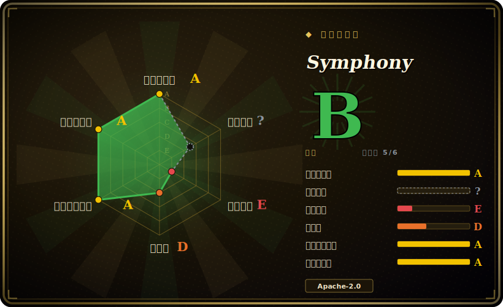

# Symphony

OpenAI 出品的长驻编排器：轮询 issue 跟踪器（Linear），为每个 issue 拉起隔离工作区，并驱动一个 coding agent 会话（Codex）跑到完成——让你管理「工作」，而不是盯着 agent 干活。

## 何时使用

你是某个团队的工程负责人，团队已经在用基于 Codex 的 coding agent，瓶颈已经转移了：agent 能实现任务，但每一次运行仍要一个人盯着——手动启动、看它一轮轮跑、把它送到 PR、再开下一个。你的待办躺在 Linear 里，你希望队列本身就是接口：某个 issue 进入「就绪」状态，就有东西把它捡起来、给它一个干净的隔离工作区、对着它跑 agent、再把结果汇报回来。Symphony 正是为这个闭环而建。它是一个轮询式编排器：从 Linear 看板读取工作，用 issue 上下文渲染 prompt，在每个 issue 的工作区里拉起一个 Codex `app-server` 子进程，流式处理一轮轮交互，并在每轮后与跟踪器状态做对账——按结果决定重试还是清理。

由于编排契约是以语言无关的 spec 形式发布的（「Draft v1」）,Elixir 只是*参考*实现，所以如果你想研究或 fork 这套分发/对账模型、而非直接采用二进制，它也合适。「每 issue 一个隔离工作区」（每张工单一个工作区，成功后保留以便复用）的设计，正是你想并行跑多个自治尝试、又不让它们互相踩工作树时要的东西。

## 何时不用

- **你不用 Linear。** 当前 spec **仅支持 `tracker.kind: linear`**——即通过 `LINEAR_API_KEY` 调用 Linear 的 GraphQL API。GitHub Issues、Jira 等跟踪器都没接。工作队列在别处的话，跟踪器适配器得你自己实现。
- **你不用 Codex。** agent 会话是一个 `codex app-server` 子进程，沙箱策略和模型选择都归 Codex 管。没有面向 Claude Code、Aider 等 CLI 的一等适配——换 agent 意味着重写会话层。[推断]
- **你需要生产级的持久性。** 状态是单个**内存中**的状态机——「Blocked entries are in memory only; restarting the orchestrator clears that blocked map.」没有 Postgres/Redis 后端存储，崩溃或重启会丢失 dispatch/retry/blocked 状态。这是给可信运行用的协调器，不是高可用作业系统。
- **你要一个稳定、有版本的产品。** 它自述为**「low-key engineering preview for testing in trusted environments」**（可信环境下测试用的低调工程预览版），截至 2026-06 **没有任何 tagged release**。要做好破坏性变更、文档稀疏、你就是 QA 的心理准备。
- **你需要强多租户安全边界。** 隔离是文件系统级（每 issue 一个工作区）加上 Codex 沙箱策略所强制的部分（`read-only` / `workspace-write` / `danger-full-access`）。默认不是每次运行一个 VM/容器的隔离，而且 `danger-full-access` 是存在的——用这种方式跑不可信 issue 是实打实的风险。
- **你想要一个重型多 agent 框架（planner/critic/工具图）。** Symphony 编排的是「一个 agent 对跟踪器 issue 的多次运行」，不是 AutoGen/CrewAI 那样基于角色的 agent 图。

## 横向对比

| 替代品 | 是否收录 | 取舍 |
|---|---|---|
| [openfang](openfang.zh.md) | ✅ | 同属「一队自治 coding agent」的赛道；栈与集成假设不同——选型前先比跟踪器、隔离模型和 agent 后端。 |
| [claude-octopus](claude-octopus.zh.md) | ✅ | 并行编排多个 Claude Code agent;Symphony 以 Codex 为中心、由跟踪器（Linear）驱动，所以选择往往取决于你已经标准化了哪个 agent CLI。 |
| [AgentScope](agentscope.zh.md) | ✅ | 用于构建 agent 应用的通用多 agent 运行时/框架；Symphony 更窄——是「队列→工作区→agent 运行」的编排器，不是用来组合 agent 的框架。 |
| [DSPy](dspy.zh.md) | ✅ | 编排/优化 LLM 流水线；是正交问题——DSPy 构建 agent 的推理，Symphony 调度并隔离整次实现运行。 |
| Devin / Cognition（托管） | 未收录 | 托管「自治工程师」SaaS，卖点类似「管理工作」；闭源、不能自托管、不能 fork。Symphony 开源可自托管，但处于预览阶段。 |
| GitHub Actions + agent CLI（自建） | 未收录 | 自己搭：CI 在 issue 上触发 agent。控制力更强、基础设施更持久（CI runner），但 dispatch/对账/隔离得你自己造——这些正是 Symphony 给你的。 |

## 技术栈

- **语言：** Elixir（约占仓库字节 92%；尾部有少量 Python/CSS/Shell/Dockerfile/Makefile）。[未验证] 精确占比。
- **运行时/可观测性：** Elixir/OTP 应用；可选的基于 Phoenix 的可观测性服务，通过 `--port` 标志启动。
- **工具链：** 用 `mise` 做版本管理；用 `mix` 构建/运行（`mix setup`、`mix build`、`./bin/symphony ./WORKFLOW.md`）。
- **agent 后端：** OpenAI Codex，经 `codex app-server`，由 `codex.command` 和 `codex.turn_sandbox_policy` 配置。
- **工作来源：** Linear GraphQL API(`tracker.kind: linear`)。
- **配置：** 一个 `WORKFLOW.md` 工作流文件，加上每个 issue 的工作区钩子（如 `hooks.after_create` 里跑 `git clone`）。

## 依赖

- **运行时：** Elixir/OTP（文档未 pin 版本——通过 `mise install` 管理）。[未验证] 精确版本下限。
- **agent:** 一个可用、可作为 `codex app-server` 调起的 Codex 安装/CLI（你给 Codex 提供 OpenAI 凭证/模型访问）。
- **跟踪器：** 一个 Linear 账户 + `LINEAR_API_KEY` 用于 GraphQL 集成。
- **Git:** 工作区钩子里要做 `git clone`，需有 git 可用。
- **无需数据库/缓存：** 编排器状态仅在内存（因此不用运维 Postgres/Redis，但也没有持久性）。
- **可选：** Docker（`docker compose`）仅用于 SSH worker 测试；Phoenix 可观测性面板经 `--port`。

## 运维难度

**中。** 依赖面不大——没有数据库要跑，一个 Elixir 服务加一个外部 Codex CLI 和一个 Linear key——熟悉 BEAM 工具链（`mise` + `mix`）的小团队照着 Elixir README 就能搭起来。难点在运维而非安装：因为状态在内存里，重启/恢复语义得你自己兜；因为是没有发版的预览版，得读源码、跟 `main`，而不是 pin 一个版本。真正的运维负担在于安全地跑实现运行（沙箱策略、`danger-full-access` 允许碰什么、Codex/Linear 的密钥处理）。

## 健康度与可持续性

- **维护——活跃，预览阶段（截至 2026-06）。** 最后推送 2026-06；未归档。但**没有任何 tagged release / semver**——它自述为「低调工程预览版」，所以你是跟 `main` 而非 pin 某个版本，配置键可能无预告变更。未决 issue 很少（约 8 个），与外部使用量低相符，而非 API 已定型。
- **治理与背书——强厂商（OpenAI）、弱产品承诺。** 归在 `openai` 名下，所以背书组织的资源与长期性无须担心——但「低调预览」不带任何产品 / SLA 承诺，且大厂确实会搁置实验。这里背书强度不等于路线图保证。
- **年龄与 Lindy——年轻、未经证明。** 2026-02 创建，约 4 个月（截至 2026-06）。无历史沉淀且处于预览阶段；属于「背书强但年轻未经证明」——OpenAI 的名号抬高了下限，但 Lindy 尚不适用。
- **风险信号——无持久性、预览 API。** Apache-2.0（无重许可风险），但状态仅在内存（重启会丢 dispatch/blocked 状态）、与 Codex+Linear 硬耦合、且无发版，意味着风险在产品成熟度而非许可。

## 存疑（未验证）

- [未验证] 截至 2026-06 star 约 25.6k——本生态的 GitHub star 不可靠且对时间敏感，仅供参考。
- [未验证] 精确语言字节占比（「约 92% Elixir」）取自某一时刻的 GitHub `languages` API，会随仓库变化而变。
- [未验证] 校验时不存在 tagged release / semver;「engineering preview」是项目自己的表述——特性集与配置键（如 `WORKFLOW.md` schema、`codex.*` 选项）可能无预告变更。
- [未验证] 所读文档未给出 Elixir/OTP/Phoenix 的版本下限；`mise` 从未在此引用的项目配置里解析它们。
- [推断] 没有面向非 Codex agent（Claude Code、Aider 等）的一等适配——据 spec/README 仅描述 Codex `app-server` 会话推断；并未被明确确认为「不支持」。
- [推断] 隔离是「文件系统工作区 + Codex 沙箱策略」，默认不是每次运行一个容器/VM——据工作区描述推断；跑不可信 issue 前请核实威胁边界。
- [未验证] GitHub Issues / 非 Linear 跟踪器在「Draft v1」中被描述为不支持；后续 spec/实现修订可能加上。
