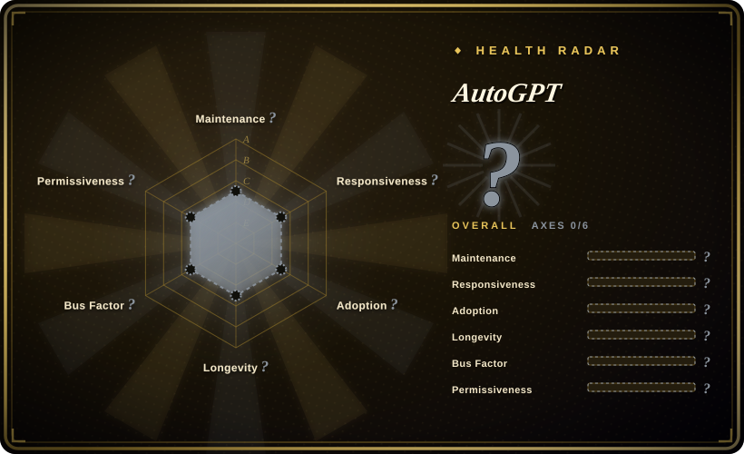

# AutoGPT

A platform to create, deploy, and manage continuous AI agents that automate complex workflows. You can self-host for free on your own infrastructure, or join the waitlist for the cloud-hosted beta.

## When to use

You are a developer or team that needs to automate complex, multi-step tasks with AI agents that run continuously without human intervention. You have looked at LangChain, but LangChain is a code-first library — you have to build the agent infrastructure yourself, and there is no built-in web UI or deployment model. You have looked at Hermes Agent, but Hermes is a single-agent learning framework focused on personal skill evolution, not on orchestrating multi-step workflows across tools. You choose AutoGPT over both because it provides a full platform with a web UI for building and monitoring agents, plus a deployment model for running them continuously. You want agents that can research topics, write code, manage files, and interact with APIs on a schedule, and you need the flexibility to self-host for free.

## When NOT to use

- **Simple, reliable scripts** — AutoGPT agents are non-deterministic and can fail or loop unexpectedly. For deterministic automation, use traditional scripting or n8n instead of AutoGPT, because those tools produce predictable, repeatable workflows.
- **Low-resource edge deployment** — The README specifies minimum requirements of 4 CPU cores, 8GB RAM (16GB recommended), and 10GB+ free storage. This is not a lightweight agent. If you need a lightweight assistant, use OpenClaw or Hermes Agent instead of AutoGPT, because both can run on a $5 VPS or minimal hardware.
- **Coding-specific agents** — AutoGPT is a general-purpose autonomous agent platform; for software engineering, use OpenCode or Claude Code instead of AutoGPT, because they are purpose-built for coding with file-editing and terminal execution.
- **Enterprise support guarantees** — Significant Gravitas is a community organization, not an enterprise vendor. There is no SLA or formal support contract. If you need enterprise-grade support, use Dify or LangChain with LangSmith instead of AutoGPT, because those options offer commercial backing and support tiers.
- **Mature, stable API** — The platform is still evolving rapidly; the cloud-hosted beta is not yet publicly available. If you need a stable, proven API, use LangChain instead of AutoGPT, because LangChain has a ~3.7-year track record and established API patterns.

## Comparison

| Alternative | In index | Our verdict | Tradeoff |
| --- | --- | --- | --- |
| [Hermes Agent](../agent-runtimes/hermes-agent.md) | ✅ | Self-improving agent with a learning loop. | Hermes focuses on skill evolution and memory; AutoGPT focuses on workflow automation and deployment. |
| [OpenClaw](../agent-runtimes/openclaw.md) | ✅ | Personal multi-channel assistant. | OpenClaw is a conversational assistant; AutoGPT is a task-automation platform with a web UI. |
| [OpenCode](../coding-agents/opencode.md) | ✅ | Model-agnostic terminal coding agent. | OpenCode is a coding tool; AutoGPT is a general-purpose agent framework with continuous execution. |
| [LangChain](langchain.md) | ✅ | Lower-level framework for building agent pipelines. | LangChain is a library you integrate into your code; AutoGPT is a higher-level platform with a UI and deployment model. |
| CrewAI | 未收录 | Multi-agent orchestration framework. | CrewAI focuses on multi-agent teams; AutoGPT focuses on single-agent continuous execution. |

## Tech stack

- **Python** — primary implementation language
- **FastAPI** — backend API framework
- **React / Next.js** — web UI for the platform
- **PostgreSQL** — database for agent state and metadata
- **Redis** — caching and message broker

## Dependencies

- **Hardware**: 4+ CPU cores, 8GB RAM minimum (16GB recommended), 10GB+ free storage
- **OS**: Linux (Ubuntu 20.04+ recommended), macOS, or Windows with WSL
- **Database**: PostgreSQL for agent state persistence
- **LLM provider**: OpenAI API or compatible endpoint
- **Docker**: Recommended for deployment

## Ops difficulty

**High**. Self-hosting the AutoGPT platform requires multiple services (backend, frontend, database, Redis), environment configuration, and ongoing monitoring. The system is resource-intensive and agents can fail in unexpected ways, requiring human oversight.

## Health & viability
- **Maintenance**: Grade A — 12/13 active weeks in trailing 13; last commit 8 days ago.
- **Responsiveness**: Grade A — median first-response time 47.7 hours across 28 qualifying issues/PRs.
- **Adoption**: Cannot be scored — unknown.
- **Longevity**: Grade B — 1205 days old.
- **Governance**: Grade A — top-3 contributor share 56.2% (?).
- **Risk / License**: Cannot be scored — unknown.
## Caveats (unverified)

- [未验证] The repository has no declared license (`NOASSERTION`), which creates legal uncertainty for commercial use or redistribution.
- [未验证] The cloud-hosted beta waitlist has been open for an extended period; the public release timeline is unclear.
- [推断] The 185k star count was largely driven by the 2023 hype cycle around "autonomous GPT"; current production adoption may be significantly lower than the star count suggests.
- [未验证] The hardware requirements (4+ cores, 16GB RAM recommended) are for the full platform; lighter usage may be possible but is not officially documented.
